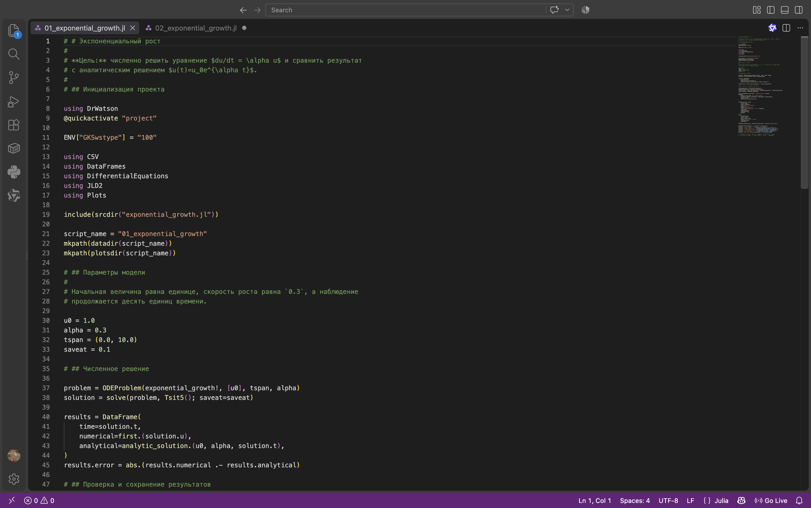
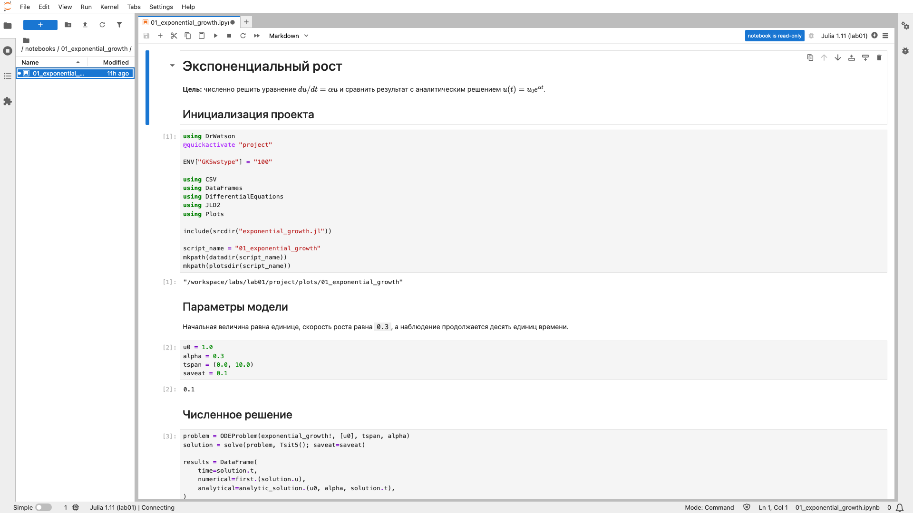
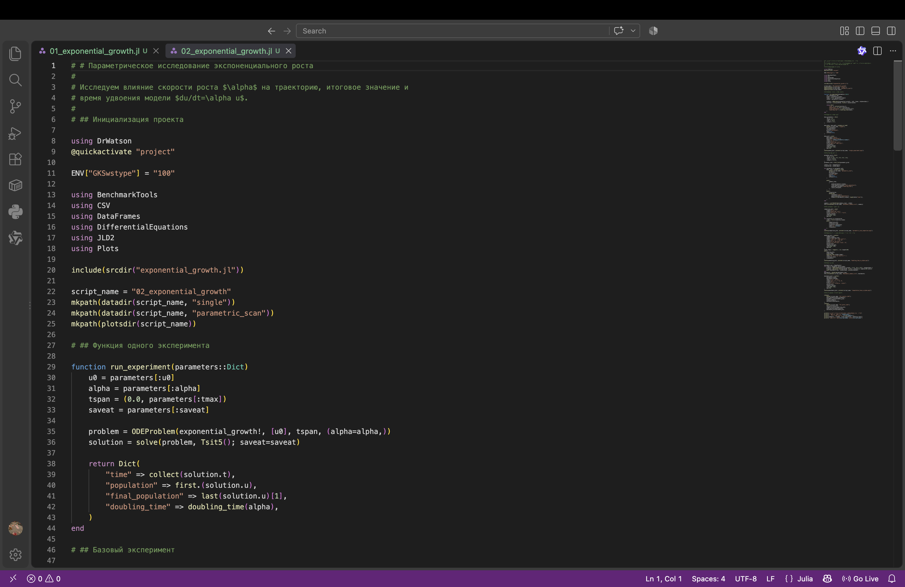
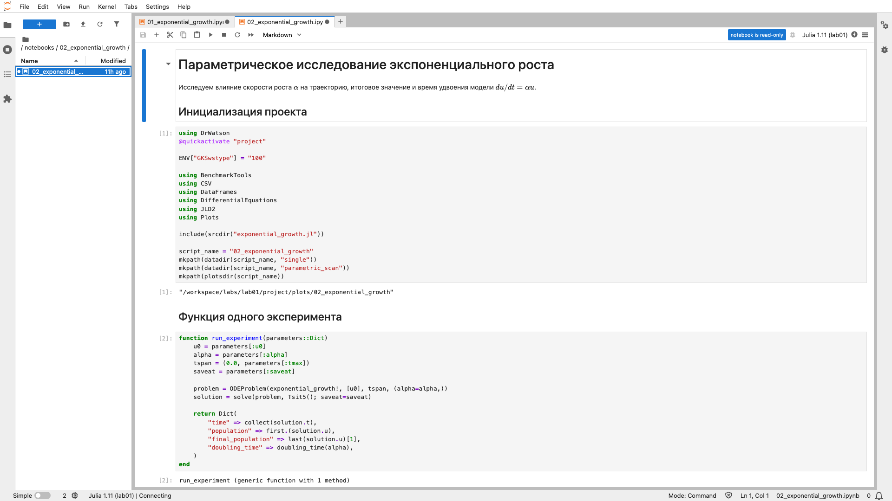
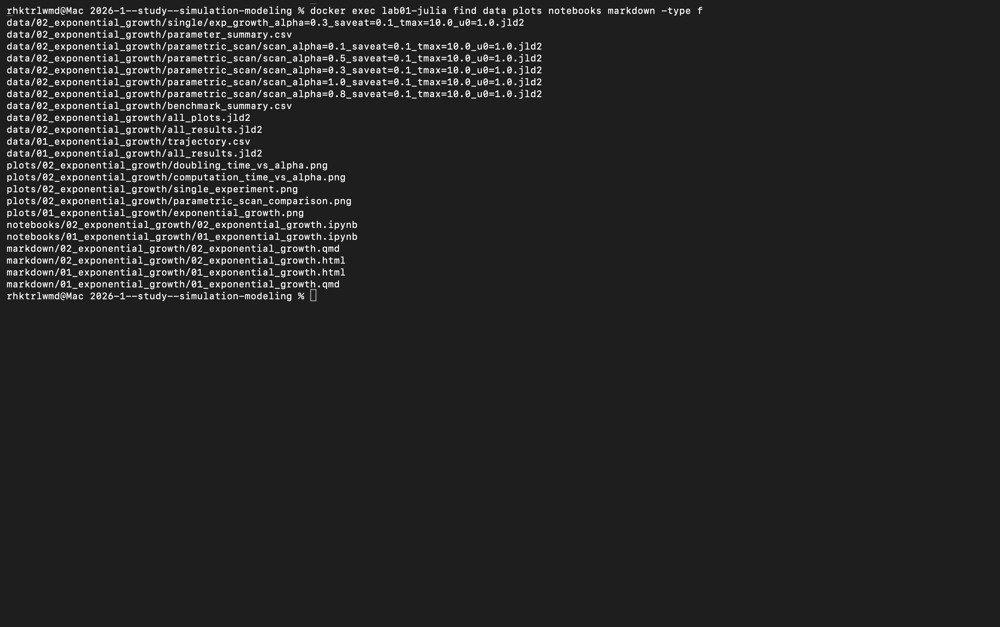

# Информация

## Докладчик

- Исаева Зарина Исмайилбековна
- Студентка
- Российский университет дружбы народов имени Патриса Лумумбы
- Студенческий билет: 1132232882

# Цель и задачи

## Цель работы

- Изучить численное решение ОДУ экспоненциального роста
- Подготовить воспроизводимый проект на Julia
- Сопоставить численное и аналитическое решения
- Провести параметрическое исследование
- Получить JL, IPYNB и QMD из литературного кода

## Задание

1. Подготовить Julia-проект с закреплёнными зависимостями
2. Реализовать модель $du/dt=\alpha u$
3. Выполнить базовый эксперимент
4. Сформировать производные форматы через Literate
5. Исследовать пять значений $\alpha$
6. Сохранить данные и графики
7. Выполнить ноутбуки и автоматические тесты

# Подготовка проекта

## Запуск Julia и окружение

{width=74%}

- Используется Julia 1.11
- Среда активируется из `Project.toml`
- Точные версии пакетов закреплены в `Manifest.toml`

## Структура каталогов

{width=78%}

- `src` — модель
- `scripts` — вычислительные сценарии
- `data`, `plots` — результаты
- `notebooks`, `markdown` — производные форматы

## Зависимости проекта

- `DifferentialEquations.jl` — решение задачи Коши
- `DrWatson.jl` — воспроизводимые пути и параметры
- `DataFrames.jl`, `CSV.jl`, `JLD2.jl` — данные
- `Plots.jl` — визуализация
- `Literate.jl`, `IJulia.jl` — QMD и IPYNB
- `BenchmarkTools.jl` — измерение времени

## Команды воспроизведения

```bash
julia --project=. -e 'using Pkg; Pkg.instantiate()'
make tangle
make run
make notebooks
make docs
make test
```

- Makefile задаёт полный порядок действий
- Все команды выполняются из каталога `lab01`

# Структура решения

## Основные файлы

- `src/exponential_growth.jl` — правая часть и аналитические функции
- `scripts/01_exponential_growth.jl` — базовый опыт
- `scripts/02_exponential_growth.jl` — параметрический опыт
- `scripts/tangle.jl` — формирование производных файлов
- `test/runtests.jl` — автоматическая проверка
- `Project.toml`, `Manifest.toml` — среда Julia

## Модель экспоненциального роста

$$
\frac{du}{dt}=\alpha u, \qquad u(0)=u_0.
$$

- $u(t)$ — исследуемая величина
- $u_0$ — начальное значение
- $\alpha$ — постоянная скорость роста
- аналитическое решение: $u(t)=u_0e^{\alpha t}$
- время удвоения: $T_2=\ln(2)/\alpha$

# Базовый запуск

## Выполнение `01_exponential_growth.jl`

{width=76%}

- задача решается методом Tsit5
- сохраняются численная и аналитическая траектории
- создаются CSV, JLD2 и график

## Выполненный базовый ноутбук

{width=78%}

- выполнены 4 из 4 кодовых ячеек
- результат и график сохранены внутри IPYNB

## График базового запуска

{width=67%}

- численная и аналитическая кривые практически совпадают
- заметного расхождения на сетке времени нет

## Численные результаты

| Показатель | Значение |
|---|---:|
| $u_{num}(10)$ | 20,0854485 |
| $u_{exact}(10)$ | 20,0855369 |
| относительная ошибка | $4,40\cdot10^{-6}$ |
| время удвоения | 2,3105 |

- базовая траектория содержит 101 точку
- точность подтверждает корректность реализации

# Параметрическое исследование

## Выполнение `02_exponential_growth.jl`

{width=76%}

- исследуется $\alpha\in\{0{,}1;0{,}3;0{,}5;0{,}8;1{,}0\}$
- для каждого опыта создаётся отдельный JLD2-файл
- сводные данные сохраняются в CSV

## Выполненный параметрический ноутбук

{width=78%}

- выполнены 8 из 8 кодовых ячеек
- сохранены таблица, четыре графика и результаты бенчмарка

## Сравнение траекторий

{height=430}

- итоговое значение экспоненциально зависит от $\alpha$
- наиболее быстрый рост наблюдается при $\alpha=1{,}0$

## Время удвоения

{height=430}

- точки расчёта лежат на кривой $\ln(2)/\alpha$
- при $\alpha=1{,}0$ удвоение занимает 0,6931

## Время вычислений

{height=430}

- каждый опыт выполняется за несколько микросекунд
- измерение повторялось 100 раз для каждого значения $\alpha$

# Результаты

## Сводная таблица

| $\alpha$ | $u(10)$ | $T_2$ |
|---:|---:|---:|
| 0,1 | 2,7183 | 6,9315 |
| 0,3 | 20,0854 | 2,3105 |
| 0,5 | 148,4086 | 1,3863 |
| 0,8 | 2 980,5736 | 0,8664 |
| 1,0 | 22 021,0156 | 0,6931 |

## Проверка и сборка

:::::::::::::: {.columns align=center}
::: {.column width="50%"}

:::
::: {.column width="50%"}

:::
::::::::::::::

- автоматические тесты: 3 из 3 пройдены
- отчёт и презентация собраны без ошибок

# Выводы

## Основные выводы

- Подготовлена воспроизводимая среда Julia
- Реализована и аналитически проверена модель роста
- Выполнены базовый и параметрический эксперименты
- Подтверждена зависимость $T_2=\ln(2)/\alpha$
- Получены JL, QMD, HTML и выполненные IPYNB
- Сохранены CSV, JLD2 и пять графиков
- Все автоматические тесты завершены успешно
