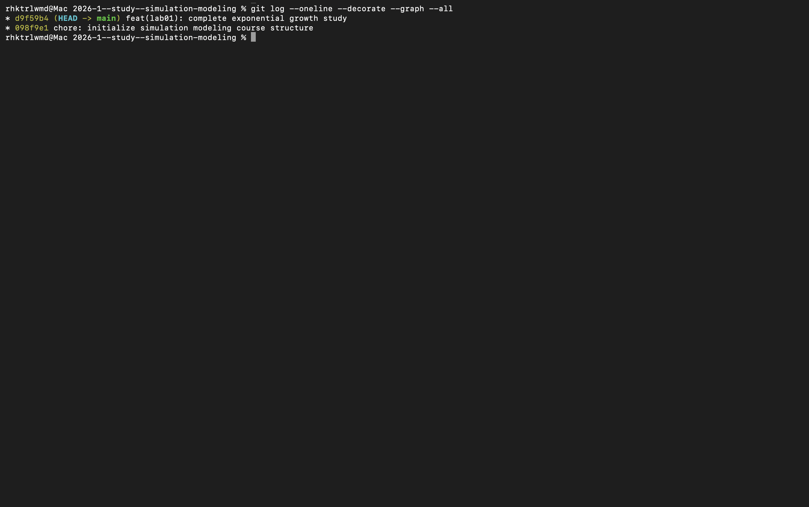
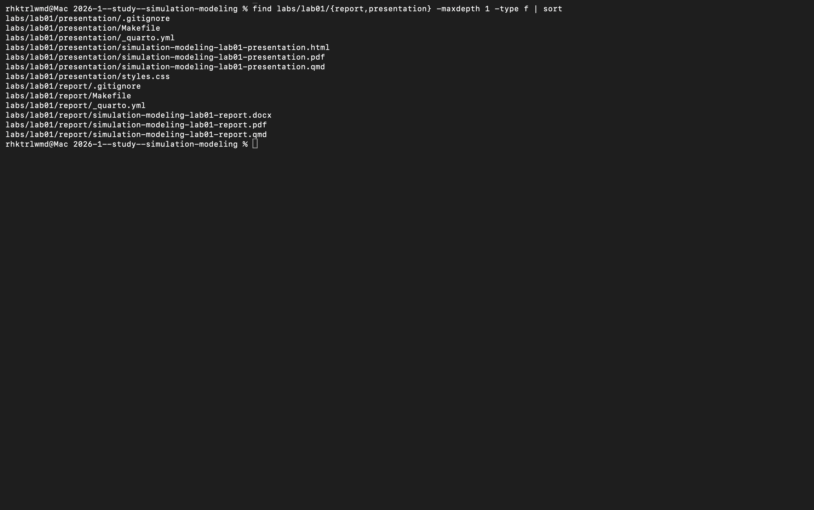



# Содержание {.unnumbered}

1. Цель работы
2. Задание
3. Теоретическое введение
   1. Модель экспоненциального роста
   2. Численное решение
   3. Инструменты
   4. Литературное программирование
4. Выполнение лабораторной работы
   1. Подготовка проекта
   2. Реализация модели
   3. Базовый запуск
   4. Параметрическое исследование
   5. Производные форматы
   6. Проверка и сборка
5. Выводы
6. Список литературы



# Список иллюстраций {.unnumbered}

1. Структура каталогов лабораторной работы
2. Проверка закреплённых зависимостей проекта
3. Фрагмент литературного сценария базового эксперимента
4. Численное и аналитическое решения при $\alpha=0{,}3$
5. Фрагмент сценария параметрического исследования
6. Сравнение траекторий для пяти значений $\alpha$
7. Зависимость времени удвоения от коэффициента роста
8. Измеренное время вычисления
9. Выполненный базовый Jupyter-ноутбук
10. Выполненный параметрический Jupyter-ноутбук
11. Результат автоматических тестов
12. Сборка отчёта и презентации
13. История версии лабораторной работы



# Список таблиц {.unnumbered}

1. Компоненты вычислительного проекта
2. Параметры базового эксперимента
3. Результаты серии вычислительных экспериментов
4. Состав производных форматов



# Цель работы

**Цель работы** — освоить воспроизводимую организацию вычислительного проекта
на Julia и исследовать свойства модели экспоненциального роста.

# Задание

1. создан отдельный Julia-проект с закреплёнными зависимостями;
2. реализован базовый сценарий решения задачи Коши;
3. проведена серия экспериментов для пяти значений параметра $\alpha$;
4. из литературных исходников получены скрипты, QMD и IPYNB;
5. выполнены ноутбуки, сформированы таблицы и графики;
6. численные результаты проверены аналитически и автоматическими тестами;
7. подготовлены отчёт, презентация и журнал изменений.

# Теоретическое введение

## Модель экспоненциального роста

Пусть $u(t)$ — величина, изменяющаяся со скоростью, пропорциональной своему
текущему значению. Такая постановка соответствует модели экспоненциального
роста из методических указаний [@rudn_simulation_manual]. Модель имеет вид

$$
\frac{du}{dt}=\alpha u, \qquad u(0)=u_0,
$$ {#eq-growth}

где $u_0$ — начальное значение, а $\alpha$ — постоянный коэффициент роста.
После разделения переменных получаем аналитическое решение

$$
u(t)=u_0e^{\alpha t}.
$$ {#eq-exact}

Время удвоения определяется условием $u(T_2)=2u_0$:

$$
T_2=\frac{\ln 2}{\alpha}, \qquad \alpha>0.
$$ {#eq-double}

Для базового опыта приняты $u_0=1$, $\alpha=0{,}3$ и
$t\in[0;10]$. Значения решения сохраняются с шагом $0{,}1$.

## Численное решение

Задача Коши решается адаптивным методом Tsit5 из экосистемы
`DifferentialEquations.jl`, предназначенной для решения дифференциальных
уравнений на Julia [@rackauckas2017diffeq]. Численная траектория сохраняется в тех же точках,
что и аналитическое решение, поэтому абсолютную и относительную ошибки можно
вычислить непосредственно на общей сетке времени.

## Инструменты

Структура вычислительного эксперимента и сохранение результатов организованы
с помощью `DrWatson.jl` [@datseris2020drwatson]. Производные скрипты, QMD и
Jupyter Notebook формируются пакетом `Literate.jl` [@literatejl_docs], а
отчёт и презентация собираются системой Quarto [@quarto_docs].

# Выполнение лабораторной работы

## Подготовка проекта

Каталог лабораторной работы разделён по назначению: модуль модели находится в
`src`, литературные сценарии — в `scripts`, результаты — в `data` и `plots`,
а производные документы — в `notebooks` и `markdown`. Отчёт и презентация
собираются из самостоятельных QMD-файлов.

{#fig-tree width=94%}

Пакеты и их точные версии записаны в `Project.toml` и `Manifest.toml`. Поэтому
после клонирования репозитория среда восстанавливается командой
`julia --project=. -e 'using Pkg; Pkg.instantiate()'`.

{#fig-deps width=94%}

| Компонент | Назначение |
|---|---|
| `DifferentialEquations.jl` | постановка задачи Коши и интегрирование методом Tsit5 |
| `DrWatson.jl` | пути проекта и параметрические эксперименты |
| `DataFrames.jl`, `CSV.jl`, `JLD2.jl` | табличные и бинарные результаты |
| `Plots.jl` | графики траекторий и зависимостей |
| `Literate.jl`, `IJulia.jl` | генерация QMD, Julia-скриптов и ноутбуков |
| `BenchmarkTools.jl` | измерение времени решения |
| Quarto | сборка отчёта, презентации и HTML-документации |

## Реализация модели

## Общая функция правой части

Математическая часть вынесена в `src/exponential_growth.jl`. Одна функция
принимает как скалярный параметр, так и именованный кортеж, поэтому используется
в обоих сценариях.

```julia
"""Правая часть уравнения экспоненциального роста `du/dt = αu`."""
function exponential_growth!(du, u, p, t)
    alpha = p isa NamedTuple ? p.alpha : p
    du[1] = alpha * u[1]
    return nothing
end

analytic_solution(u0, alpha, t) = u0 * exp(alpha * t)

function doubling_time(alpha)
    alpha > 0 || throw(ArgumentError("alpha must be positive"))
    return log(2) / alpha
end
```

Листинг 1 — Полный модуль модели `src/exponential_growth.jl`.

## Базовый эксперимент

В литературном сценарии `01_exponential_growth.jl` задача описана вместе с
поясняющим текстом. Для численного решения создан `ODEProblem`, а затем вызван
адаптивный решатель `Tsit5`.

{#fig-source width=94%}

Ниже непосредственно подключён полный QMD-фрагмент, автоматически полученный
из литературного исходника `scripts/01_exponential_growth.jl`. В нём сохранены
инициализация проекта, параметры, решение, аналитическая проверка, запись CSV и
JLD2, построение графика и вывод контрольных величин.



Листинг 2 — Полный сценарий базового эксперимента, интегрированный из
`project/markdown/01_exponential_growth/01_exponential_growth.qmd`.

Получено 101 сохранённое значение. При $t=10$ численное решение равно
$20{,}0854485$, аналитическое — $20{,}0855369$. Относительная ошибка

$$
\varepsilon_{rel}=
\frac{|u_{num}(10)-u_{exact}(10)|}{|u_{exact}(10)|}
\approx 4{,}40\cdot10^{-6}.
$$

{#fig-baseline width=82%}

Кривые визуально совпадают, а малая относительная ошибка подтверждает
корректность реализации.

## Параметрическое исследование

Во втором сценарии коэффициент роста принимает значения
$0{,}1$, $0{,}3$, $0{,}5$, $0{,}8$ и $1{,}0$. Для каждого набора параметров
`DrWatson.produce_or_load` сохраняет отдельный результат [@datseris2020drwatson]. Такой способ позволяет
расширять сетку параметров без дублирования вычислительного кода.

{#fig-scan-run width=94%}

Следующий фрагмент подключён из QMD, сформированного `Literate.jl` на основе
`scripts/02_exponential_growth.jl`. Приведён весь сценарий: функция одного
опыта, базовый запуск через `produce_or_load`, сетка параметров, обход пяти
наборов, сохранение таблиц, четыре графика, бенчмарк и архивирование объектов.



Листинг 3 — Полный сценарий параметрического исследования, интегрированный из
`project/markdown/02_exponential_growth/02_exponential_growth.qmd`.



| $\alpha$ | $u(10)$ | $T_2$ |
|---:|---:|---:|
| 0,1 | 2,7183 | 6,9315 |
| 0,3 | 20,0854 | 2,3105 |
| 0,5 | 148,4086 | 1,3863 |
| 0,8 | 2 980,5736 | 0,8664 |
| 1,0 | 22 021,0156 | 0,6931 |

: Результаты серии вычислительных экспериментов {#tbl-scan}

{#fig-scan width=82%}

Итоговое значение экспоненциально зависит от $\alpha$: увеличение коэффициента
с $0{,}1$ до $1{,}0$ приводит к росту $u(10)$ примерно в 8102 раза. При этом
время удвоения уменьшается обратно пропорционально $\alpha$.

{#fig-double width=82%}

Измерения `BenchmarkTools.jl` дают микросекундный порядок времени одного
решения. Различия между точками невелики, поскольку интервал интегрирования,
метод и сетка сохранения одинаковы.

{#fig-runtime width=82%}

## Литературное программирование и производные форматы

Файл `scripts/tangle.jl` преобразует каждый исходный литературный сценарий в
три согласованных представления:

- чистый `.jl` для пакетного запуска;
- `.ipynb` для интерактивной проверки;
- `.qmd` для публикации читаемой документации.

```julia
#!/usr/bin/env julia

using DrWatson
@quickactivate "project"
using Literate

function generate_formats(source::AbstractString)
    isfile(source) || error("Source file not found: $(source)")

    script_name = splitext(basename(source))[1]
    clean_dir = scriptsdir(script_name)
    quarto_dir = projectdir("markdown", script_name)
    notebook_dir = projectdir("notebooks", script_name)

    mkpath(clean_dir)
    mkpath(quarto_dir)
    mkpath(notebook_dir)

    println("Generating formats from $(source)")
    Literate.script(source, clean_dir; name=script_name, credit=false)
    println("  clean Julia: $(joinpath(clean_dir, script_name * ".jl"))")

    Literate.notebook(
        source,
        notebook_dir;
        name=script_name,
        execute=false,
        credit=false,
    )
    println("  notebook:    $(joinpath(notebook_dir, script_name * ".ipynb"))")

    Literate.markdown(
        source,
        quarto_dir;
        name=script_name,
        flavor=Literate.QuartoFlavor(),
        credit=false,
    )
    println("  Quarto:      $(joinpath(quarto_dir, script_name * ".qmd"))")
end

isempty(ARGS) && error(
    "Usage: julia --project=. scripts/tangle.jl <source.jl> [source.jl ...]",
)
foreach(generate_formats, ARGS)
```

Листинг 4 — Полный генератор производных форматов `scripts/tangle.jl`.

Оба ноутбука выполнены, поэтому выходные таблицы и графики сохранены внутри
IPYNB и доступны после открытия без повторного расчёта.

{#fig-nb-base width=94%}

{#fig-nb-scan width=94%}

## Проверка и воспроизводимость

Автоматические тесты проверяют четыре свойства: значение правой части ОДУ,
аналитическую формулу, время удвоения и обработку недопустимого $\alpha$.

```julia
using Test
using DifferentialEquations

include(joinpath(@__DIR__, "..", "src", "exponential_growth.jl"))

@testset "Exponential growth" begin
    u0 = 1.0
    alpha = 0.3
    tspan = (0.0, 10.0)
    problem = ODEProblem(exponential_growth!, [u0], tspan, alpha)
    solution = solve(problem, Tsit5(); saveat=0.1)

    @test isapprox(
        last(solution.u)[1],
        analytic_solution(u0, alpha, last(solution.t));
        rtol=1e-5,
    )
    @test isapprox(
        doubling_time(alpha),
        2.3104906018664844;
        rtol=1e-12,
    )
    @test_throws ArgumentError doubling_time(0.0)
end

println("All lab01 tests passed")
```

Листинг 5 — Полный набор автоматических проверок `test/runtests.jl`.

{#fig-tests width=94%}

Сборка управляется целями Makefile. Последовательность `tangle`, `run`,
`notebooks`, `docs`, `test` восстанавливает производные форматы, результаты и
документацию. Отдельные Makefile формируют отчёт и презентацию.

{#fig-artifacts width=94%}

Для повторения работы на другом компьютере достаточно установить Julia и
Quarto, клонировать репозиторий, восстановить зависимости и выполнить:

```bash
cd labs/lab01/project
julia --project=. -e 'using Pkg; Pkg.instantiate()'
make all
```

Полная последовательность целей проекта задана следующим `Makefile`.

```makefile
.PHONY: setup tangle run notebooks docs test all clean-results

setup:
	julia --project=. scripts/setup_environment.jl

tangle:
	julia --project=. scripts/tangle.jl scripts/01_exponential_growth.jl
	julia --project=. scripts/tangle.jl scripts/02_exponential_growth.jl

run:
	julia --project=. scripts/01_exponential_growth.jl
	julia --project=. scripts/02_exponential_growth.jl

notebooks:
	jupyter nbconvert --to notebook --execute --inplace \
		--ExecutePreprocessor.kernel_name=julia-lab01-1.11 \
		--ExecutePreprocessor.timeout=600 \
		notebooks/01_exponential_growth/01_exponential_growth.ipynb
	jupyter nbconvert --to notebook --execute --inplace \
		--ExecutePreprocessor.kernel_name=julia-lab01-1.11 \
		--ExecutePreprocessor.timeout=600 \
		notebooks/02_exponential_growth/02_exponential_growth.ipynb

docs:
	quarto render markdown/01_exponential_growth/01_exponential_growth.qmd \
		--to html --embed-resources
	quarto render markdown/02_exponential_growth/02_exponential_growth.qmd \
		--to html --embed-resources

test:
	julia --project=. test/runtests.jl

all: tangle run notebooks docs test

clean-results:
	rm -rf data/01_exponential_growth data/02_exponential_growth
	rm -rf plots/01_exponential_growth plots/02_exponential_growth
	rm -rf notebooks/01_exponential_growth notebooks/02_exponential_growth
	rm -rf markdown/01_exponential_growth markdown/02_exponential_growth
```

Листинг 6 — Полный `project/Makefile`.

Начальная настройка среды выполняется отдельным скриптом.

```julia
using Pkg

Pkg.activate(joinpath(@__DIR__, ".."))
Pkg.instantiate()
Pkg.precompile()

using IJulia

project_path = dirname(Base.active_project())
IJulia.installkernel("Julia lab01", "--project=$(project_path)")

println("Environment is ready")
println("Julia: ", VERSION)
println("Project: ", project_path)
```

Листинг 7 — Полный скрипт `scripts/setup_environment.jl`.

Файл `Project.toml` фиксирует имя проекта, версию Julia и прямые зависимости.
Точные транзитивные версии записаны в `Manifest.toml`.

```toml
name = "project"
uuid = "5e6fc9a5-189d-46e2-b824-9dd395edfa0f"
authors = ["rhktrlwmd"]
version = "1.0.0"

[deps]
BenchmarkTools = "6e4b80f9-dd63-53aa-95a3-0cdb28fa8baf"
CSV = "336ed68f-0bac-5ca0-87d4-7b16caf5d00b"
DataFrames = "a93c6f00-e57d-5684-b7b6-d8193f3e46c0"
DifferentialEquations = "0c46a032-eb83-5123-abaf-570d42b7fbaa"
DrWatson = "634d3b9d-ee7a-5ddf-bec9-22491ea816e1"
IJulia = "7073ff75-c697-5162-941a-fcdaad2a7d2a"
JLD2 = "033835bb-8acc-5ee8-8aae-3f567f8a3819"
Literate = "98b081ad-f1c9-55d3-8b20-4c87d4299306"
Plots = "91a5bcdd-55d7-5caf-9e0b-520d859cae80"
Quarto = "d7167be5-f61b-4dc9-b75c-ab62374668c5"

[compat]
julia = "1.11"
```

Листинг 8 — Полный `project/Project.toml`.

## Сборка и учёт изменений

История изменений описана в двух уровнях: общий `CHANGELOG.md` фиксирует релизы
курса, а `labs/lab01/CHANGELOG.md` содержит проверяемые результаты первой
лабораторной. Публикация помечается тегом `lab01`.

{#fig-history width=94%}

{#fig-release width=94%}

# Выводы

В работе подготовлен воспроизводимый Julia-проект и реализована модель
экспоненциального роста. Для базового набора параметров численное решение
согласуется с аналитическим с относительной ошибкой около
$4{,}40\cdot10^{-6}$. Серия из пяти экспериментов показала резкую зависимость
итогового значения от $\alpha$ и подтвердила формулу времени удвоения.

Литературный исходный код стал единым источником для чистых программ,
ноутбуков и Quarto-документации. Данные, графики, выполненные IPYNB, тесты,
отчёт и презентация организованы в одной структуре и могут быть повторно
получены командами проекта.

Сопоставление численного и аналитического решений на всей исследованной сетке
времени дополнительно подтверждает корректность программной реализации.

# Список литературы {.unnumbered}

::: {#refs}
:::
