

# Содержание {.unnumbered}

1. Цель работы
2. Задание
3. Теоретическое введение
   1. Трёхпараметрическая модель SIR
   2. Модель Лотки–Вольтерры
   3. Численное решение и проверяемые свойства
4. Выполнение лабораторной работы
   1. Подготовка проекта
   2. Общий модуль моделей
   3. Базовая модель SIR
   4. Параметрическое исследование SIR
   5. Базовая модель Лотки–Вольтерры
   6. Параметрическое исследование Лотки–Вольтерры
   7. Литературное программирование и notebooks
   8. Автоматические проверки
5. Выводы
6. Список литературы



# Список иллюстраций {.unnumbered}

1. Структура вычислительного проекта
2. Закреплённые зависимости Julia
3. Базовый сценарий SIR в редакторе
4. Динамика компартментов SIR
5. Эффективное репродуктивное число
6. Фазовая траектория SIR
7. Выполненный notebook базовой SIR
8. Параметрические результаты SIR
9. Выполненный notebook параметрической SIR
10. Параметрический сценарий Лотки–Вольтерры в редакторе
11. Циклы популяций
12. Фазовый портрет хищник–жертва
13. Спектральный анализ
14. Проверка первого интеграла
15. Выполненный notebook базовой модели хищник–жертва
16. Параметрические результаты модели хищник–жертва
17. Выполненный notebook параметрического опыта
18. Генерация производных форматов
19. Результаты автоматических тестов



# Цель работы

**Цель работы** — реализовать и исследовать две классические модели,
описываемые системами обыкновенных дифференциальных уравнений: эпидемическую
модель SIR с явным разделением вероятности передачи и частоты контактов, а
также модель взаимодействия популяций Лотки–Вольтерры. Дополнительная цель —
оформить вычисления в воспроизводимом литературном проекте Julia.

# Задание

В соответствии с главой 2 методических указаний [@rudn_simulation_manual]
необходимо:

1. подготовить рабочий каталог и закрепить зависимости Julia;
2. выполнить предложенные базовые программы `sir_ode.jl` и `lv_ode.jl`;
3. представить оба сценария в литературном стиле;
4. получить из каждого исходника чистый Julia-код, Jupyter Notebook и QMD;
5. выполнить полученные notebooks;
6. добавить отдельные вычисления для наборов параметров обеих моделей;
7. сформировать и выполнить производные варианты параметрических сценариев;
8. интегрировать полные QMD-фрагменты в настоящий отчёт;
9. сохранить таблицы, графики и контрольные показатели, проверить свойства
   решений автоматическими тестами.

# Теоретическое введение

## Трёхпараметрическая модель SIR

Классическая модель SIR восходит к работе Кермака и Маккендрика и разделяет
закрытую популяцию на восприимчивых $S$, инфицированных $I$ и удалённых из
цепочки передачи $R$ [@kermack1927; @hethcote2000]. В трёхпараметрической
форме вероятность передачи за контакт $\beta$ отделена от среднего числа
контактов $c$:

$$
\begin{aligned}
\frac{dS}{dt}&=-\beta c\frac{IS}{N},\\
\frac{dI}{dt}&= \beta c\frac{IS}{N}-\gamma I,\\
\frac{dR}{dt}&=\gamma I,
\end{aligned}
\qquad N=S+I+R.
$$ {#eq-sir}

Базовое репродуктивное число и его эффективное значение имеют вид

$$
R_0=\frac{\beta c}{\gamma}, \qquad R_e(t)=R_0\frac{S(t)}{N}.
$$ {#eq-r0}

При $R_0>1$ начальное число инфицированных растёт. Пик достигается, когда
$R_e$ проходит единицу, а теоретический порог коллективного иммунитета равен
$1-1/R_0$. Разделение $\beta$ и $c$ позволяет отдельно интерпретировать
биологическую заразность и изменение числа контактов.

## Модель Лотки–Вольтерры

Модель хищник–жертва была сформулирована в работах А. Лотки и В. Вольтерры
[@lotka1920; @volterra1926]. Она задаётся системой

$$
\frac{dx}{dt}=\alpha x-\beta xy, \qquad
\frac{dy}{dt}=\delta xy-\gamma y,
$$ {#eq-lv}

где $x$ — численность жертв, $y$ — численность хищников, $\alpha$ — скорость
размножения жертв, $\beta$ — интенсивность их поедания, $\delta$ —
эффективность конверсии пищи в прирост хищников, $\gamma$ — смертность
хищников. Положительное равновесие

$$
x^*=\frac{\gamma}{\delta}, \qquad y^*=\frac{\alpha}{\beta}
$$ {#eq-lv-equilibrium}

является центром семейства замкнутых орбит. Вдоль точного решения сохраняется

$$
V(x,y)=\delta x-\gamma\ln x+\beta y-\alpha\ln y.
$$ {#eq-lv-invariant}

Для малых колебаний вблизи равновесия период оценивается как
$T\approx2\pi/\sqrt{\alpha\gamma}$. При удалении начальной точки от равновесия
нелинейность увеличивает расхождение этой оценки с наблюдаемым периодом.

## Численное решение и проверяемые свойства

Обе задачи интегрируются адаптивным методом Tsit5 из пакета
`DifferentialEquations.jl` [@rackauckas2017diffeq]. Для SIR проверяются
неотрицательность компонент и закон сохранения $S+I+R=N$. Для модели
Лотки–Вольтерры проверяются положительность популяций и малый численный дрейф
инварианта [@eq-lv-invariant].

Проектные пути и результаты организованы через `DrWatson.jl`
[@datseris2020drwatson], а чистые скрипты, notebooks и QMD создаются из одного
литературного источника с помощью `Literate.jl` [@literatejl_docs].

# Выполнение лабораторной работы

## Подготовка проекта

Проект разделён на исходный модуль, литературные сценарии, тесты, таблицы,
графики и производные форматы.

{#fig-layout width=94%}

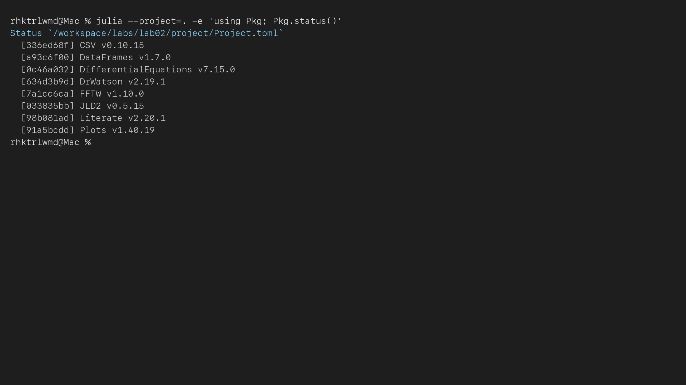{#fig-deps width=94%}

Основные команды воспроизведения: `make setup`, `make tangle`, `make run`,
`make notebooks`, `make docs` и `make test`. Полное описание среды находится в
`Project.toml`.



Листинг 1 — Полный файл `project/Project.toml`.

Автоматизация всех этапов записана в `Makefile`.



Листинг 2 — Полный файл `project/Makefile`.

## Общий модуль моделей

Модуль `BasicModels.jl` отделяет математические правые части и формирование
таблиц от конкретных опытов. Это исключает расхождения между базовыми и
параметрическими версиями.



Листинг 3 — Полный общий модуль `project/src/BasicModels.jl`.

## Базовая модель SIR

По методичке используются $S_0=990$, $I_0=10$, $R_0^{state}=0$,
$\beta=0{,}05$, $c=10$, $\gamma=0{,}25$, $t\in[0;40]$ и шаг сохранения
$0{,}1$. Здесь обозначение $R_0^{state}$ относится к начальному числу
выздоровевших и не смешивается с репродуктивным числом.

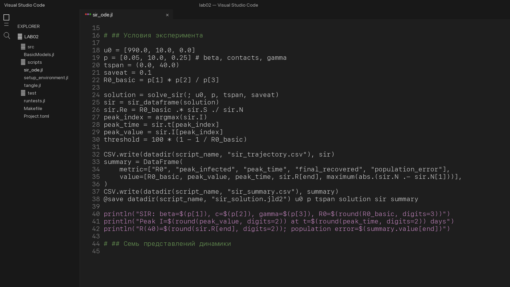{#fig-sir-code width=94%}

Ниже целиком включён QMD, автоматически полученный из литературного исходника
`scripts/sir_ode.jl`.



Листинг 4 — Полный литературный сценарий базовой модели SIR.

Для выбранных параметров $R_0=2$, теоретический порог иммунитета равен 50%.
Численный пик составляет 158,45 инфицированного и наблюдается на 17,5-й день.
К моменту $t=40$ в компоненте $R$ находится 775,69 человека.

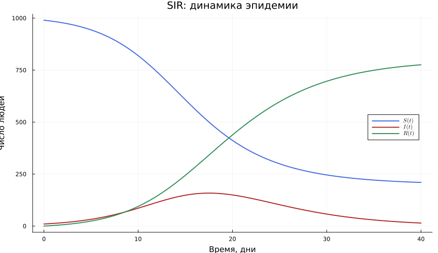{#fig-sir-main width=84%}

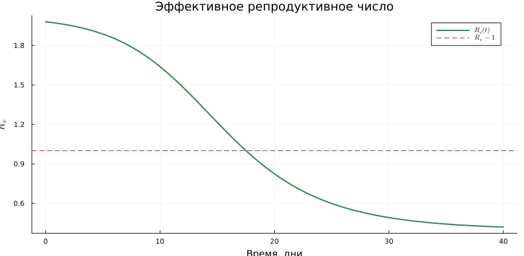{#fig-sir-re width=82%}

Фазовая траектория показывает однозначное уменьшение $S$ и рост $I$ до
пересечения порога $S/N=1/R_0$, после чего $I$ снижается.

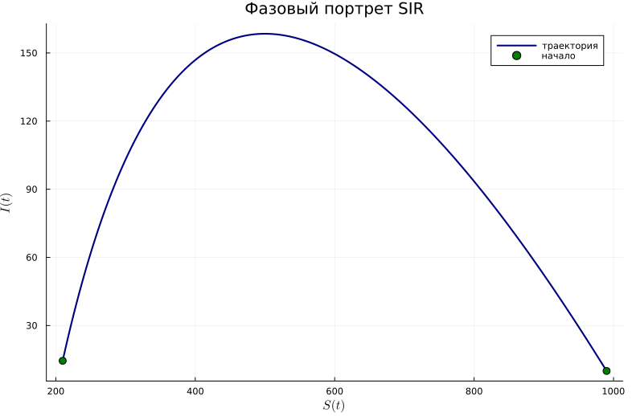{#fig-sir-phase width=78%}

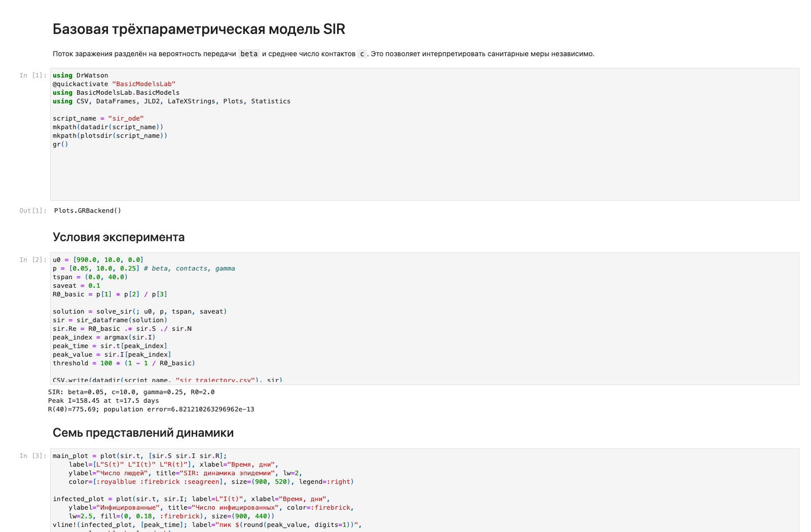{#fig-sir-notebook width=94%}

## Параметрическое исследование SIR

Отдельный полный факторный план содержит 36 сочетаний:

- $\beta\in\{0{,}025;0{,}04;0{,}055;0{,}07\}$;
- $c\in\{5;10;15\}$ контактов в день;
- $\gamma\in\{0{,}15;0{,}25;0{,}35\}$.

Для каждого опыта сохранены $R_0$, пик и время пика, $R(60)$, $S(60)$ и ошибка
баланса населения.



Листинг 5 — Полный литературный сценарий параметрической SIR.

| Показатель | Минимум | Максимум |
|---|---:|---:|
| $R_0$ | 0,357 | 7,000 |
| пик $I$ | 10,00 | 580,35 |
| время пика | 0,0 | 50,6 |
| $R(60)$ | 15,45 | 998,79 |

: Диапазоны результатов 36 опытов SIR {#tbl-sir-scan}

При $R_0<1$ максимум равен начальному $I_0=10$ и возникает при $t=0$.
Наиболее интенсивная вспышка получена для $\beta=0{,}07$, $c=15$,
$\gamma=0{,}15$: $R_0=7$, пик 580,35 на 7,2-й день, $R(60)=998{,}79$.

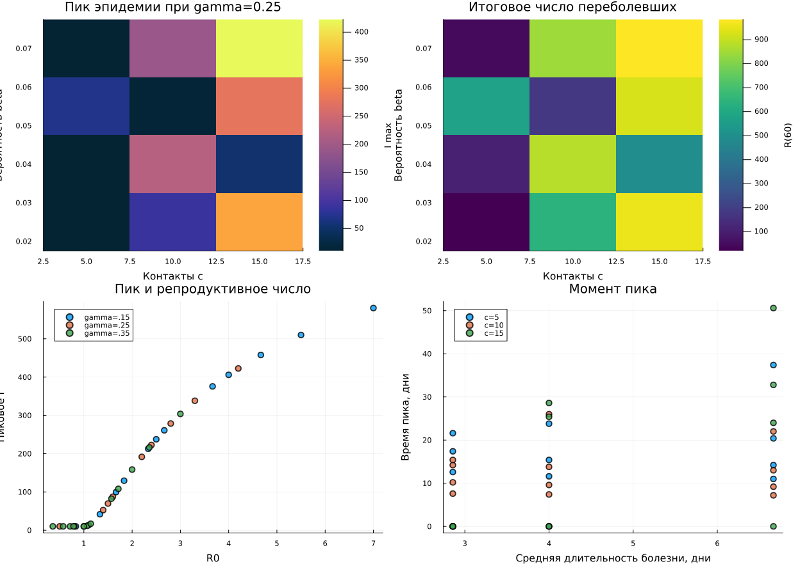{#fig-sir-grid width=94%}

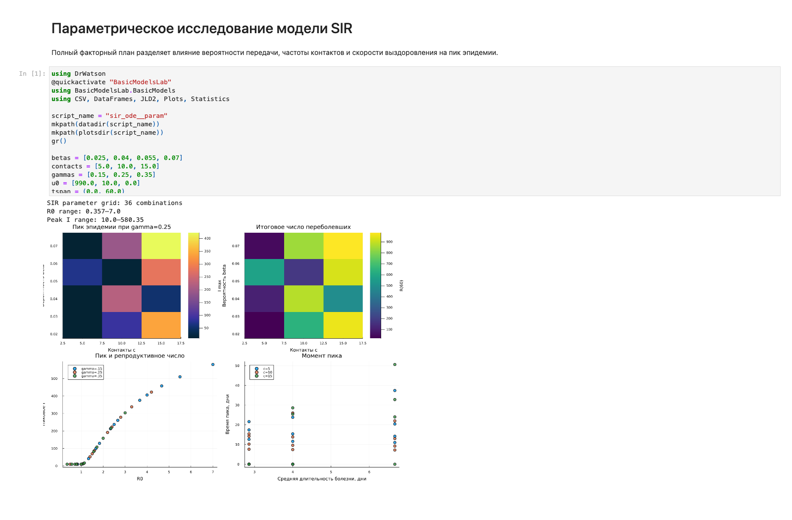{#fig-sir-param-notebook width=94%}

## Базовая модель Лотки–Вольтерры

Базовые параметры строго соответствуют примеру: $\alpha=0{,}1$,
$\beta=0{,}02$, $\delta=0{,}01$, $\gamma=0{,}3$, $x_0=40$, $y_0=9$,
$t\in[0;200]$, шаг сохранения $0{,}1$. Равновесие равно $(30;5)$.



Листинг 6 — Полный литературный сценарий базовой модели Лотки–Вольтерры.

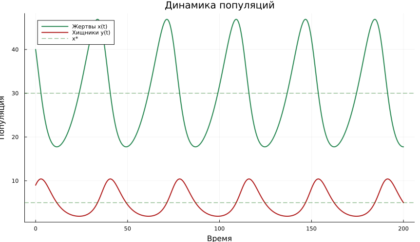{#fig-lv-dynamics width=84%}

Первый показанный пик жертв приходится на $t=33{,}7$, следующий пик хищников —
на $t=40{,}6$. Положительный лаг 6,9 подтверждает ожидаемую последовательность:
сначала растёт кормовая база, затем увеличивается популяция хищников.

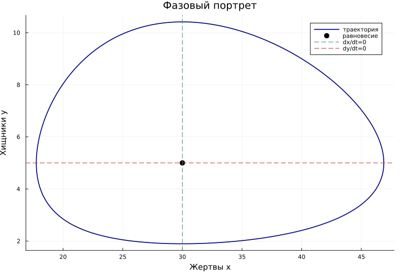{#fig-lv-phase width=78%}

Спектральная оценка периода равна 40,02, тогда как локальная линейная оценка
даёт 36,276. Разница объясняется конечной амплитудой орбиты.

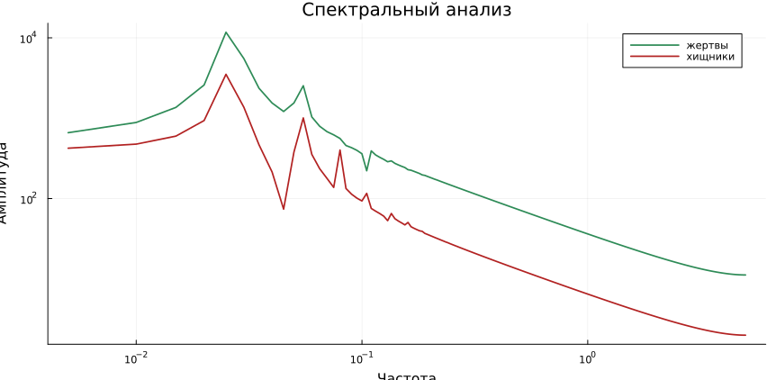{#fig-lv-spectrum width=82%}

Максимальный численный дрейф $V(t)-V(0)$ равен
$1{,}27\cdot10^{-9}$, поэтому замкнутая орбита не является следствием
заметного численного накопления ошибки.

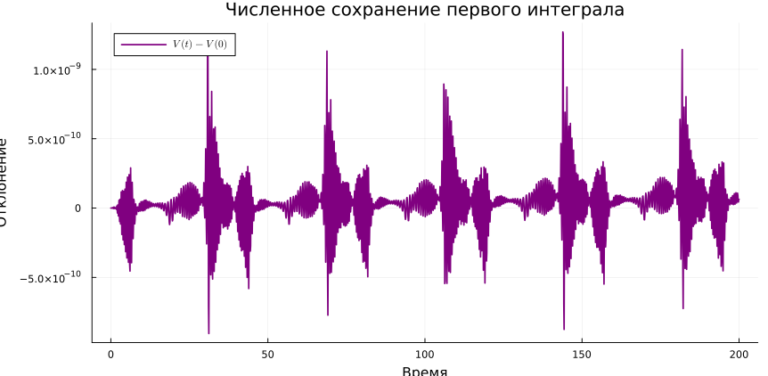{#fig-lv-invariant width=82%}

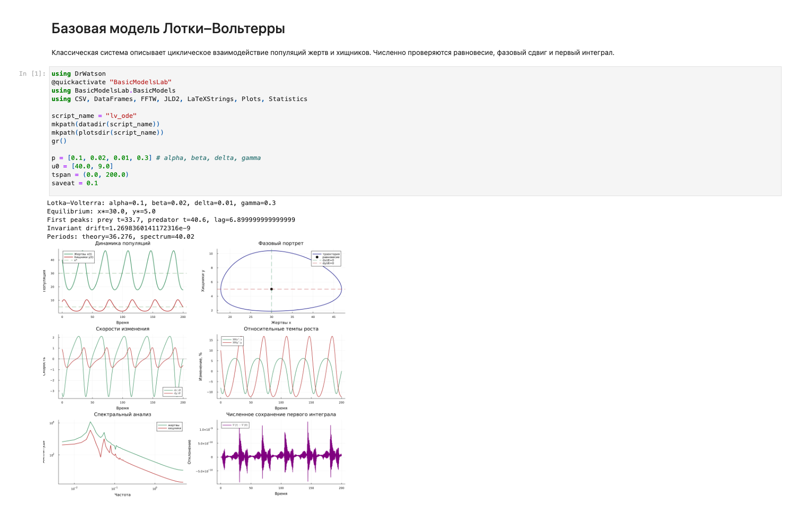{#fig-lv-notebook width=94%}

## Параметрическое исследование Лотки–Вольтерры

Согласно предложенному в методичке набору исследуются
$\alpha\in\{0{,}05;0{,}1;0{,}2;0{,}3\}$ и
$\gamma\in\{0{,}1;0{,}3;0{,}5;0{,}7\}$. Параметры взаимодействия
$\beta=0{,}02$ и $\delta=0{,}01$ фиксированы. Полный план содержит 16 опытов,
горизонт 600 обеспечивает не менее двух циклов во всех режимах.

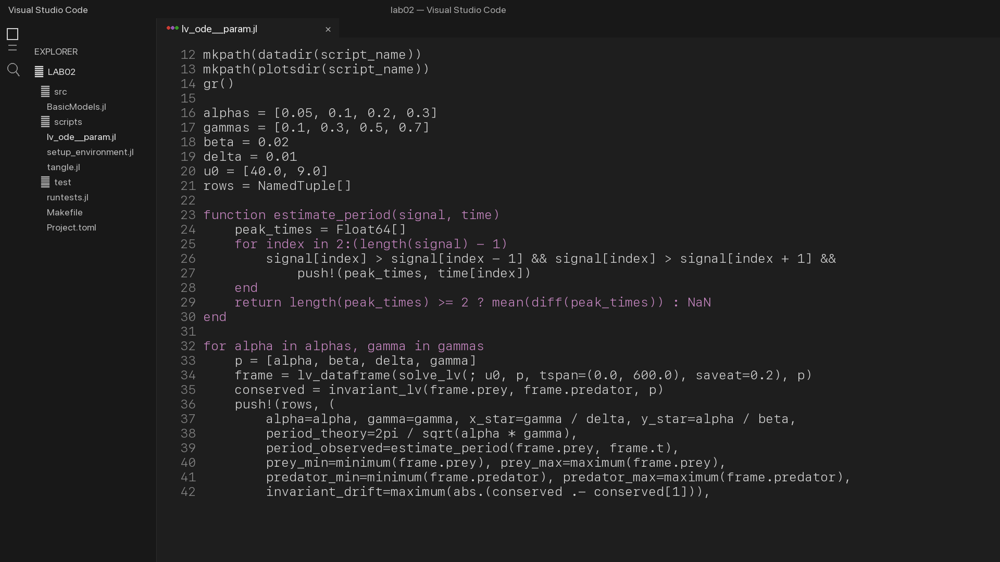{#fig-lv-code width=94%}



Листинг 7 — Полный литературный сценарий параметрической модели
Лотки–Вольтерры.

| Показатель | Минимум | Максимум |
|---|---:|---:|
| наблюдаемый период | 14,40 | 142,93 |
| максимум жертв | 40,14 | 128,03 |
| максимум хищников | 9,79 | 39,10 |
| дрейф инварианта | $1{,}40\cdot10^{-9}$ | $9{,}87\cdot10^{-9}$ |

: Диапазоны результатов 16 опытов Лотки–Вольтерры {#tbl-lv-scan}

Самый короткий период наблюдается при $\alpha=0{,}3$, $\gamma=0{,}7$;
самый длинный — при $\alpha=0{,}05$, $\gamma=0{,}1$. Направление изменения
согласуется с зависимостью $2\pi/\sqrt{\alpha\gamma}$, а различия по величине
характеризуют нелинейный режим конечной амплитуды.

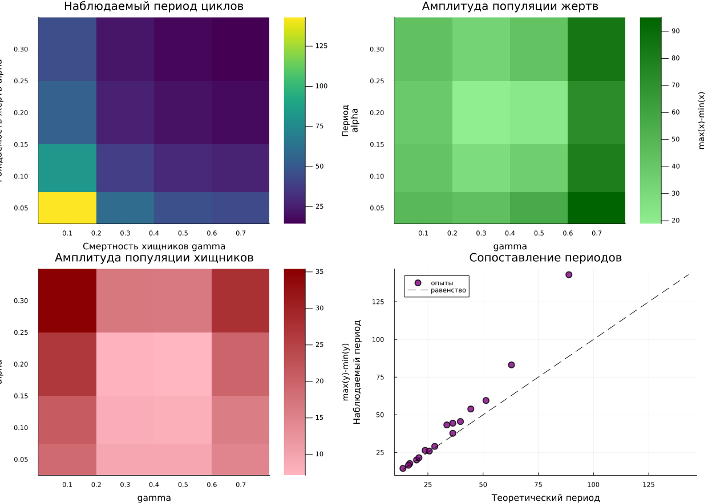{#fig-lv-grid width=94%}

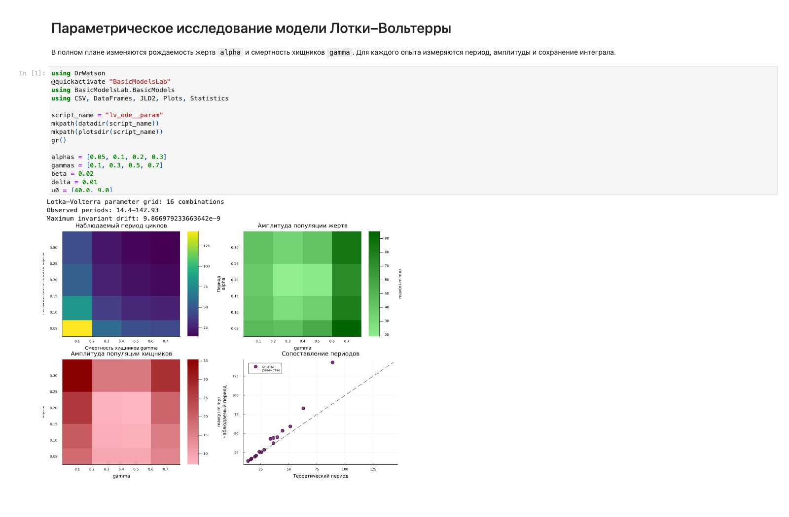{#fig-lv-param-notebook width=94%}

## Литературное программирование и производные форматы

Генератор создаёт для каждого из четырёх литературных исходников чистый
скрипт, notebook и QMD. Логика преобразования приведена полностью.



Листинг 8 — Полный генератор `project/scripts/tangle.jl`.

Ядро Jupyter устанавливается в то же изолированное окружение проекта.



Листинг 9 — Полная настройка окружения `setup_environment.jl`.

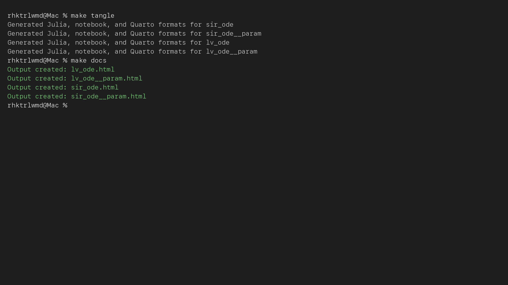{#fig-tangle width=94%}

Все четыре IPYNB выполнены ядром `julia-lab02-1.11`. В них отсутствуют ошибки,
каждый содержит сохранённый текстовый результат и итоговый график. HTML для
каждого QMD собран с внедрёнными ресурсами.

## Автоматические проверки

Тесты SIR контролируют 401 временную точку, неотрицательность компонент,
сохранение населения, существование эпидемического пика и направление потоков.
Тесты Лотки–Вольтерры проверяют 2001 точку, положительность популяций, наличие
локальных пиков и сохранение первого интеграла.



Листинг 10 — Полный файл `project/test/runtests.jl`.

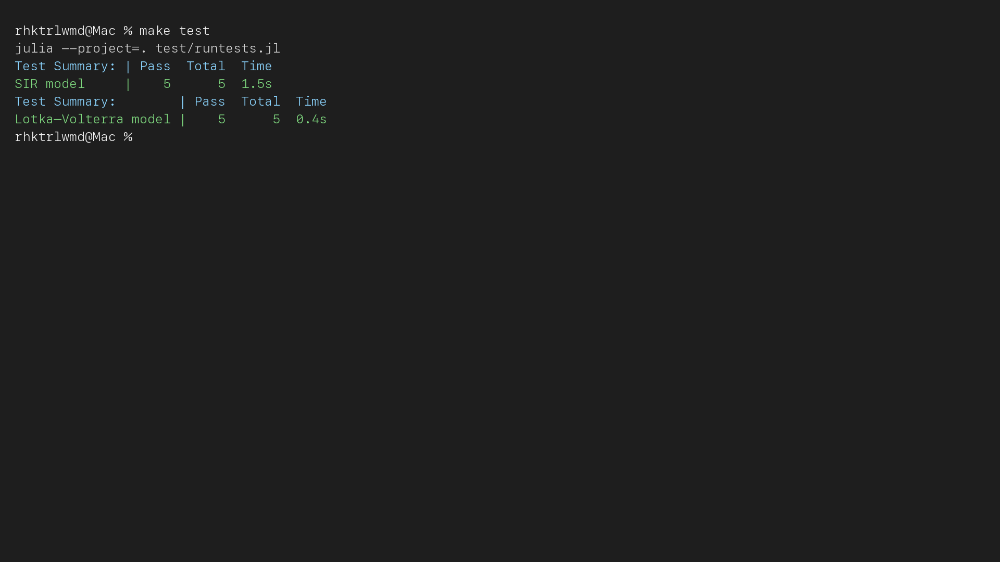{#fig-tests width=94%}

# Выводы

В работе реализованы обе предусмотренные методичкой базовые модели и два
отдельных параметрических сценария. Для SIR численно подтверждены сохранение
населения, условие роста через $R_0$ и прохождение пика при снижении $R_e$.
Для модели Лотки–Вольтерры получены циклы со сдвигом фаз, замкнутый фазовый
портрет, спектральная оценка периода и сохранение первого интеграла.

Сформированы четыре литературных исходника, четыре чистых Julia-скрипта,
четыре QMD, четыре HTML-документа и четыре выполненных IPYNB. Базовые и
параметрические вычисления сохранили CSV, JLD2 и 24 графических результата.
Все десять автоматических проверок завершены успешно.

# Список литературы {.unnumbered}

::: {#refs}
:::
