# Информация

## Докладчик

:::::::::::::: {.columns align=center}
::: {.column width="72%"}

- Исаева Зарина Исмайилбековна
- Студентка
- Российский университет дружбы народов имени Патриса Лумумбы
- Студенческий билет: 1132232882

:::
::: {.column width="28%"}

{width=78%}

:::
::::::::::::::

# Цель и задачи

## Цель работы

- построить агентную модель Daisyworld на периодической клеточной сетке
- исследовать связь популяций, альбедо и температуры
- выполнить базовые и параметрические сценарии
- подготовить воспроизводимые JL, IPYNB, QMD и HTML

## Состав задания

| Группа | Сценарии |
|---|---:|
| пространственная визуализация | 2 |
| численность популяций | 2 |
| динамика светимости | 2 |
| анимация | 1 |
| **Всего** | **7** |

- параметрический план содержит четыре сочетания условий
- каждый notebook выполнен с сохранёнными результатами

# Агентная модель

## Агенты и среда

:::::::::::::: {.columns align=center}
::: {.column width="46%"}

**Агент Daisy**

- вид: чёрный или белый
- возраст
- альбедо
- одна занятая клетка

**Среда**

- решётка $30\times30$
- периодические границы
- поле локальной температуры

:::
::: {.column width="54%"}

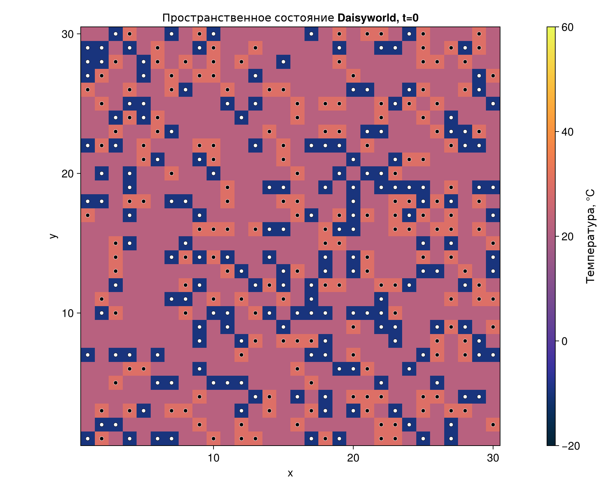

:::
::::::::::::::

## Локальные правила

1. клетка нагревается с учётом альбедо
2. температура диффундирует по восьми соседям
3. растение пытается заселить свободную соседнюю клетку
4. возраст увеличивается, старые агенты удаляются
5. светимость меняется по выбранному сценарию

## Температура клетки

$$
Q=(1-A)L,\qquad T_{local}=72\ln Q+80.
$$

- малое альбедо увеличивает поглощение
- чёрные маргаритки нагревают клетку сильнее
- белые маргаритки отражают большую долю излучения
- синхронная диффузия не зависит от порядка обхода сетки

## Вероятность размножения

$$
p(T)=\max\left(0,\min\left(1,\,
0{,}1457T-0{,}0032T^2-0{,}6443\right)\right)
$$

- вероятность ограничена диапазоном от 0 до 1
- размножение возможно только в благоприятной области
- вид потомка совпадает с видом родительского агента

# Реализация

## Структура проекта

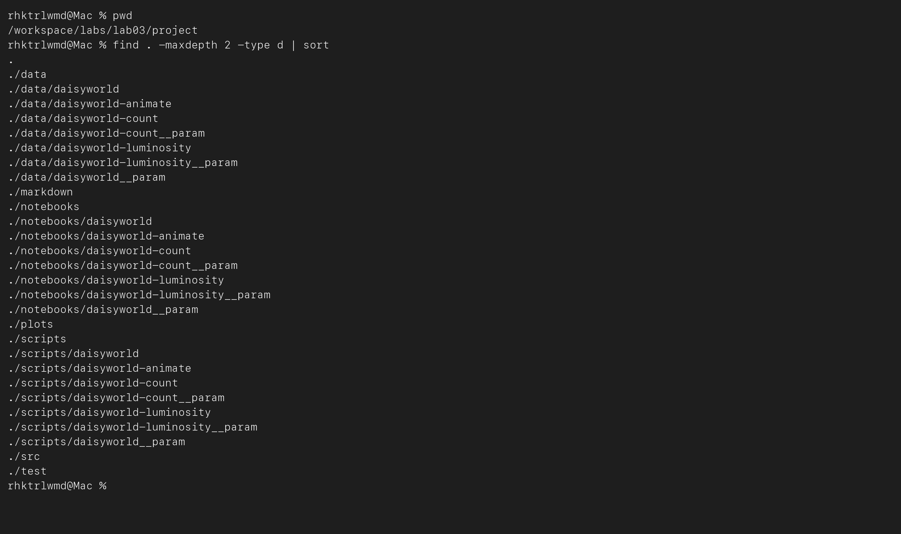{height=510}

- модуль модели отделён от семи сценариев
- таблицы, графики и производные форматы сгруппированы по опыту

## Общий модуль

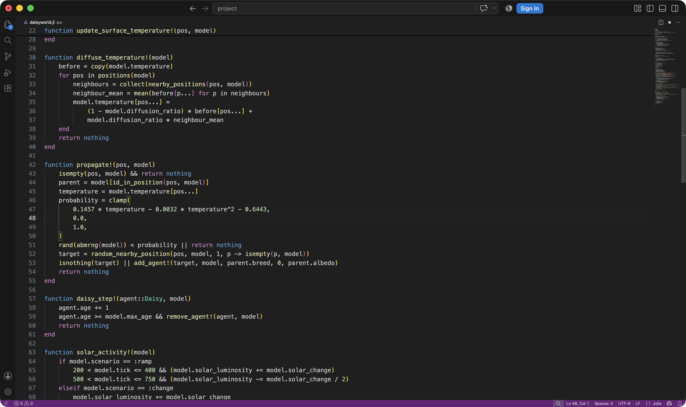{height=515}

- проверка всех диапазонов параметров
- воспроизводимый генератор MersenneTwister
- единая функция наблюдения для всех экспериментов

## Базовые параметры

| Параметр | Значение |
|---|---:|
| размер сетки | $30\times30$ |
| max_age | 25 |
| init_white, init_black | 0,2; 0,2 |
| albedo_white, albedo_black | 0,75; 0,25 |
| surface_albedo | 0,4 |
| diffusion_ratio | 0,5 |
| seed | 165 |

# Пространственная эволюция

## Начальное состояние

{height=485}

| Чёрные | Белые | Свободные | Температура |
|---:|---:|---:|---:|
| 180 | 180 | 540 | 16,91 °C |

## Быстрое заполнение сетки

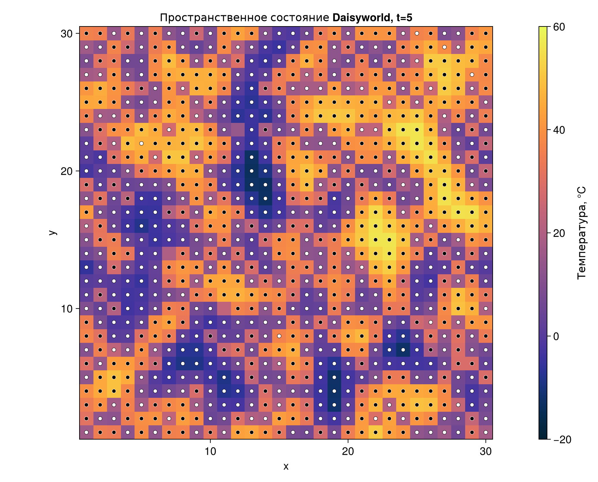{height=485}

| Чёрные | Белые | Свободные | Температура |
|---:|---:|---:|---:|
| 457 | 440 | 3 | 23,03 °C |

## Состояние на шаге 45

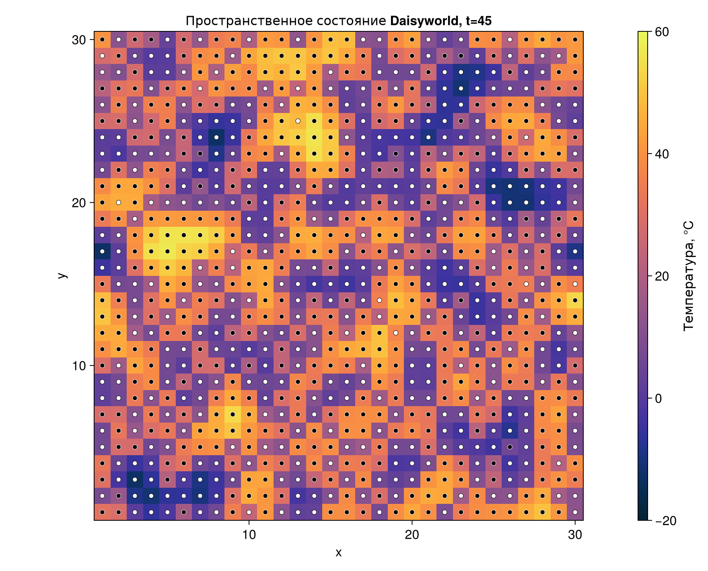{height=485}

| Чёрные | Белые | Свободные | Температура |
|---:|---:|---:|---:|
| 469 | 431 | 0 | 21,70 °C |

## Анимация

:::::::::::::: {.columns align=center}
::: {.column width="58%"}

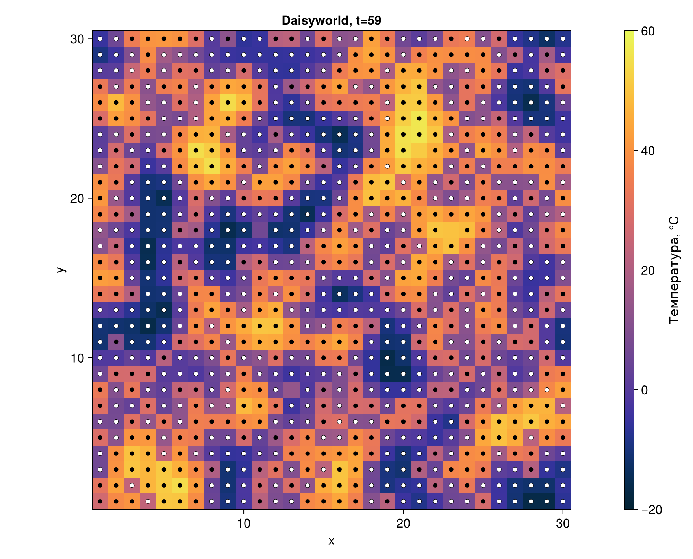

:::
::: {.column width="42%"}

- 60 последовательных состояний
- частота 10 кадров/с
- MP4 длительностью 6 секунд
- отдельный CSV из 60 наблюдений
- фиксированный seed

:::
::::::::::::::

# Динамика популяций

## Базовая численность

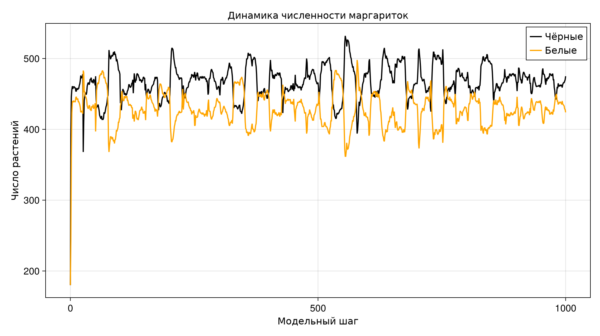{height=465}

- оба вида сохраняются на всём горизонте
- к шагу 1000: 475 чёрных и 424 белые
- максимумы: 532 и 498 растений

## Светимость ramp

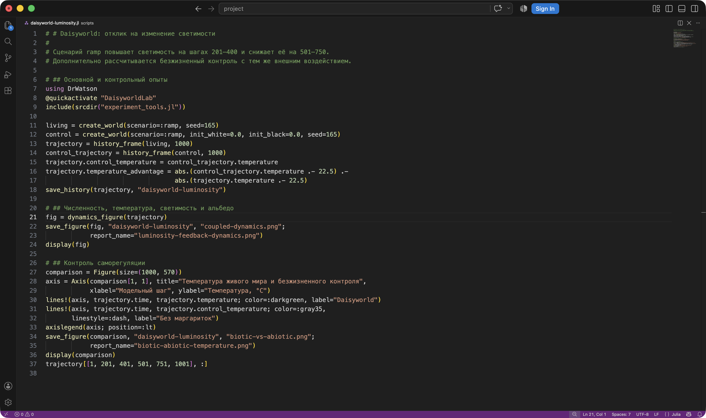{height=500}

- рост $L$: шаги 201–400
- плато $L=2$: шаги 401–500
- снижение: шаги 501–750
- окончательное значение $L=1{,}375$

## Связанная динамика

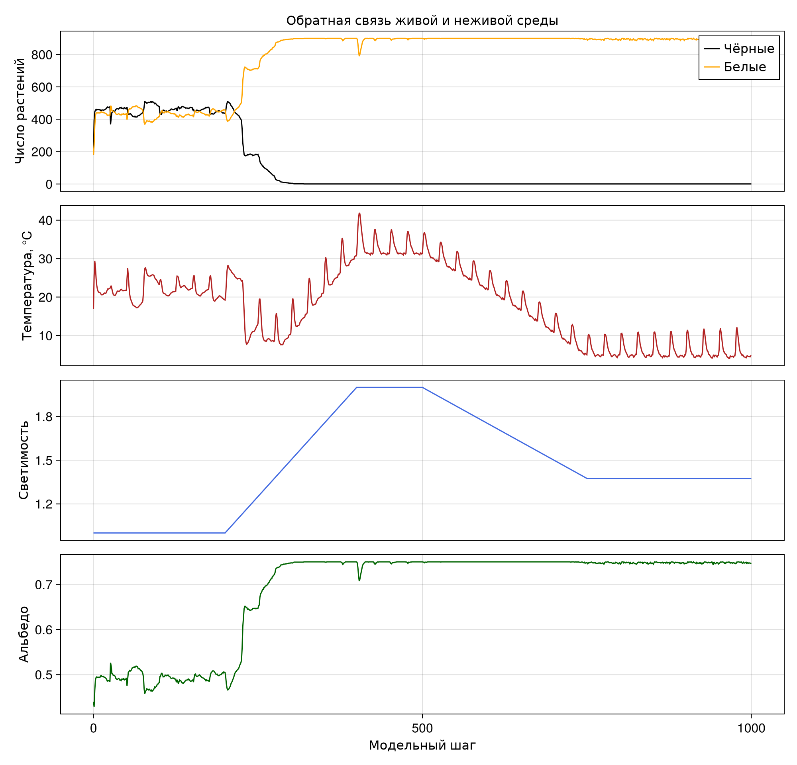{height=520}

- рост светимости вызывает замещение чёрных растений белыми
- к шагу 400 все клетки заняты белыми маргаритками

## Биотический и абиотический мир

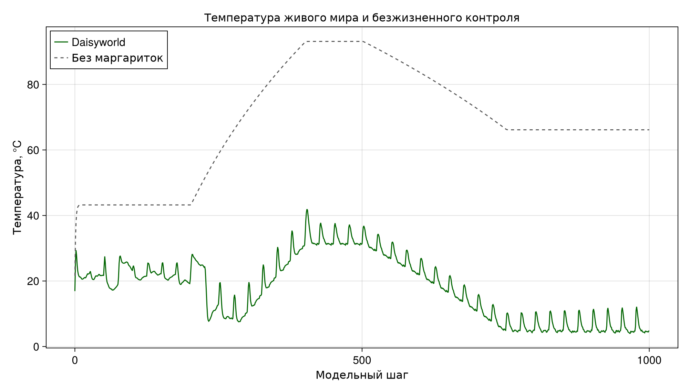{height=475}

- при $L=2$ контроль без растений достигает 93,13 °C
- Daisyworld удерживает 31,35 °C
- максимальное уменьшение отклонения: 62,32 °C

## Предел саморегуляции

| Шаг | Светимость | Чёрные | Белые | Температура |
|---:|---:|---:|---:|---:|
| 200 | 1,000 | 438 | 458 | 19,21 °C |
| 400 | 2,000 | 0 | 900 | 31,03 °C |
| 500 | 2,000 | 0 | 900 | 31,35 °C |
| 750 | 1,375 | 0 | 896 | 4,95 °C |
| 1000 | 1,375 | 0 | 894 | 4,79 °C |

- после быстрого снижения светимости состав популяции перестраивается медленно

# Параметрическое исследование

## План эксперимента

| Опыт | max_age | init_white | init_black |
|---:|---:|---:|---:|
| 1 | 25 | 0,2 | 0,2 |
| 2 | 25 | 0,8 | 0,2 |
| 3 | 40 | 0,2 | 0,2 |
| 4 | 40 | 0,8 | 0,2 |

- каждый опыт повторён для пространственного, численного и светового сценария

## Пространственные состояния

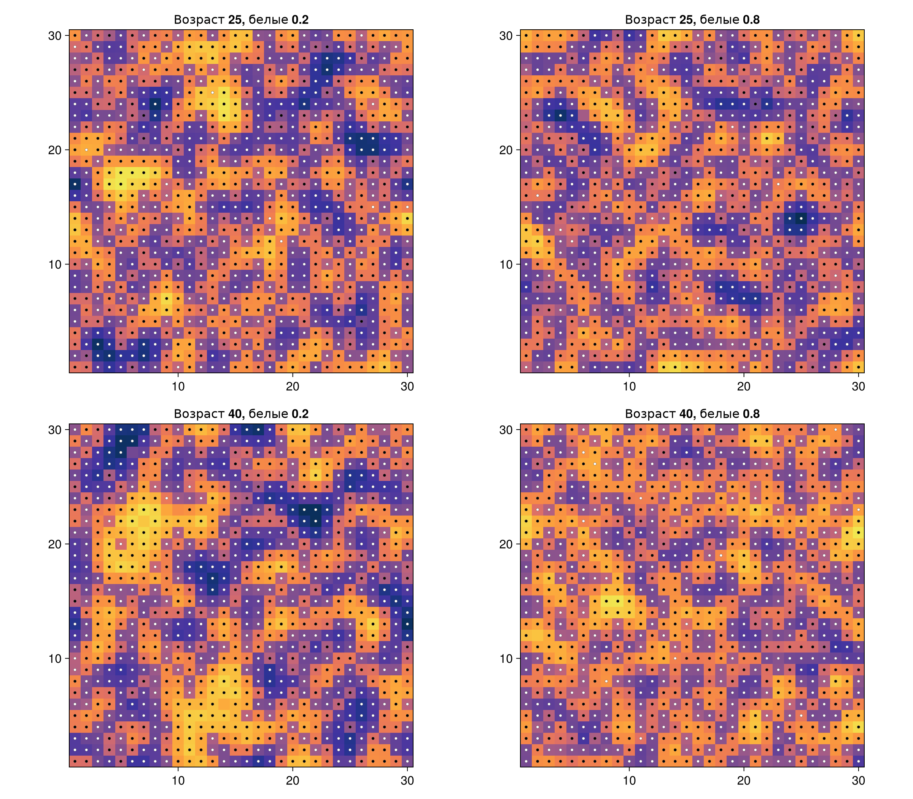{height=520}

- сравниваются четыре состояния на шаге 45
- увеличение возраста уменьшает частоту освобождения клеток

## Численность при разных параметрах

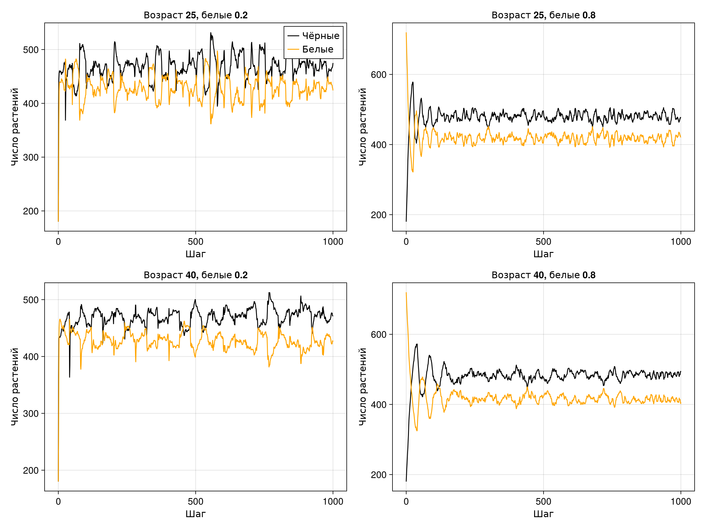{height=500}

- ни одна популяция не вымерла
- все траектории содержат 1001 сохранённое состояние

## Ошибка регулирования

| max_age | init_white | Средняя ошибка |
|---:|---:|---:|
| 25 | 0,2 | 1,679 °C |
| 25 | 0,8 | 1,374 °C |
| 40 | 0,2 | **1,200 °C** |
| 40 | 0,8 | 1,500 °C |

- лучший результат базовой светимости: возраст 40 и начальная доля белых 0,2

## Температура в сценарии ramp

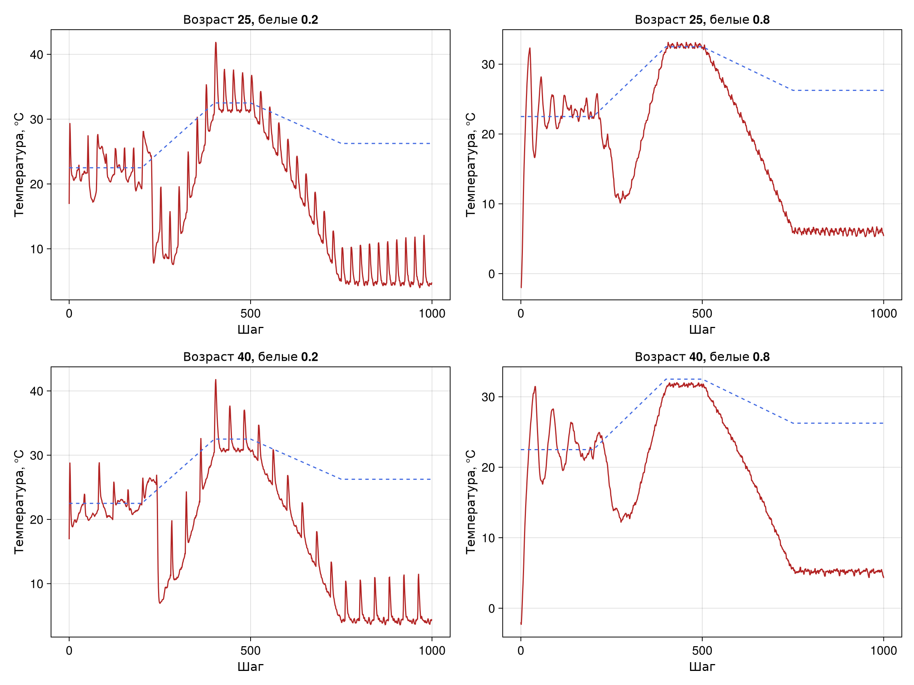{height=500}

- максимум находится в диапазоне 32,04–41,91 °C
- большая начальная доля белых ограничивает верхний температурный максимум

# Воспроизводимость

## Литературный процесс

1. один комментированный JL служит первичным исходником
2. Literate формирует чистый JL, QMD и IPYNB
3. notebook выполняется в окружении проекта
4. Quarto собирает самостоятельный HTML
5. QMD-фрагмент целиком включается в отчёт

## Выполненные notebooks

:::::::::::::: {.columns align=center}
::: {.column width="50%"}
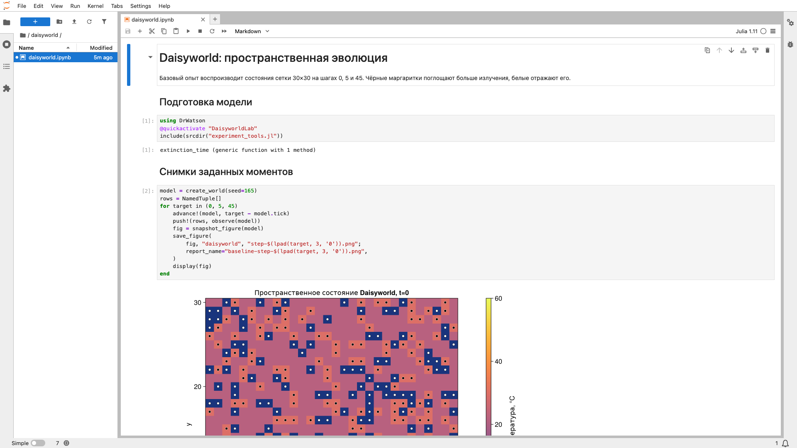
:::
::: {.column width="50%"}
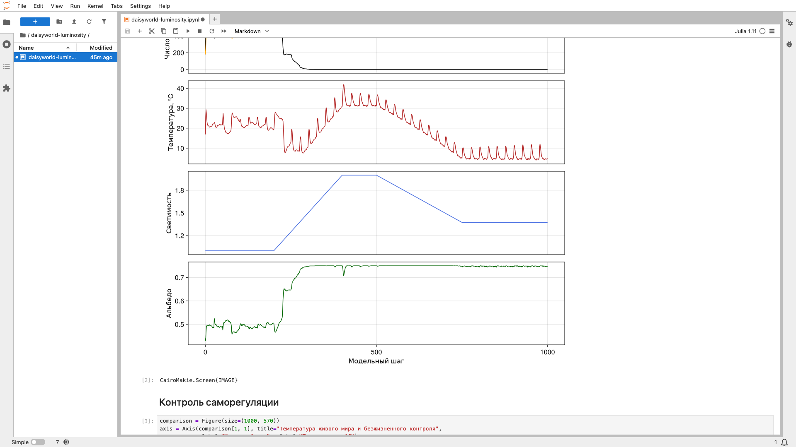
:::
::::::::::::::

- сохранены номера выполнения, таблицы и встроенные графики

## Параметрический notebook

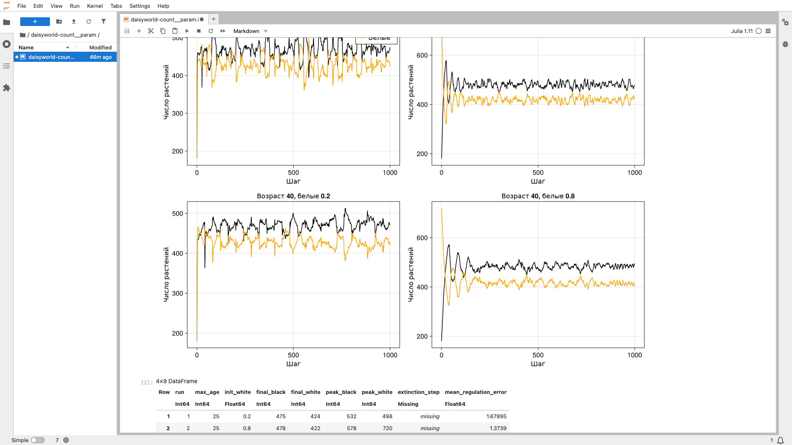{height=500}

- показаны все четыре сочетания условий
- результат получен из того же литературного источника

# Проверка

## Автоматические тесты

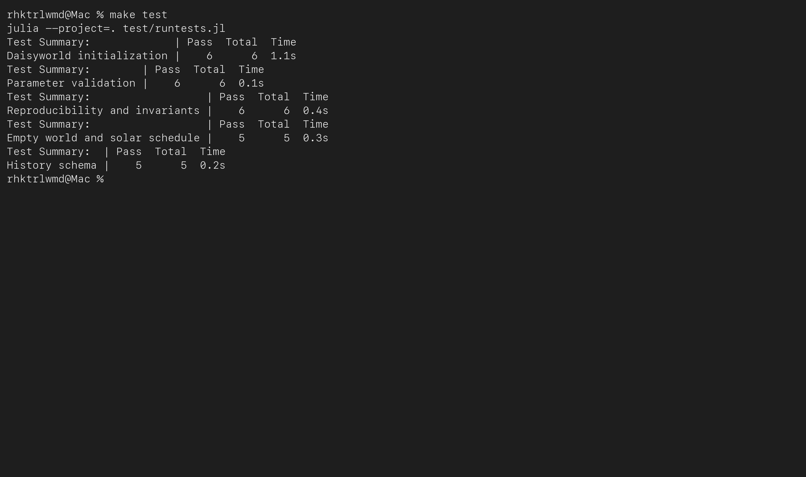{height=500}

- 28 проверок завершены успешно
- проверены ограничения, воспроизводимость и баланс клеток
- отдельно проверен точный график изменения светимости

## Полнота производных форматов

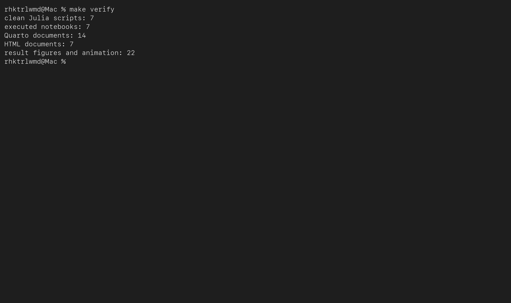{height=500}

| Формат | Количество |
|---|---:|
| чистые JL | 7 |
| выполненные IPYNB | 7 |
| QMD | 7 |
| HTML | 7 |

# Выводы

## Основные результаты

- выполнены все семь сценариев главы 3
- подтверждена локальная температурная обратная связь
- в постоянных условиях оба вида сохраняются 1000 шагов
- биота сильно уменьшает перегрев относительно контроля
- быстрый спад светимости выявляет предел адаптации
- полный проект воспроизводится командами Makefile
- безжизненный контроль отделяет действие биоты от внешнего нагрева
