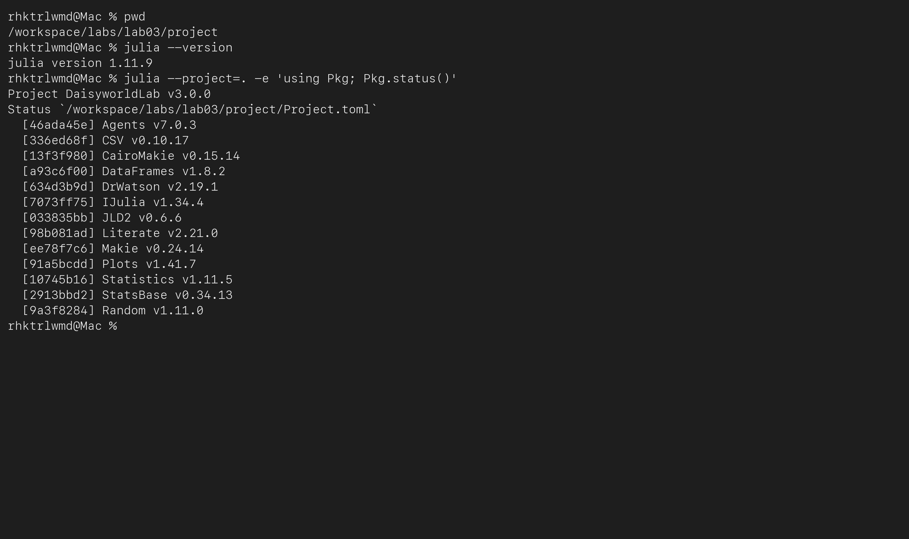



# Содержание {.unnumbered}

1. Цель работы
2. Задание
3. Теоретическое введение
4. Выполнение лабораторной работы
5. Выводы
6. Список литературы



# Список иллюстраций {.unnumbered}

1. Структура проекта и окружение Julia
2. Модуль модели в VS Code
3. Состояния сетки на шагах 0, 5 и 45
4. Финальный кадр анимации
5. Динамика численности
6. Связанная динамика температуры и светимости
7. Сравнение живого мира с безжизненным контролем
8. Три параметрических исследования
9. Выполненные Jupyter notebooks
10. Автоматические проверки



# Цель работы

**Цель работы** — построить агентную модель Daisyworld на клеточной сетке,
исследовать обратную связь между популяциями чёрных и белых маргариток,
температурой поверхности и внешней светимостью, а также оформить семь
вычислительных сценариев в воспроизводимом литературном проекте Julia.

# Задание

Согласно главе 3 практикума [@rudn_simulation_manual] необходимо:

1. создать проект и установить необходимые пакеты;
2. реализовать общий модуль **src/daisyworld.jl**;
3. выполнить базовую визуализацию состояний сетки;
4. записать 60 кадров анимации;
5. рассчитать динамику численности на 1000 шагах;
6. исследовать численность, температуру, альбедо и светимость в сценарии ramp;
7. повторить пространственный, численный и световой опыты для четырёх
   сочетаний max_age ∈ {25, 40} и init_white ∈ {0,2; 0,8};
8. получить из каждого литературного исходника чистый JL, выполненный IPYNB,
   QMD и HTML;
9. интегрировать полные QMD-фрагменты в отчёт и проверить модель тестами.

# Теоретическое введение

## Агентный подход

В агентной модели глобальная динамика возникает из локальных правил отдельных
агентов. Каждый агент хранит состояние, занимает позицию в среде и изменяется
при выполнении шага. Agents.jl предоставляет клеточные пространства,
планировщик, генератор случайных чисел и операции добавления и удаления
агентов [@agentsjl2022].

В Daisyworld агентами служат чёрные и белые маргаритки, а средой — периодическая
решётка $30\times30$. Каждый агент характеризуется видом, возрастом и альбедо.
Чёрные растения сильнее нагревают клетку, белые сильнее отражают свет.

## Механизм Daisyworld

Модель Уотсона и Лавлока показывает, как биота может расширить диапазон
внешних условий, при которых сохраняется пригодная температура
[@watson1983daisyworld]. Она не задаёт глобальный термостат. Саморегуляция
возникает из конкуренции двух видов за свободные клетки и зависимости
размножения от локальной температуры. Обзор вариантов Daisyworld показывает,
что результат зависит от пространственной структуры, правил смерти, диффузии
и скорости изменения светимости [@wood2008daisyworld].

## Температура и размножение

Для клетки с альбедо $A$ и светимостью $L$ используется поглощённое излучение
$Q=(1-A)L$. Целевая локальная температура вычисляется как

$$
T_{local}=72\ln Q+80,\qquad Q>0.
$$

После локального нагрева половина температурного поля диффундирует по восьми
соседям. Вероятность прорастания семени равна

$$
p(T)=\max\left(0,\min\left(1,\,
0{,}1457T-0{,}0032T^2-0{,}6443\right)\right).
$$

Агент стареет на каждом шаге и удаляется при достижении максимального возраста.
Освободившуюся клетку может занять семя соседнего растения.

# Выполнение лабораторной работы

## Окружение и структура проекта

Проект разделён на модуль модели, общие средства экспериментов, семь
литературных сценариев, тесты, таблицы, графики и производные документы.
DrWatson задаёт устойчивые пути к данным и результатам [@drwatson2020].

{#fig-layout width=94%}

{#fig-packages width=94%}



Листинг 1 — полный файл `project/Project.toml`.



Листинг 2 — полный файл `project/Makefile`.



Листинг 3 — настройка окружения и ядра Jupyter.

## Общий модуль модели

Модуль проверяет входные параметры, создаёт периодическую сетку, размещает
агентов без пересечений и выполняет локальный нагрев, синхронную диффузию,
распространение семян и изменение светимости. Копия температурного поля
исключает зависимость диффузии от порядка обхода клеток.

{#fig-module width=94%}



Листинг 4 — полный модуль `project/src/daisyworld.jl`.



Листинг 5 — общие средства экспериментов и визуализации.

## Базовая пространственная визуализация

Базовые параметры: сетка $30\times30$, возраст 25, начальные доли обоих видов
0,2, альбедо белых 0,75, чёрных 0,25, почвы 0,4, светимость 1 и seed 165.



Листинг 6 — литературный сценарий `scripts/daisyworld.jl`.

:::::::::::::: {.columns}
::: {.column width="33%"}
{#fig-step0}
:::
::: {.column width="33%"}
{#fig-step5}
:::
::: {.column width="33%"}
{#fig-step45}
:::
::::::::::::::

На шаге 0 имеется по 180 растений каждого вида, средняя температура равна
16,91 °C. К шагу 5 занято 897 клеток, температура повышается до 23,03 °C.
На шаге 45 сетка полностью занята: 469 чёрных и 431 белая маргаритка,
температура составляет 21,70 °C.

## Анимация модели

Отдельный сценарий сохраняет 60 последовательных состояний в MP4 с частотой
10 кадров/с. Вместе с видео записывается CSV с наблюдаемыми величинами.



Листинг 7 — сценарий `scripts/daisyworld-animate.jl`.

{#fig-animation width=72%}

## Динамика численности



Листинг 8 — сценарий `scripts/daisyworld-count.jl`.

{#fig-count width=88%}

За 1000 шагов оба вида сохраняются. Конечное состояние содержит 475 чёрных и
424 белые маргаритки; максимумы равны 532 и 498. Полного вымирания нет.

## Изменение светимости

В сценарии ramp светимость возрастает от 1 до 2 на шагах 201–400, сохраняется
до шага 500 и затем уменьшается до 1,375 на шагах 501–750.

{#fig-lum-code width=94%}



Листинг 9 — сценарий `scripts/daisyworld-luminosity.jl`.

{#fig-dynamics width=76%}

При росте светимости белые маргаритки вытесняют чёрные и повышают среднее
альбедо. На шаге 400 все 900 клеток заняты белыми растениями, а средняя
температура равна 31,03 °C. После снижения светимости популяция остаётся
преимущественно белой, поэтому к шагу 1000 температура уменьшается до 4,79 °C.
Это показывает предел адаптации при быстром внешнем воздействии.

{#fig-control width=88%}

При светимости 2 контроль без маргариток достигает примерно 93,13 °C, тогда
как Daisyworld удерживает 31,35 °C. Наибольшее уменьшение отклонения от
22,5 °C составляет 62,32 °C.

## Пространственный параметрический сценарий



Листинг 10 — сценарий `scripts/daisyworld__param.jl`.

{#fig-param-space width=88%}

Все сочетания приводят к высокой занятости сетки, но различаются балансом
видов. Увеличение возраста до 40 уменьшает частоту освобождения клеток.

## Параметрическая динамика численности



Листинг 11 — сценарий `scripts/daisyworld-count__param.jl`.

{#fig-param-count width=92%}

Ни один опыт не завершился вымиранием. Средняя абсолютная ошибка относительно
22,5 °C находится в диапазоне 1,20–1,68 °C. Наименьшее значение получено при
max_age=40 и init_white=0,2.

## Параметрический отклик на светимость



Листинг 12 — сценарий `scripts/daisyworld-luminosity__param.jl`.

{#fig-param-temp width=92%}

Во всех опытах агенты присутствуют в каждом из 1001 сохранённого состояния.
Максимальная температура составляет 32,04–41,91 °C. Большая начальная доля
белых маргариток ограничивает нагрев, но усиливает переохлаждение после
снижения светимости.

## Литературное программирование и notebooks

Один исходник используется для получения чистого скрипта, QMD и notebook,
сохраняя связь объяснения и выполняемого кода [@knuth1984literate].



Листинг 13 — генератор производных форматов `scripts/tangle.jl`.

:::::::::::::: {.columns}
::: {.column width="50%"}
{#fig-nb-base}
:::
::: {.column width="50%"}
{#fig-nb-lum}
:::
::::::::::::::

{#fig-nb-param width=88%}

Во всех семи IPYNB заполнены номера выполнения, отсутствуют ошибки и сохранены
числовые либо табличные результаты вместе со встроенными изображениями.

## Автоматические проверки



Листинг 14 — полный файл `test/runtests.jl`.

{#fig-tests width=94%}

{#fig-artifacts width=94%}

Проверены начальные количества, уникальность позиций, ограничения параметров,
воспроизводимость, возраст агентов, диапазон альбедо, пустой мир, участки
сценария ramp и баланс 900 клеток.

# Выводы

Реализована пространственная агентная модель Daisyworld и выполнены все семь
сценариев главы 3 практикума. Получены базовые состояния, анимация,
1000-шаговые траектории и три параметрических исследования. При постоянной
светимости два вида формируют устойчивое заполнение сетки. Сопоставление с
безжизненным контролем показывает, как белые растения уменьшают нагрев, но
после снижения светимости медленная перестройка
состава приводит к переохлаждению.

Из семи литературных исходников сформированы и выполнены семь чистых JL,
семь Jupyter notebooks, семь QMD и семь HTML-документов. Модель и результаты
проверены 28 автоматическими тестами.

# Список литературы{.unnumbered}

::: {#refs}
:::
