# Информация

## Докладчик

- Исаева Зарина Исмайилбековна
- студент Российского университета дружбы народов имени Патриса Лумумбы
- студенческий билет: **1132232882**
- дисциплина: «Имитационное моделирование»

## Содержание

1. Цель и постановка задачи
2. Модель и программная реализация
3. Базовый опыт и параметрический вариант
4. Порог и гетерогенность
5. Миграция и карантин
6. Многокритериальная оптимизация
7. Воспроизводимость и выводы

# Постановка задачи

## Актуальность

- компартментальная SIR предполагает однородное перемешивание
- города различаются контактами и миграционными потоками
- случайное угасание особенно важно при малом числе источников
- агентный подход сохраняет индивидуальные состояния и события

## Цель

Реализовать агентную SIR-модель для системы городов и количественно оценить:

- порог эпидемии;
- влияние неоднородности и миграции;
- эффективность карантина;
- параметры управления при ограничении пика 30%.

## Задачи

1. реализовать состояния S, I, R и граф городов;
2. выполнить пять основных сценариев главы 4;
3. закрыть шесть дополнительных заданий;
4. выполнить многокритериальный эволюционный поиск;
5. сформировать JL, IPYNB, QMD и HTML из литературных исходников.

# Модель

## Классическая система SIR

$$
\frac{dS}{dt}=-\beta\frac{SI}{N},\qquad
\frac{dI}{dt}=\beta\frac{SI}{N}-\gamma I,\qquad
\frac{dR}{dt}=\gamma I.
$$

$$
R_0=\frac{\beta}{\gamma}=\beta T_{inf}.
$$

- для $\beta=0{,}5$ и $T_{inf}=14$: **$R_0=7$**

## Состояние агента

| Поле | Смысл |
|---|---|
| `status` | `:S`, `:I` или `:R` |
| `days_infected` | число дней после заражения |
| `pos` | номер города в графе |
| `id` | уникальный идентификатор Agents.jl |

## Один модельный день

1. попытка миграции по строке вероятностной матрицы;
2. пуассоновское число локальных попыток заражения;
3. уменьшение заразности после выявления;
4. увеличение длительности болезни;
5. выздоровление или смерть;
6. пересчёт городов, закрытых карантином.

## Параметры базового опыта

| Параметр | Значение |
|---|---:|
| Население | 1000 + 1000 + 1000 |
| $\beta_{und}$ / $\beta_{det}$ | 0,5 / 0,05 |
| Период инфекции | 14 дней |
| Выявление | 7-й день |
| Смертность / реинфекция | 0,02 / 0,1 |
| Начальные I | 0, 0, 1 |

# Базовый опыт

## Динамика SIR

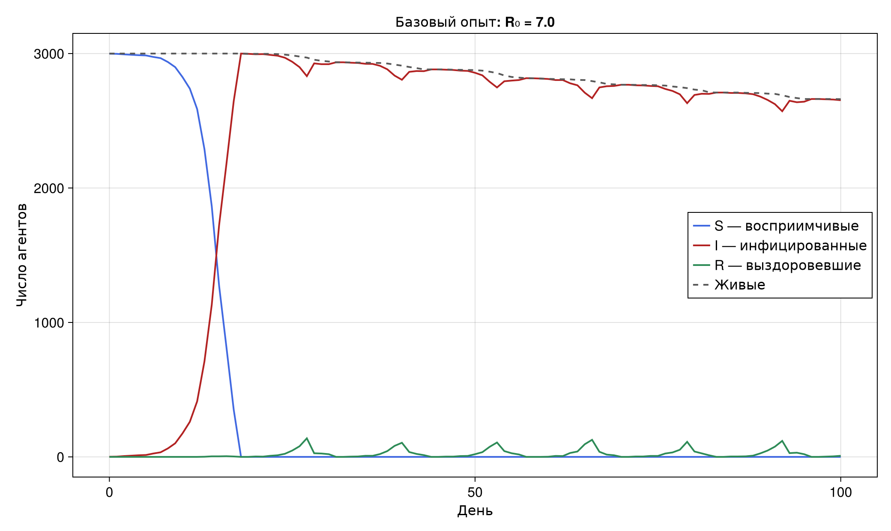{height=510}

- пик достигается на 18-й день
- высокий $R_0$ быстро охватывает все города
- к 100-му дню зарегистрировано 339 смертей

## Параметрический вариант

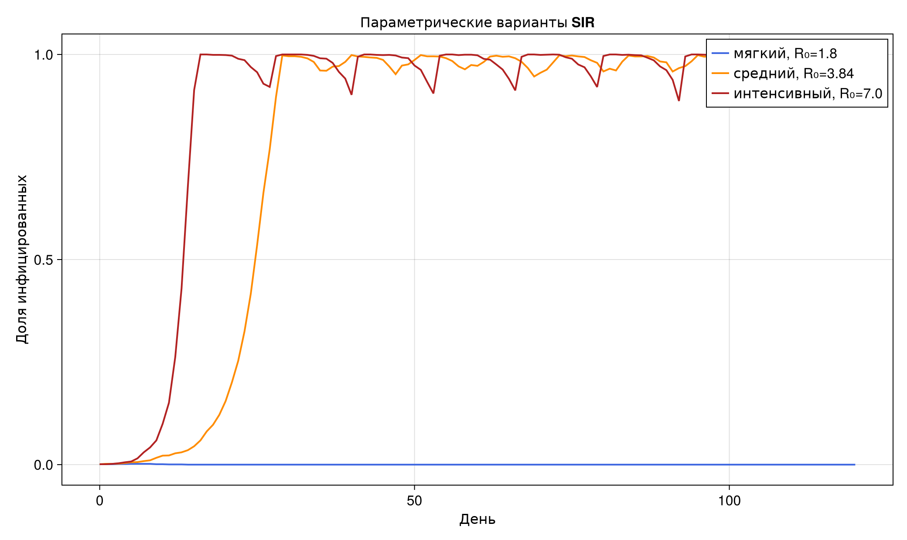{height=510}

- $R_0=1{,}8$: стохастическое угасание, пик 0,19%
- $R_0=3{,}84$ и 7: крупные эпидемические волны

## Форматы §4.2

| Производный материал | Количество |
|---|---:|
| чистые Julia-сценарии | 8 |
| выполненные Jupyter notebook | 8 |
| QMD-фрагменты | 16 |
| автономные HTML-документы | 8 |

# Порог и города

## Сканирование β

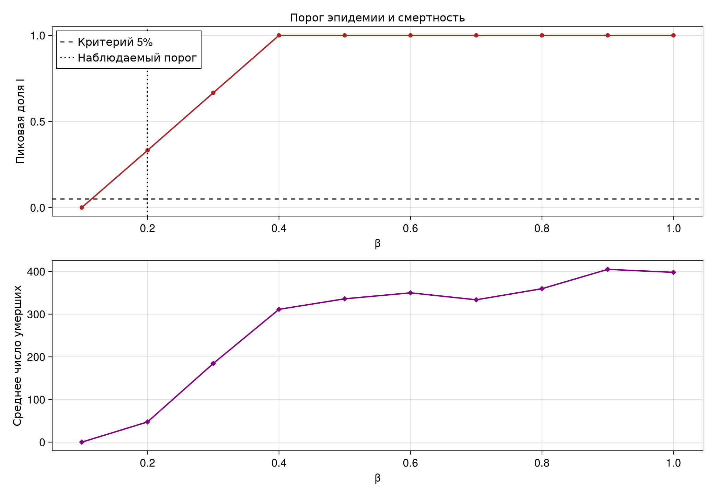{height=510}

- 10 значений β × 3 seed = 30 прогонов
- критерий эпидемии: средний пик I > 5%

## Теория и наблюдение

| Граница | β | $R_0$ |
|---|---:|---:|
| теоретическая | 0,0714 | 1,0 |
| наблюдаемая в сетке | **0,2** | **2,8** |

- при одном источнике возможен ранний случайный обрыв цепочки
- наблюдаемый порог зависит от критерия 5% и числа повторов

## Неоднородные города

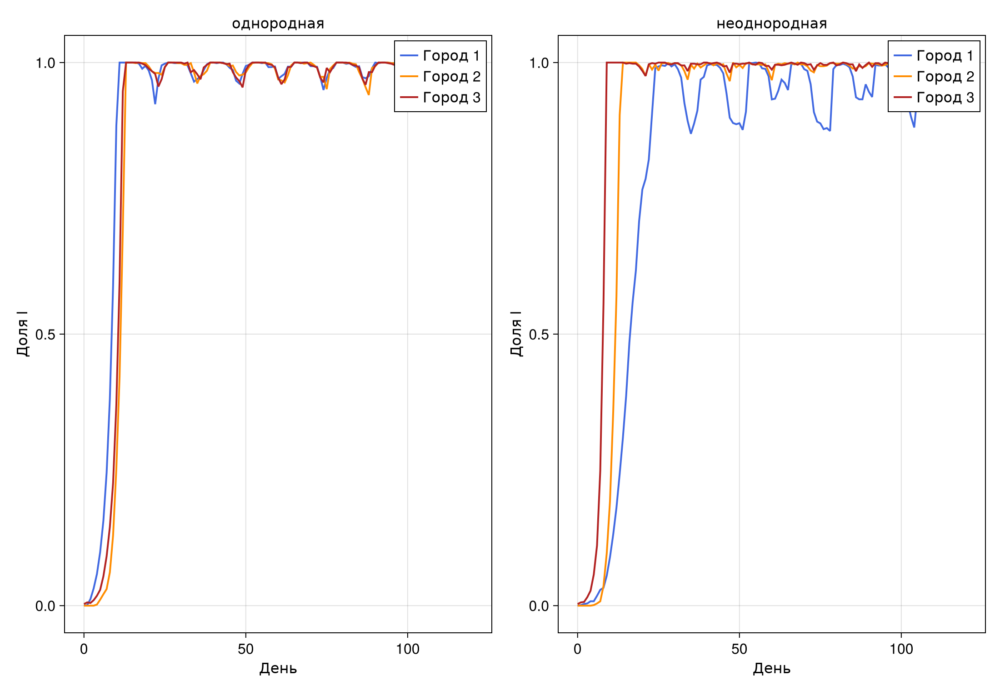{height=515}

- коэффициенты β: 0,22; 0,50; 0,82
- город с β=0,82 достигает пика первым
- город с β=0,22 отстаёт при той же миграционной матрице

# Миграция

## План исследования

- инфекция начинается только в первом городе
- интенсивность миграции: 0; 0,1; …; 0,5
- для каждого значения используются seed 42, 43, 44
- фиксируются день пика и приход инфекции в города 2 и 3

## Результат

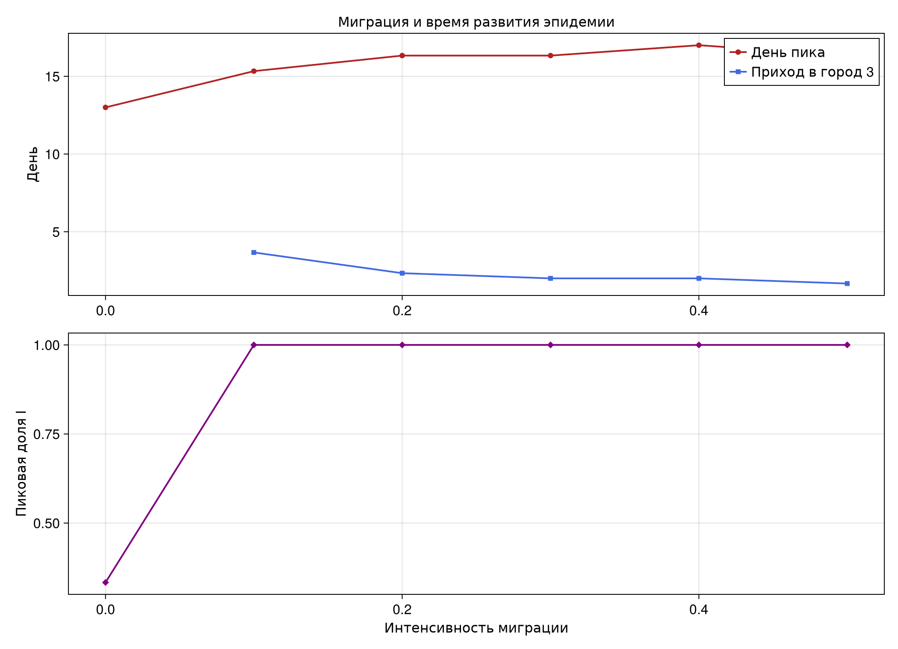{height=510}

- при нулевой миграции глобальный пик ограничен одним городом
- при интенсивности 0,1 инфекция приходит в другие города примерно за 4 дня
- наиболее быстрый средний приход в город 3: интенсивность 0,5

# Карантин

## Правило закрытия

Город закрывается для исходящей миграции, если

$$
\frac{I_c}{S_c+I_c+R_c}\ge 0{,}05.
$$

- состояние пересчитывается каждый модельный день
- внутри города заражения продолжаются
- сравнение проводится попарно для пяти одинаковых seed

## Сравнение режимов

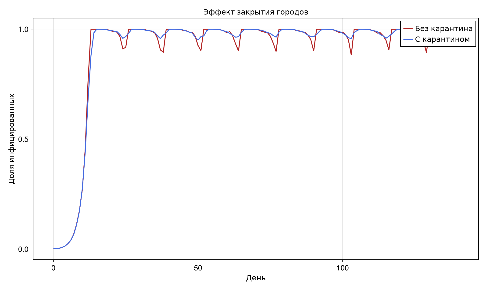{height=510}

## Количественный эффект

| Режим | Средний пик | Средняя смертность |
|---|---:|---:|
| без карантина | 100% | 517,4 |
| с карантином | 100% | 511,6 |

- закрытие миграции после 5% мало при $R_0=7$
- нужна комбинация раннего выявления и снижения контактов

# Оптимизация

## Переменные и критерии

Переменные:

- день выявления: 2–10;
- $\beta_{det}$: 0,01–0,18;
- интенсивность миграции: 0–0,25;
- порог карантина: 0,03–0,18.

Критерии: минимизировать долю умерших и пик I при условии **пик ≤30%**.

## Алгоритм NSGA-II

- популяция 18 решений, 7 поколений
- каждое решение проверяется на двух seed
- недопустимые пики получают штраф
- отбор использует Парето-ранг и crowding distance
- потомки создаются смешением и мутацией параметров

## Парето-фронт

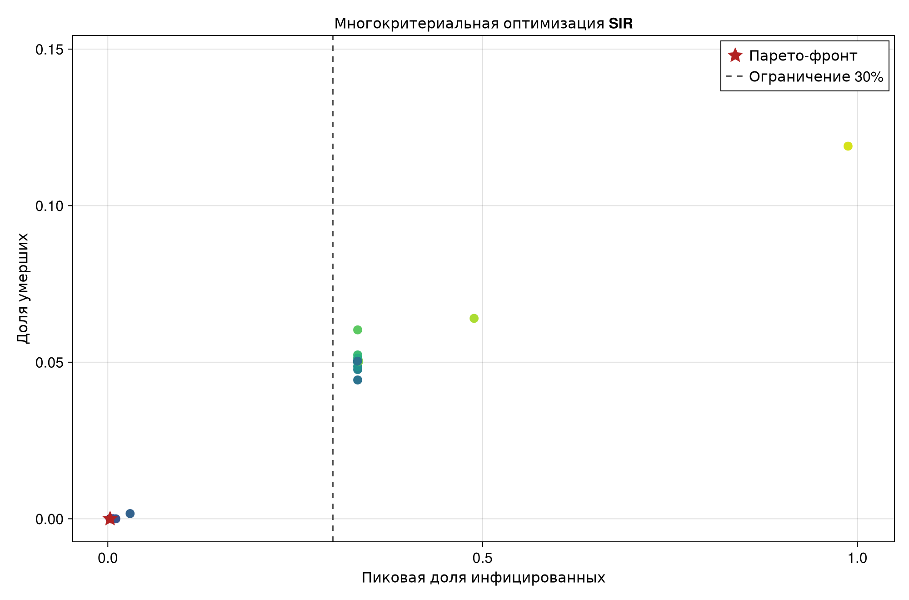{height=520}

## Лучшее допустимое решение

| Параметр | Значение |
|---|---:|
| день выявления | **2** |
| $\beta_{det}$ | **0,0160** |
| миграция | **0,2032** |
| порог карантина | **0,1020** |
| средний пик | **0,3%** |
| средняя смертность | **0** |

# Воспроизводимость

## Один первичный исходник

1. литературный `.jl` содержит код и пояснения;
2. Literate.jl генерирует чистый JL, QMD и IPYNB;
3. IPYNB выполняется ядром Julia;
4. Quarto собирает автономный HTML;
5. полный QMD-фрагмент включается в отчёт.

## Выполненные notebook

:::::::::::::: {.columns align=center}
::: {.column width="50%"}
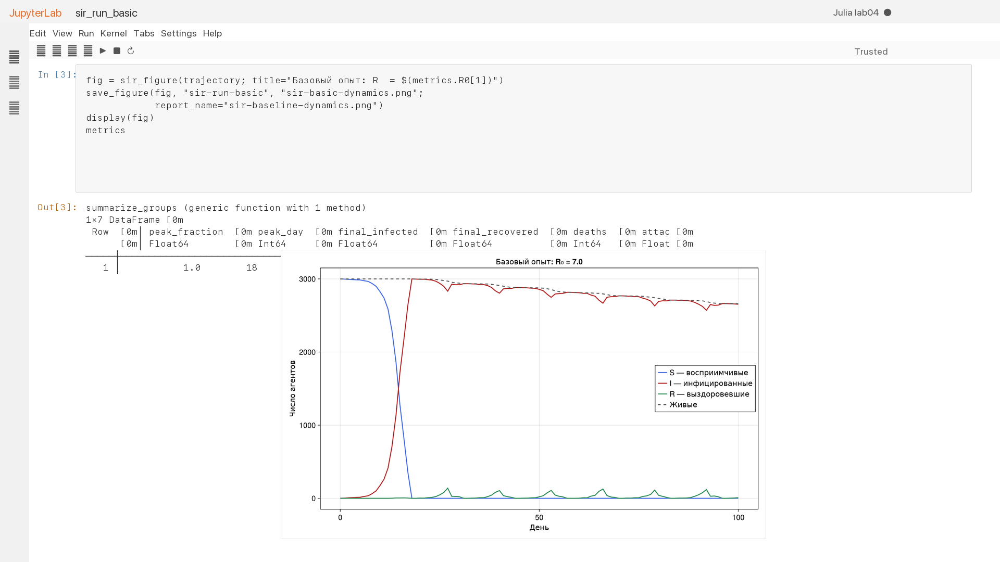
:::
::: {.column width="50%"}
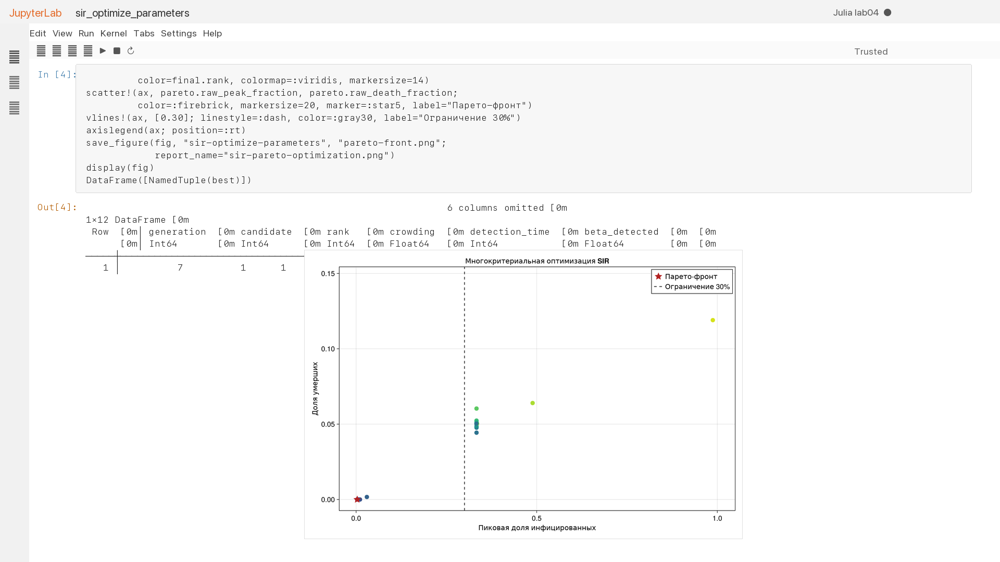
:::
::::::::::::::

- все кодовые ячейки имеют номер выполнения
- ошибок нет; рисунки встроены в notebook

## Сводный анализ CSV

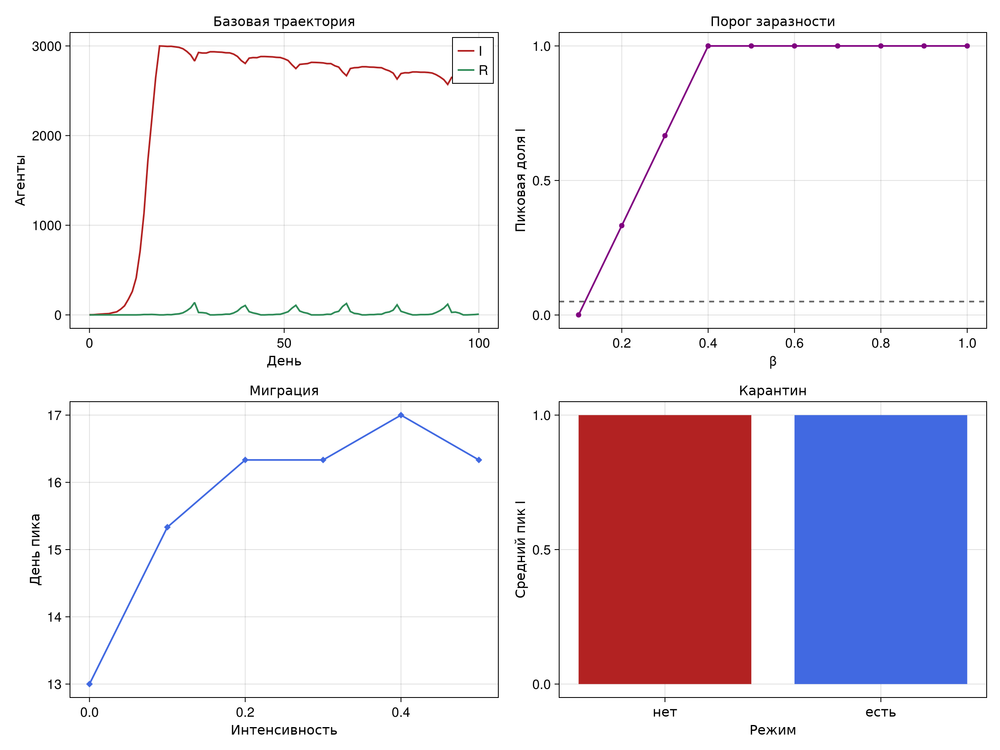{height=510}

- повторная симуляция не выполняется
- объединяются сохранённые результаты четырёх исследований

## Автоматические тесты

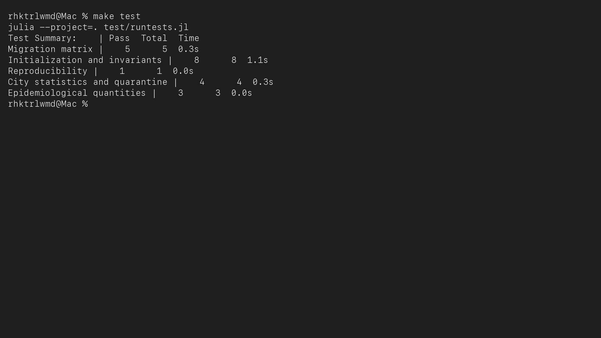{height=500}

- 21 проверка прошла успешно
- проверены баланс, воспроизводимость и ограничения параметров
- отдельно проверены города, карантин и формула $R_0$

# Выводы

## Основные результаты

- выполнены все сценарии и задания главы 4
- наблюдаемый порог β=0,2 выше теоретической границы
- неоднородность меняет порядок и время городских пиков
- миграция ускоряет проникновение инфекции
- изолированное закрытие городов недостаточно при $R_0=7$
- NSGA-II нашёл решение с пиком 0,3% и нулевой смертностью
- проект полностью воспроизводится из литературных исходников
