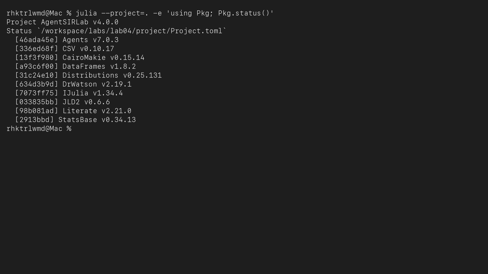
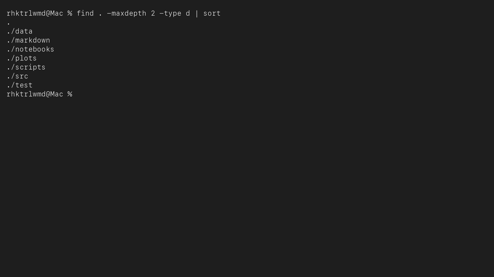
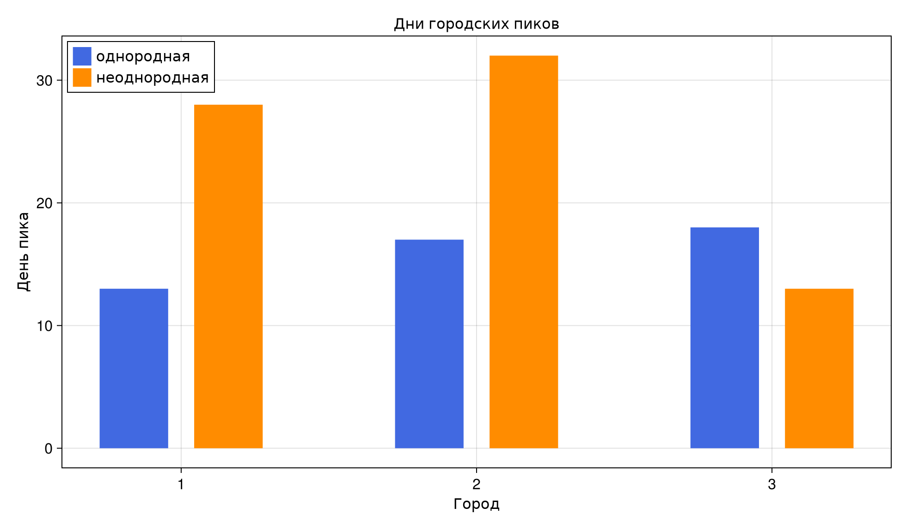
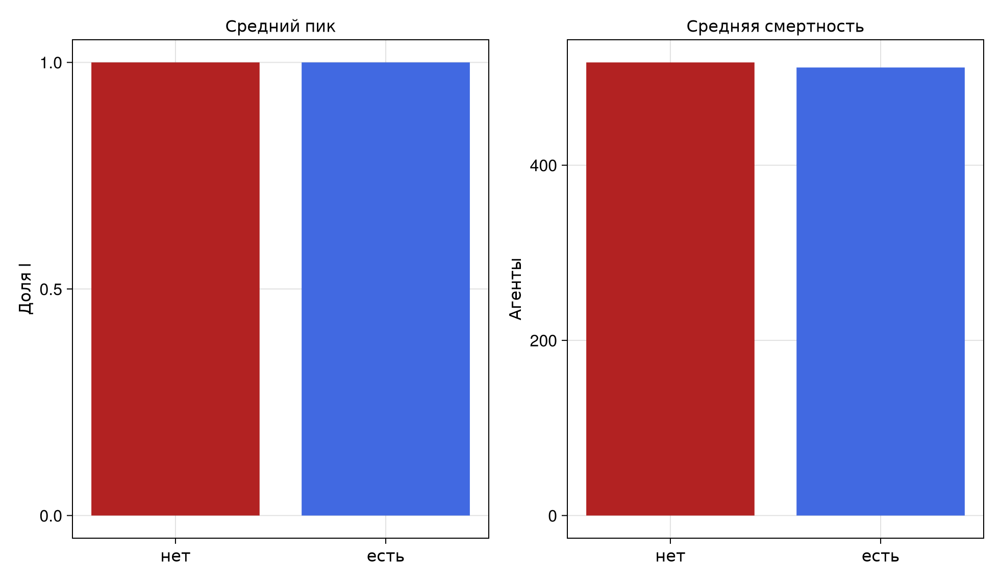
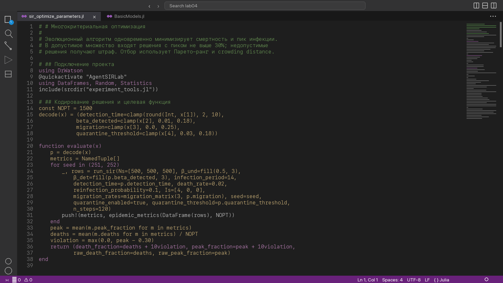



# Содержание {.unnumbered}

1. Цель работы
2. Задание
3. Теоретическое введение
4. Выполнение лабораторной работы
5. Выводы
6. Список литературы



# Список иллюстраций {.unnumbered}

1. Среда Julia и структура проекта
2. Модуль агентной модели и сценарий оптимизации в редакторе
3. Базовая динамика SIR и параметрические варианты
4. Порог эпидемии и гетерогенность городов
5. Миграция и карантинные меры
6. Парето-фронт многокритериального поиска
7. Сводный анализ сохранённых данных
8. Выполненные Jupyter notebooks и автоматические проверки



# Цель работы

**Цель работы** — реализовать пространственную стохастическую модель SIR в
агентном подходе, исследовать влияние заразности, неоднородности городов,
миграции и карантина, а также подобрать меры управления, минимизирующие
смертность при ограничении пика заболеваемости.

# Задание

Согласно главе 4 практикума [@rudn_simulation_manual] требуется:

1. создать воспроизводимый проект Julia и установить Agents.jl;
2. реализовать `src/sir_model.jl` с состояниями S, I и R, миграцией,
   выявлением, выздоровлением, смертью и повторным заражением;
3. выполнить пять основных сценариев: базовый опыт, сканирование β,
   миграцию, многокритериальную оптимизацию и сводную визуализацию;
4. определить $R_0$, наблюдаемый порог эпидемии и влияние неоднородных β;
5. добавить закрытие города при превышении порога заболеваемости;
6. найти параметры с пиком не выше 30% и минимальной смертностью;
7. создать параметрический вариант и для каждого из восьми литературных
   исходников получить чистый JL, выполненный IPYNB, QMD и HTML;
8. интегрировать в отчёт полные листинги, результаты и библиографию.

# Теоретическое введение

## Компартментальная модель SIR

Модель Кермака—Маккендрика разделяет население на восприимчивых $S$,
инфицированных $I$ и выздоровевших $R$ [@kermack1927]. В детерминированной
форме динамика задаётся системой

$$
\frac{dS}{dt}=-\beta\frac{SI}{N},\qquad
\frac{dI}{dt}=\beta\frac{SI}{N}-\gamma I,\qquad
\frac{dR}{dt}=\gamma I.
$$

Для средней продолжительности инфекции $T_{inf}$ используется
$\gamma=1/T_{inf}$, поэтому базовое репродуктивное число равно
$R_0=\beta T_{inf}$. При параметрах пособия $\beta=0{,}5$ и
$T_{inf}=14$ дней получаем $R_0=7$.

## Агентное представление

В агентной модели каждый человек имеет дискретное состояние, город и число
дней после заражения. Локальные случайные контакты и индивидуальные события
дают динамику, которую агрегированная система ОДУ не описывает напрямую.
Agents.jl предоставляет графовое пространство, планировщик и единый генератор
случайных чисел [@agentsjl2022]. Общие принципы построения и проверки
агентных моделей изложены также в [@railsback2019].

В модели невыявленный инфицированный создаёт пуассоновское число попыток
заражения с интенсивностью $\beta_{und}$, а после дня выявления — с меньшей
$\beta_{det}$. По окончании болезни агент выздоравливает либо удаляется с
вероятностью `death_rate`. Матрица миграции является стохастической по строкам.

## Воспроизводимость вычислений

Проект организован DrWatson [@drwatson2020]. Literate.jl превращает один
комментированный Julia-файл в чистый сценарий, notebook и Quarto-документ,
следуя принципу литературного программирования [@knuth1984literate]. Все
случайные серии закреплены seed, а сводная визуализация читает сохранённые CSV,
не повторяя симуляцию.

# Выполнение лабораторной работы

## Окружение и структура

Проект содержит общий модуль, восемь литературных сценариев, тесты, исходные
и производные документы, таблицы CSV/JLD2 и графики. Среда закреплена в
`Project.toml`; команды полного цикла собраны в `Makefile`.

{#fig-packages width=94%}

{#fig-tree width=94%}



Листинг 1 — полный файл `project/Project.toml`.



Листинг 2 — полный файл `project/Makefile`.



Листинг 3 — подготовка среды.



Листинг 4 — генерация производных форматов Literate.jl.

## Общий модуль агентной модели

Модуль проверяет размеры городских параметров, нормировку миграционной
матрицы и вероятностные ограничения. Модель использует полный граф городов,
но интенсивность переходов задаётся матрицей. Карантин динамически блокирует
исходящую миграцию из города, где доля инфицированных достигла порога.

{#fig-code-module width=94%}



Листинг 5 — полный модуль `project/src/sir_model.jl`.



Листинг 6 — сбор статистики и общая визуализация.

## Базовый опыт и число R₀



Листинг 7 — базовый литературный сценарий.

{#fig-basic width=90%}

Расчёт даёт $R_0=7$. Наблюдаемый пик достигается на 18-й день. Из-за высокого
$R_0$ и вероятности повторного заражения система быстро охватывает все три
города, а к 100-му дню зарегистрировано 339 смертей.

## Параметрический вариант



Листинг 8 — параметрический вариант §4.2.

{#fig-param width=90%}

При $R_0=1{,}8$ начальная цепочка прекращается и пик составляет 0,19%.
Режимы с $R_0=3{,}84$ и $R_0=7$ формируют крупную эпидемию, что показывает
влияние стохастического старта даже выше теоретического порога.

## Наблюдаемый порог эпидемии



Листинг 9 — тридцать прогонов сканирования β.

{#fig-threshold width=88%}

В исследованной сетке минимальным значением с усреднённым пиком выше 5%
оказалось $\beta=0{,}2$, то есть $R_0=2{,}8$. Теоретическая граница
$R_0=1$ соответствует $\beta\approx0{,}0714$, но единичный источник инфекции
может стохастически исчезнуть до образования устойчивой цепочки.

## Гетерогенность городов



Листинг 10 — однородный и неоднородный городские опыты.

{#fig-heterogeneity width=92%}

{#fig-city-peaks width=82%}

При коэффициентах 0,22; 0,50 и 0,82 город с наибольшей заразностью достигает
пика первым, а город с β=0,22 — последним. Различие сохраняется при общей
матрице миграции и одинаковой продолжительности болезни.

## Интенсивность миграции



Листинг 11 — исследование шести интенсивностей миграции.

{#fig-migration width=88%}

Без миграции эпидемия остаётся в первом городе, поэтому глобальная доля имеет
верхнюю границу около одной трети. При интенсивности 0,1 инфекция приходит в
остальные города в среднем к четвёртому дню. Минимальный средний день прихода
в третий город получен при интенсивности 0,5.

## Карантинные меры



Листинг 12 — парное сравнение пяти seed с карантином и без него.

{#fig-quarantine width=90%}

{#fig-quarantine-metrics width=82%}

При исходных $R_0=7$ закрытие только исходящей миграции после достижения 5%
не останавливает внутригородскую передачу: средний пик остаётся близок к 100%.
Средняя смертность уменьшается с 517,4 до 511,6. Следовательно, такая мера
должна сочетаться с ранним выявлением и уменьшением контактов.

## Многокритериальная оптимизация

{#fig-code-opt width=94%}



Листинг 13 — эволюционный алгоритм с Парето-рангом.

{#fig-pareto width=88%}

Поиск изменяет день выявления, заразность выявленных случаев, миграцию и
порог карантина. Лучшее допустимое решение: выявление на 2-й день,
$\beta_{det}=0{,}0160$, интенсивность миграции 0,2032 и порог закрытия 0,1020.
В двух проверочных прогонах средний пик составил 0,3%, смертей не было.

## Сводный анализ CSV



Листинг 14 — анализ ранее сохранённых CSV без повторной симуляции.

{#fig-summary width=92%}

Сводная панель соединяет четыре независимых результата и подтверждает, что
управляемые параметры выявления сильнее влияют на пик, чем изолированное
закрытие миграции при уже высокой распространённости.

## Выполненные notebooks

Все восемь notebook выполнены ядром Julia. Каждая кодовая ячейка имеет
непустой `execution_count`; ошибок выполнения нет, а графики сохранены внутри
файлов.

:::::::::::::: {.columns}
::: {.column width="50%"}
{#fig-nb-basic}
:::
::: {.column width="50%"}
{#fig-nb-opt}
:::
::::::::::::::

## Автоматические проверки



Листинг 15 — полный набор автоматических тестов.

{#fig-tests width=94%}

Проверена 21 характеристика: матрица миграции, входные ограничения,
инициализация, баланс живых и умерших, воспроизводимость, городская статистика,
карантин и формула $R_0$.

# Выводы

В работе реализована воспроизводимая агентная SIR-модель для трёх городов.
Выполнены все пять основных сценариев, все шесть дополнительных заданий и
параметрический вариант §4.2. На исследованной сетке наблюдаемый порог равен
$\beta=0{,}2$, гетерогенность меняет порядок городских пиков, а миграция
ускоряет проникновение инфекции в исходно здоровые города. Одно только
закрытие миграции при высоком $R_0$ малоэффективно. Многокритериальный поиск
показал, что раннее выявление и низкая заразность выявленных случаев позволяют
выполнить ограничение пика 30% и снизить смертность. Полный цикл воспроизводится
из литературных исходников командами Makefile.

# Список литературы{.unnumbered}

::: {#refs}
:::
