# Информация

## Исходные данные

- Дисциплина: **Имитационное моделирование**
- Тема: **сети Петри и задача обедающих философов**
- Автор: Исаева Зарина Исмайилбековна
- Студенческий билет: 1132232882
- Среда: Julia 1.11, DrWatson, Literate, CairoMakie

## Содержание

1. Цель и требования
2. Формальная модель сети Петри
3. Классическая схема и арбитр
4. Стохастический и детерминированный эксперименты
5. Анимация и анализ сохранённых CSV
6. Параметрическая серия
7. Проверка и выводы

# Цель и задачи

## Цель работы

Построить две сети Петри для задачи обедающих философов и экспериментально
проверить, как ограничение арбитра предотвращает глобальную взаимную
блокировку.

## Обязательные параметры

| Сценарий | Параметры | Результат |
|---|---:|---|
| Базовый | N=5, T=50 | две полные траектории |
| Анимация | N=3, T=30, seed=123 | GIF, 5 кадров/с |
| Анализ CSV | N=5 | две панели Eat |
| Серия | N=3,5,7; 12 повторов | 216 траекторий |

## Производные форматы

Для каждого из четырёх литературных сценариев созданы:

- чистый Julia-код;
- выполненный Jupyter notebook;
- Quarto QMD;
- автономный HTML-документ.

# Аппарат сетей Петри

## Формальное определение

Сеть задаётся позициями $P$, переходами $T$, входными и выходными дугами и
начальной маркировкой $M_0$.

$$M_{k+1}=M_k+(O-I)_{\cdot j}$$

Переход разрешён, когда во всех его входных позициях достаточно фишек.

## Интерпретация позиций

| Группа | Смысл |
|---|---|
| Thinkᵢ | философ размышляет |
| Hungryᵢ | левая вилка уже захвачена |
| Eatᵢ | обе вилки захвачены |
| Forkᵢ | вилка свободна |
| Arbiter | доступно разрешение на захват |

## Переходы

1. `TakeLeft_i`: Thinkᵢ + Forkᵢ → Hungryᵢ
2. `TakeRight_i`: Hungryᵢ + Forkᵢ₊₁ → Eatᵢ
3. `Release_i`: Eatᵢ → Thinkᵢ + Forkᵢ + Forkᵢ₊₁

Каждое срабатывание атомарно и сохраняется в журнале событий.

## Критерий deadlock

Deadlock фиксируется напрямую:

$$\{t_j:\;M\ge I_{\cdot j}\}=\varnothing.$$

Нулевое значение всех Eatᵢ без этой проверки недостаточно: оно может означать
обычную паузу между приёмами пищи.

# Подготовка проекта

## Структура

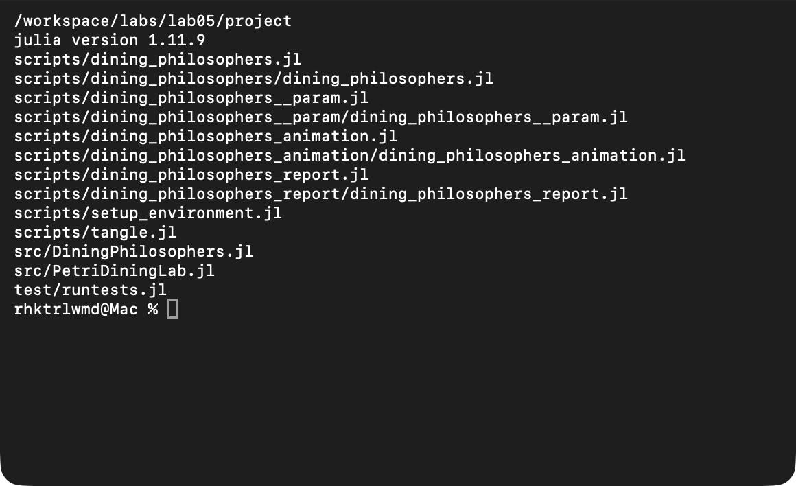{width=78%}

## Зависимости

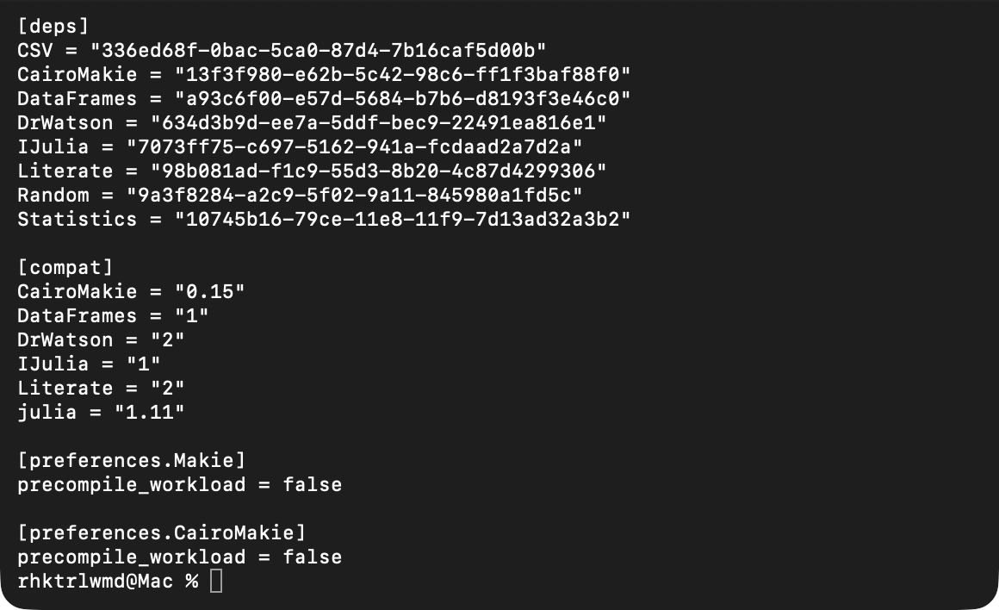{width=78%}

## Общий модуль

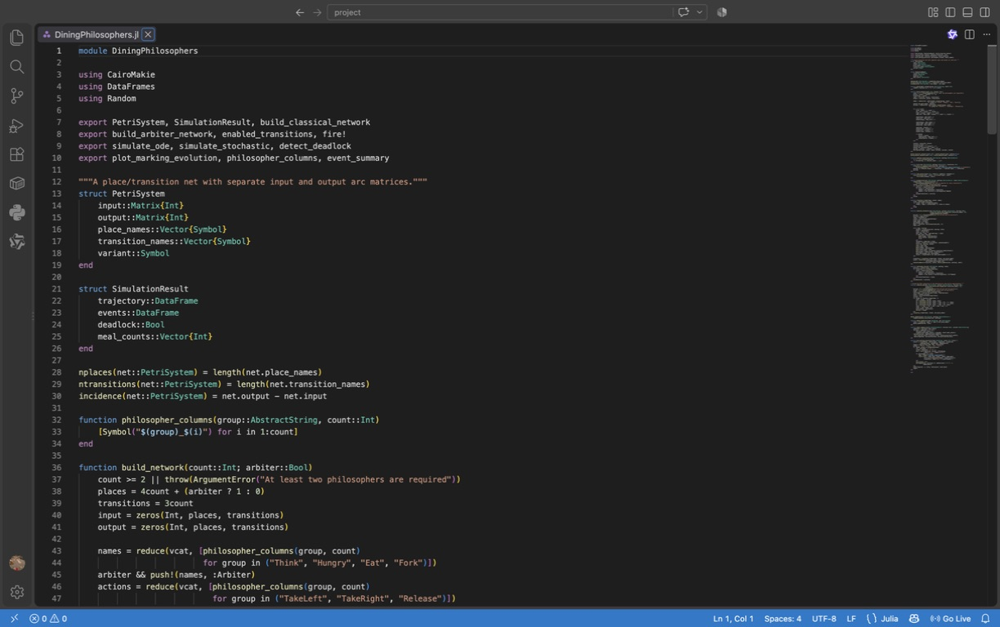{width=91%}

# Классическая сеть и арбитр

## Классическая схема

Каждый философ сначала захватывает левую вилку. Если все пять переходов
`TakeLeft_i` сработали раньше `TakeRight_i`, возникает цикл ожидания:

$$P_1\to F_2\to P_2\to\ldots\to F_1\to P_1.$$

## Маркировка классической сети

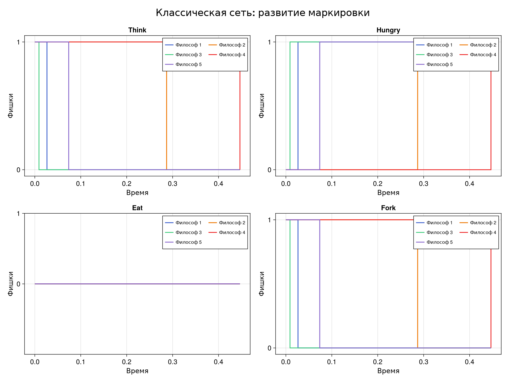{width=81%}

## Результат классической сети

- пять событий;
- время остановки 0,446562;
- завершённых приёмов пищи: 0;
- `deadlock = true`;
- итоговая маркировка: все Hungryᵢ=1.

## Сеть с арбитром

Дополнительная позиция содержит N−1 фишек. Один философ всегда остаётся за
пределами цикла захвата, поэтому сосед может получить вторую вилку, завершить
приём пищи и вернуть ресурсы.

## Маркировка сети с арбитром

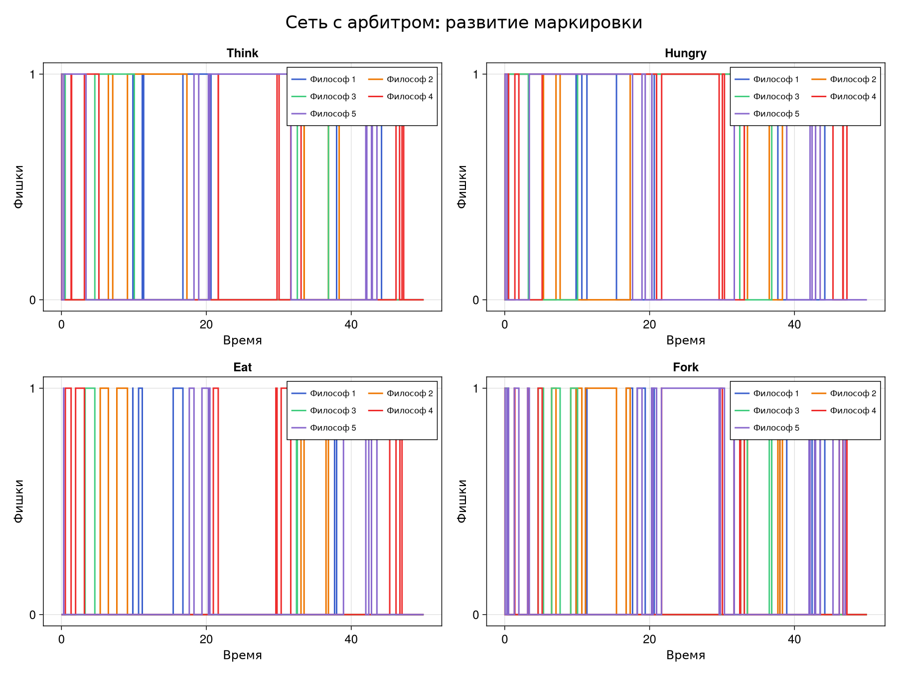{width=81%}

## Результат арбитра

- 76 событий;
- 24 завершённых приёма пищи;
- индекс Джейна 0,859701;
- конечное время 50,0;
- `deadlock = false`.

# Имитационные эксперименты

## Алгоритм Гиллеспи

1. Рассчитать интенсивности разрешённых переходов.
2. Получить $\Delta t=-\ln U/a_0$.
3. Выбрать переход пропорционально интенсивности.
4. Изменить маркировку и записать событие.
5. Остановиться при T или отсутствии переходов.

## Детерминированная аппроксимация

Одна и та же сеть задаёт векторное поле

$$\frac{du}{dt}=(O-I)a(u).$$

Интегрирование выполнено методом RK4 с шагом сохранения 0,1. Проверяется
неотрицательность всех непрерывных компонент.

## Выполненный notebook

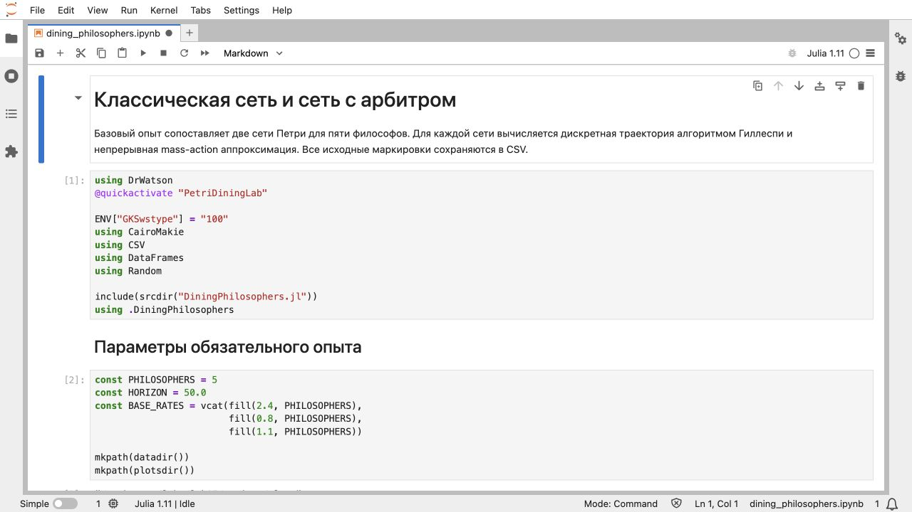{width=88%}

## Диагностика в notebook

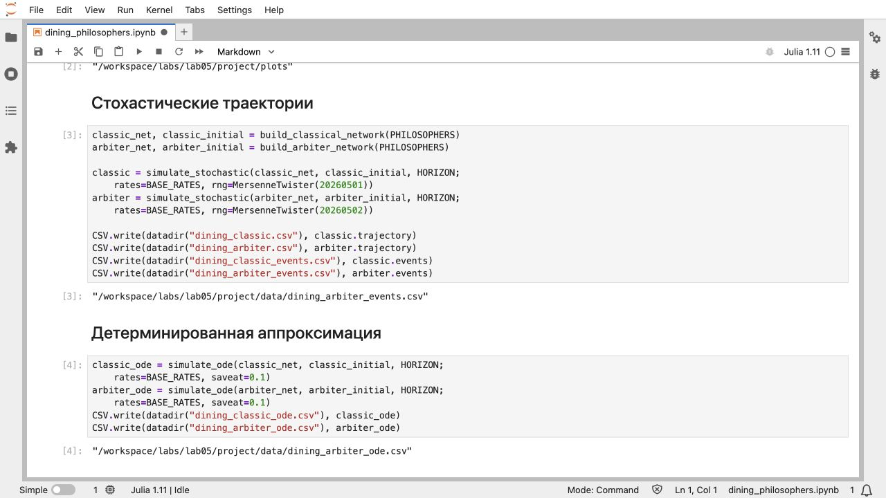{width=88%}

## Встроенный график notebook

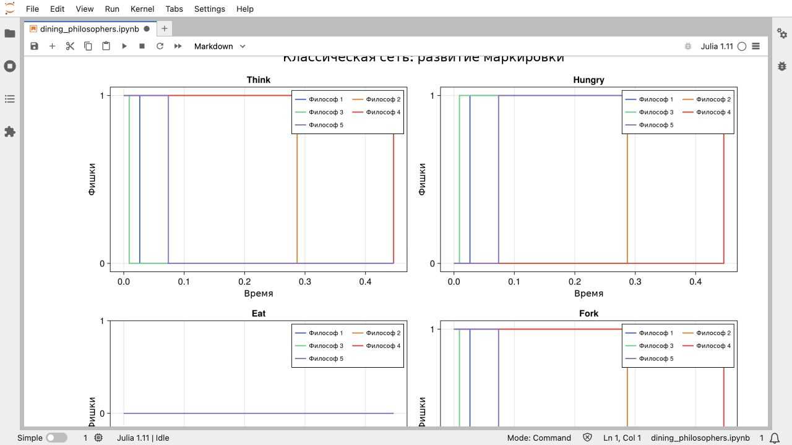{width=88%}

# Анимация и отчёт по CSV

## Анимация N=3

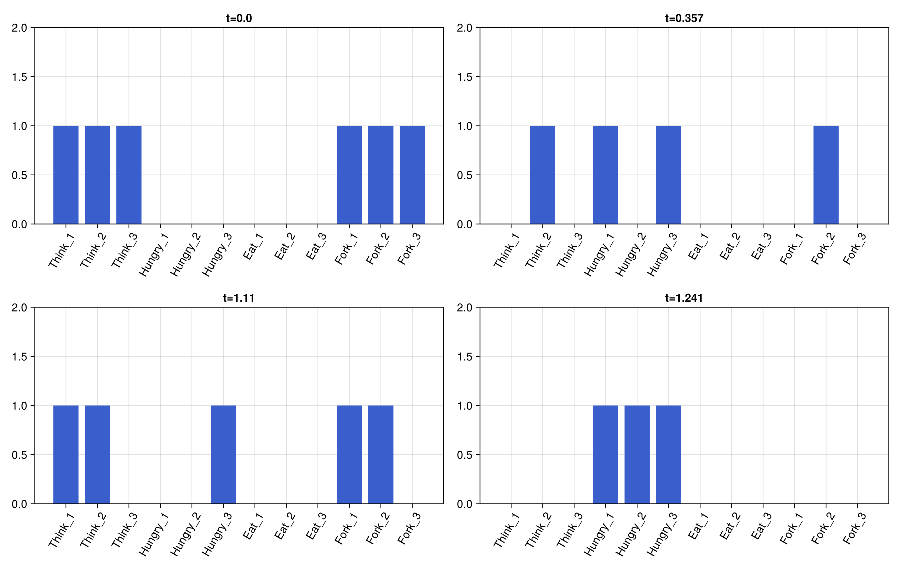{width=83%}

Получено 7 кадров из 6 событий; deadlock наступил в момент 1,240570.
Частота GIF — 5 кадров/с согласно текстовому требованию методички.

## Отдельный анализ сохранённых данных

Сценарий `dining_philosophers_report.jl`:

- проверяет наличие двух CSV;
- не запускает модель заново;
- проверяет сортировку времени и столбцы Eatᵢ;
- вычисляет активную долю и нулевой хвост;
- сохраняет `final_report.png`.

## Сравнение Eat

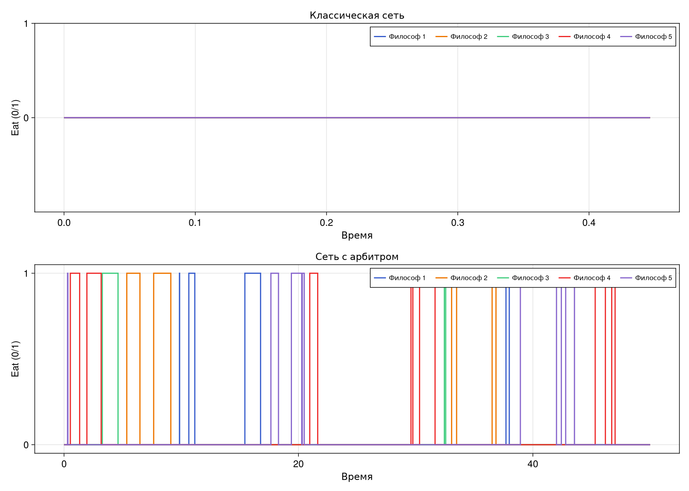{width=80%}

# Параметрическая серия

## Дизайн серии

- N∈{3,5,7};
- скорость второй вилки: 0,4; 0,8; 1,2;
- 12 повторов каждой точки;
- две структуры сети;
- всего 216 независимых траекторий.

## Литературный сценарий

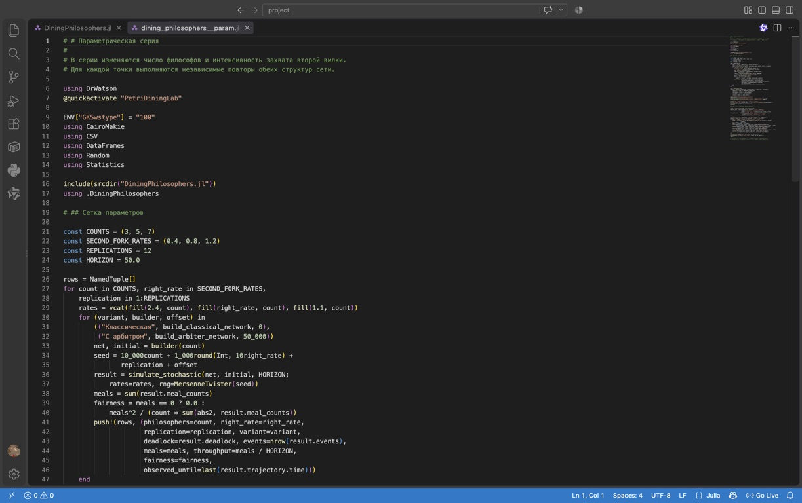{width=91%}

## Выполненный notebook серии

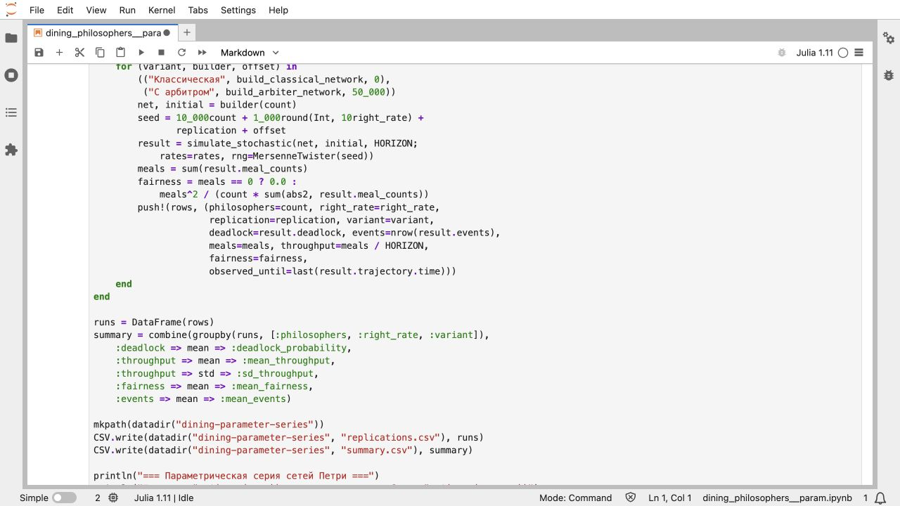{width=88%}

## Итог серии

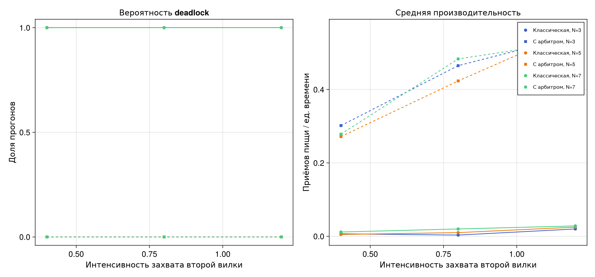{width=86%}

Классическая сеть: вероятность deadlock 1,0 во всей сетке. Арбитр: 0,0.
Для N=5 производительность возрастает с 0,271667 до 0,563333.

# Проверка и результаты

## Автоматические тесты

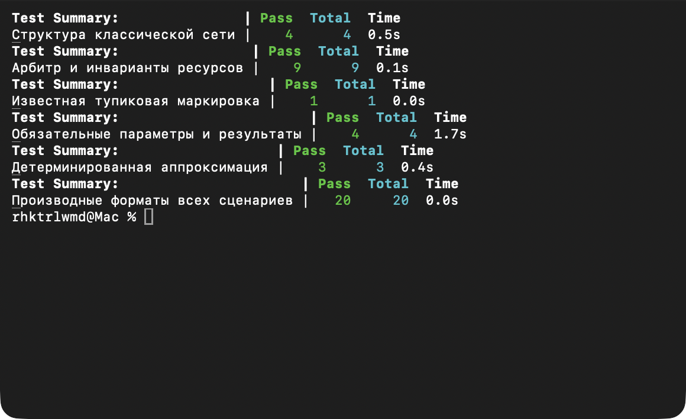{width=85%}

## Проверенные свойства

- размеры I/O-матриц: 20×15 и 21×15;
- начально разрешены пять `TakeLeft_i`;
- Thinkᵢ+Hungryᵢ+Eatᵢ=1 во всей траектории;
- маркировки неотрицательны;
- классический CSV заканчивается deadlock;
- арбитр достигает T=50;
- все четыре notebook выполнены.

## Полученные артефакты

| Группа | Количество |
|---|---:|
| самостоятельные сценарии | 4 |
| выполненные IPYNB | 4 |
| QMD-фрагменты | 8 |
| HTML-документы | 4 |
| траектории параметрической серии | 216 |
| автоматические проверки | 41 |

# Выводы

## Основной вывод

Классическая стратегия последовательного захвата ресурсов допускает
достижимую тупиковую маркировку. Арбитр с N−1 разрешениями устраняет
циклическое ожидание и сохраняет активность сети на всём горизонте.

## Роль параметров

Повышение интенсивности захвата второй вилки увеличивает производительность
сети с арбитром. В классической структуре изменение скорости не устраняет
саму возможность глобальной блокировки.

## Итог работы

- обязательные параметры методички сохранены;
- три именованных сценария и параметрический вариант выполнены отдельно;
- CSV-анализ не повторяет симуляцию;
- код, notebook, QMD, HTML, отчёт и презентация воспроизводимы;
- результаты подтверждены инвариантами и тестами.
