# Информация

## Докладчик

- Исаева Зарина Исмайилбековна
- студенческий билет: **1132232882**
- дисциплина: «Имитационное моделирование»
- лабораторная работа № 6

## Тема и цель

**Тема:** модель распространения эпидемии SIR в форме сети Петри.

**Цель:** связать структурное описание переходов, детерминированное решение
и событийную стохастическую симуляцию в одном воспроизводимом проекте.

## Задачи

1. Построить `LabelledPetriNet` с местами S, I, R.
2. Получить ODE- и SSA-траектории.
3. Просканировать 15 значений β.
4. Построить анимацию из 501 состояния.
5. Исследовать дополнительные параметры и проверить результаты.

# Модель

## Переходы сети Петри

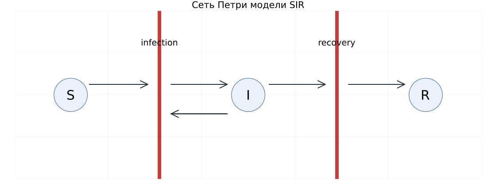

## Закон массового действия

$$S+I \xrightarrow{\beta SI} 2I, \qquad I \xrightarrow{\gamma I} R$$

$$\dot S=-\beta SI,\quad \dot I=\beta SI-\gamma I,\quad \dot R=\gamma I$$

В лабораторной работе используется именно $\beta SI$ **без деления на N**.

## Исходные параметры

| Параметр | Значение |
|:--|--:|
| $S_0, I_0, R_0$ | 990, 10, 0 |
| $\beta, \gamma$ | 0.3, 0.1 |
| Горизонт | 100 |
| Шаг сохранения ODE | 0.5 |
| Seed SSA | 123 |
| Шаг анимации | 0.2 |

## Матрица инцидентности

| Место | infection | recovery |
|:--|--:|--:|
| S | -1 | 0 |
| I | +1 | -1 |
| R | 0 | +1 |

Столбцы суммируются в ноль, поэтому $S+I+R=1000$.

# Реализация

## Архитектура проекта

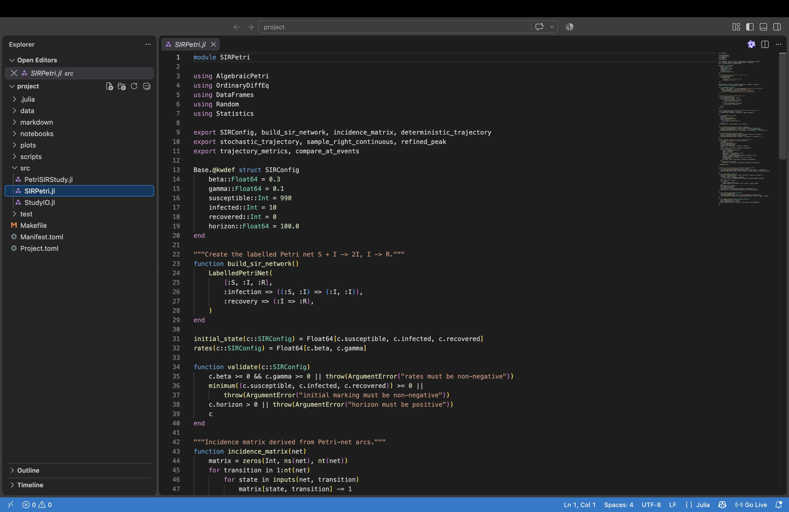

## Исходный модуль в VS Code


## Выполненный ноутбук в JupyterLab

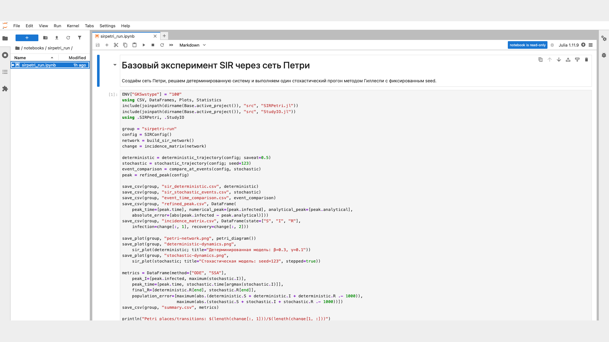

## Объект сети

```julia
function build_sir_network()
    LabelledPetriNet(
        [:S, :I, :R],
        :infection => ((:S, :I) => (:I, :I)),
        :recovery => (:I => :R),
    )
end
```

## Детерминированная модель

```julia
function rhs!(du, u, _, _)
    du .= change * propensities(u, config)
    nothing
end
solution = solve(ODEProblem(rhs!, u0, (0.0, 100.0)), Tsit5())
```

## Прямой алгоритм Гиллеспи

```julia
hazards = [beta*S*I, gamma*I]
event_time = t - log(rand(rng)) / sum(hazards)
selected = searchsortedfirst(cumsum(hazards), rand(rng)*sum(hazards))
marking .+= incidence[:, selected]
```

## Литературные сценарии

- четыре обязательных файла `sirpetri_*.jl`;
- четыре самостоятельных параметрических варианта;
- для каждого: чистый `.jl`, выполненный `.ipynb`, `.qmd` и `.html`;
- отчётные фрагменты содержат полный листинг.

# Основные результаты

## Детерминированная траектория

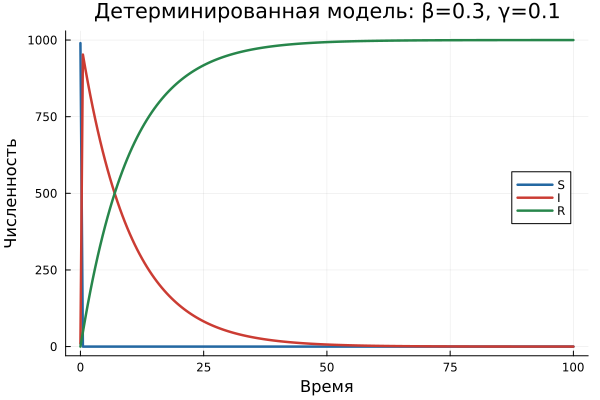

## Стохастическая траектория

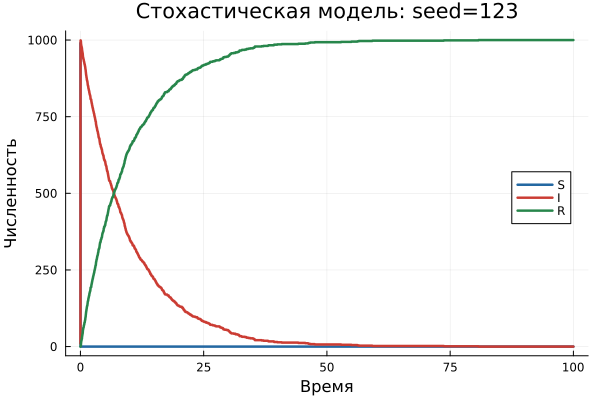

## Корректное сравнение ODE и SSA

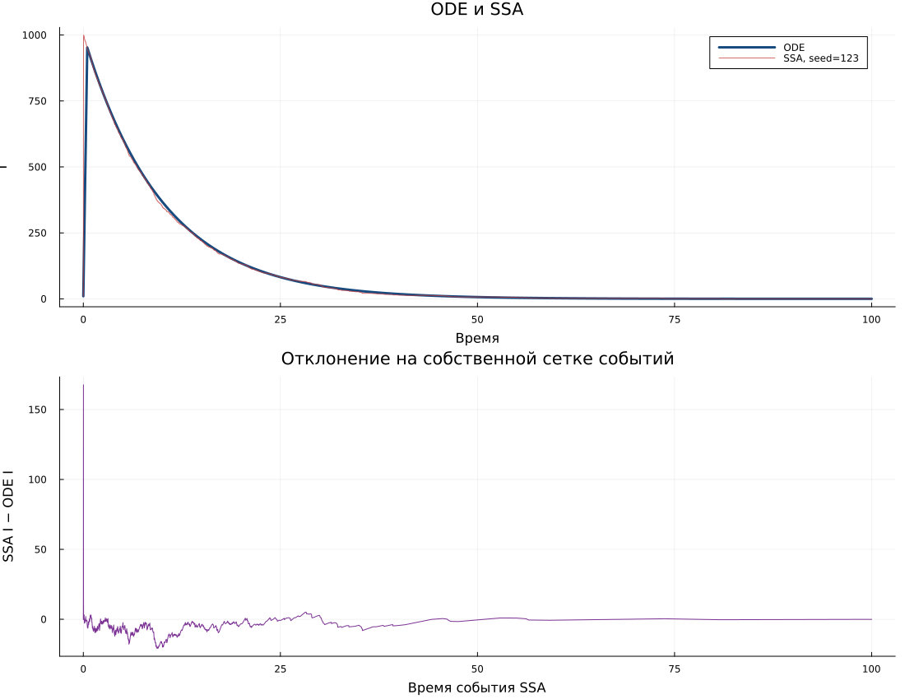

SSA — ступенчатый процесс. Значения сравниваются в фактические моменты событий,
без линейного сглаживания дискретной маркировки.

## Почему нужен уточнённый пик

- при $\beta SI$ эпидемия развивается в самом начале интервала;
- сохранение ODE с шагом 0.5 пропускает истинный максимум;
- уточнение использует условие $S=\gamma/\beta$;
- значение проверяется аналитическим инвариантом SIR.

## Сканирование β

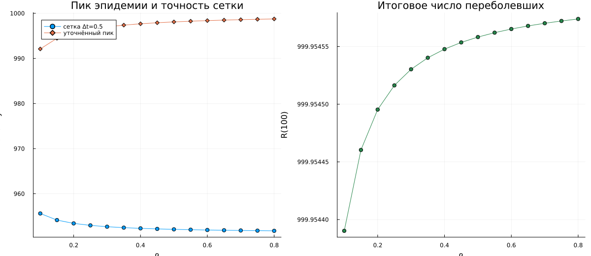

## Порог роста

$$\dot I(0)>0 \Longleftrightarrow \beta S_0-\gamma>0$$

$$\beta>\frac{\gamma}{S_0}=\frac{0.1}{990}\approx 0.000101$$

Все значения обязательной сетки $0.1:0.05:0.8$ выше этого порога.

## Настоящая анимация

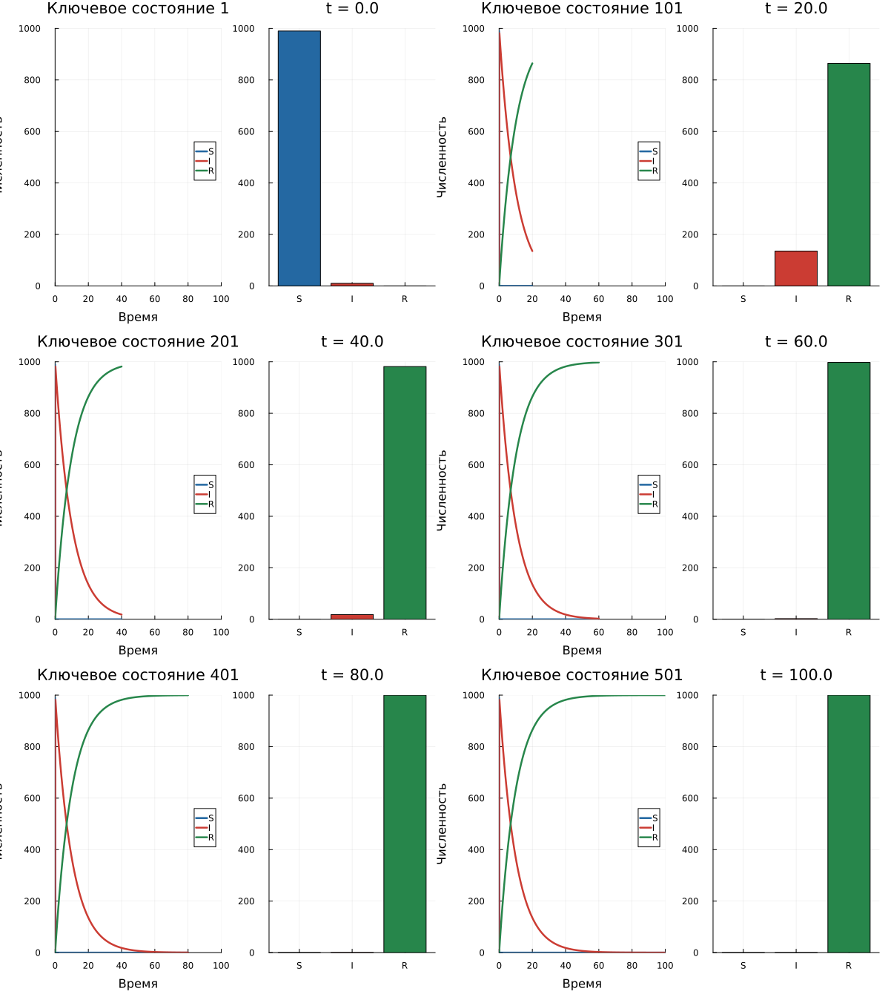

501 состояние: $t=0:0.2:100$. Сценарий создаёт GIF, а не повторяет сканирование.

# Дополнительные эксперименты

## Начальное число инфицированных

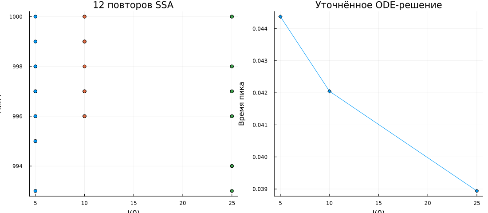

## Разведочная сетка β×γ

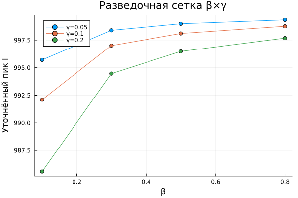

Сетка компактная и предварительная: без интерполяции и доверительных интервалов.

## Три режима

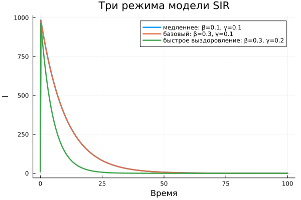

## Сводка параметрических результатов

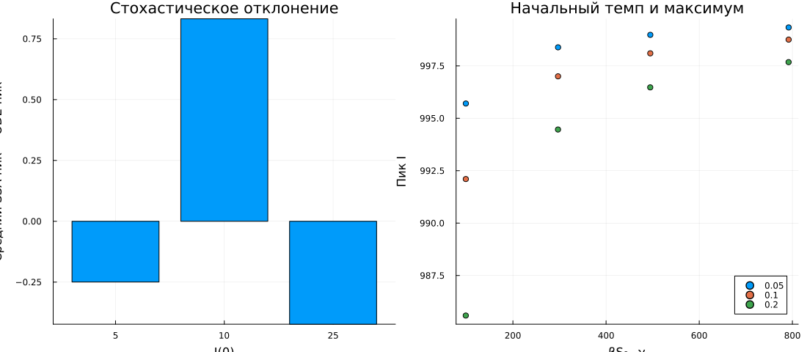

# Проверка

## Автоматические проверки

- матрица инцидентности равна ожидаемой;
- ODE содержит 201 точку при шаге 0.5;
- $S+I+R=1000$ для ODE и SSA;
- уточнённый и аналитический пики совпадают;
- ранний пик находится до $t=0.5$;
- правосторонняя выборка SSA сохраняет ступени.

## Воспроизводимость

```text
make run       # CSV, PNG и GIF
make notebooks # выполненные IPYNB
make docs      # автономные HTML
make test      # проверки модели
make verify    # контроль состава артефактов
```

Окружение закреплено `Project.toml` и `Manifest.toml`.

# Итоги

## Получено

- настоящая сеть Петри с двумя переходами;
- ODE- и SSA-траектории при параметрах задания;
- сканирование 15 значений β и анимация на 501 состояние;
- параметрические эксперименты без скрытой подмены данных;
- литературные программы, ноутбуки, отчёт и презентация.

## Вывод

Сеть Петри отделяет структуру SIR от способа вычисления. Один и тот же объект
поддерживает непрерывное и событийное моделирование, а уточнённый анализ раннего
пика предотвращает неверные выводы по редкой временной сетке.
