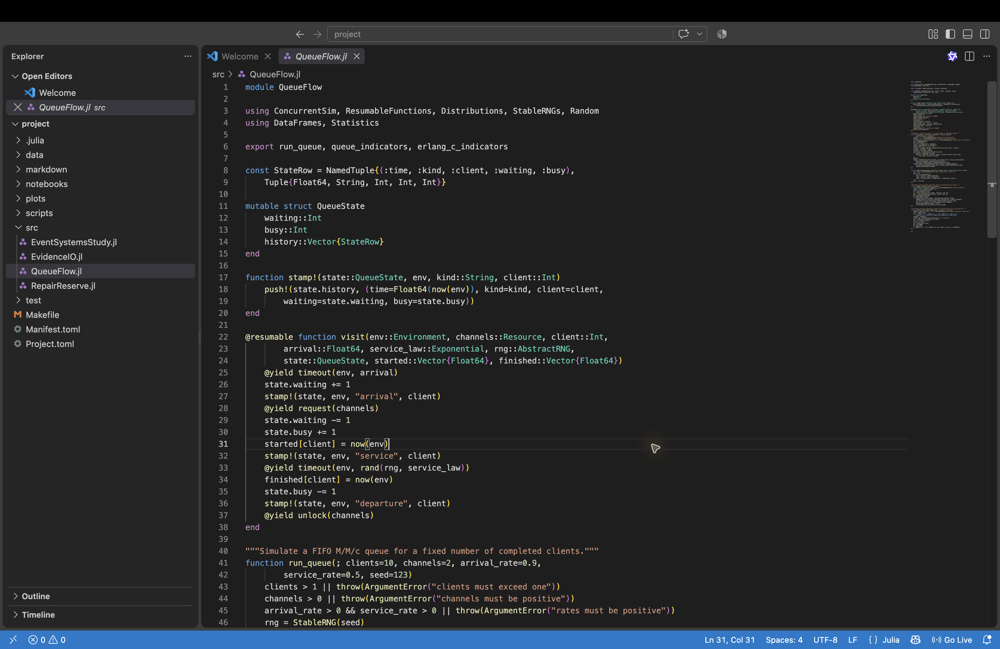
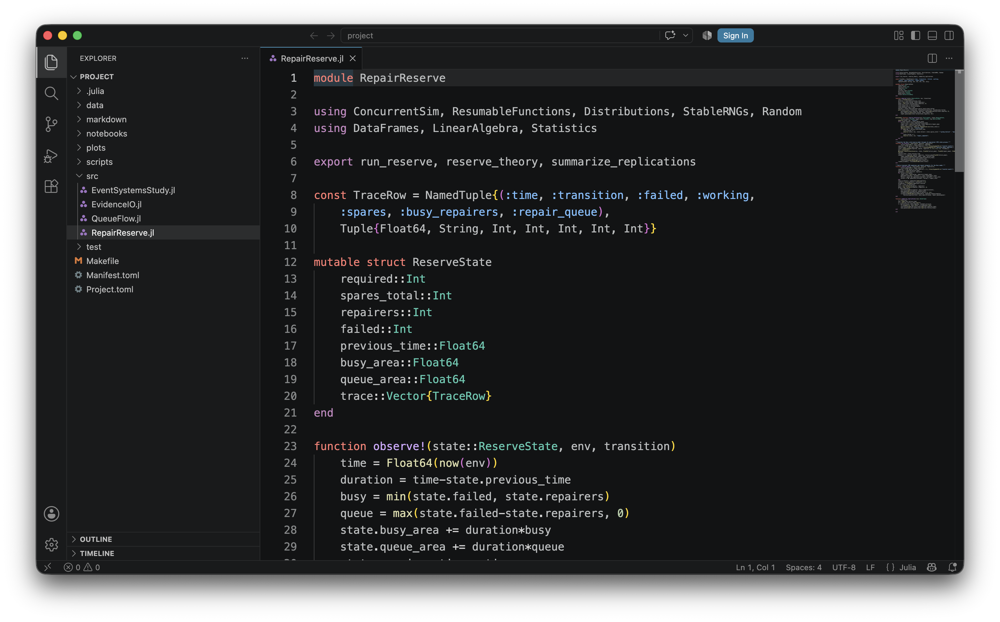
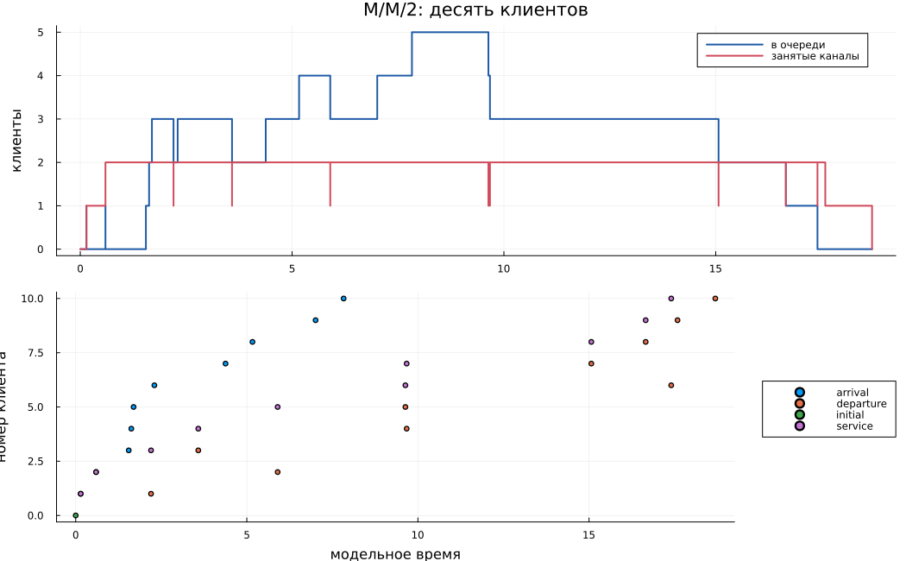
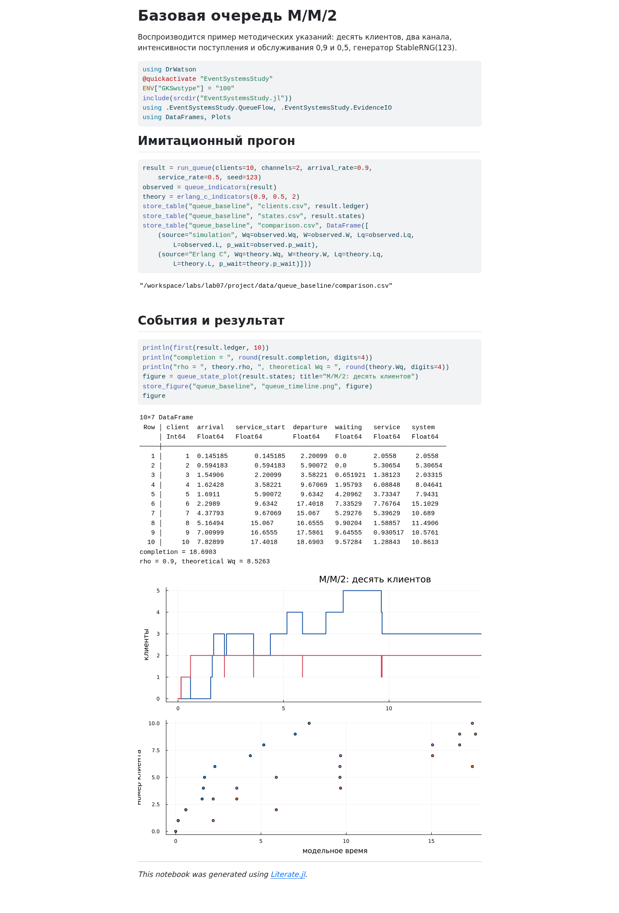
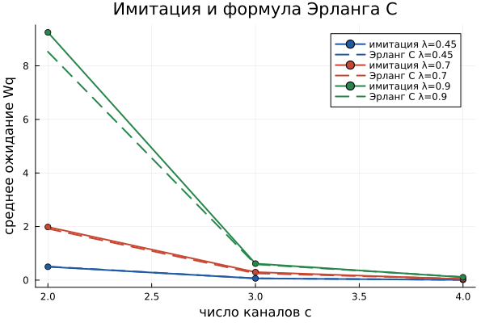
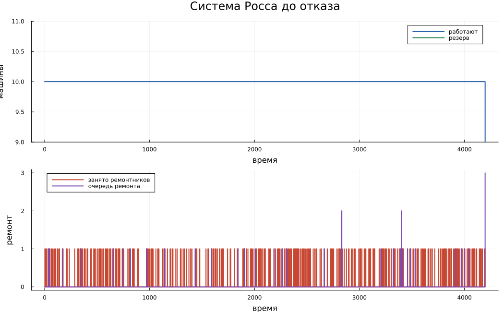
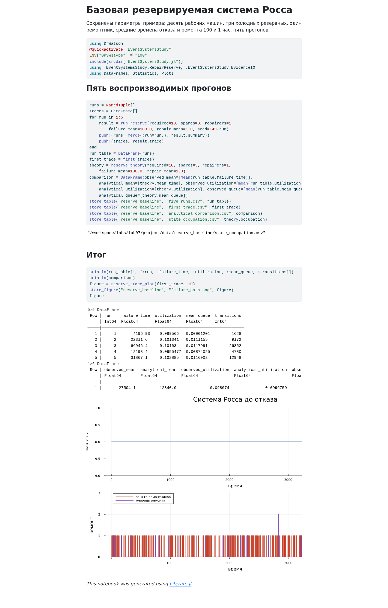
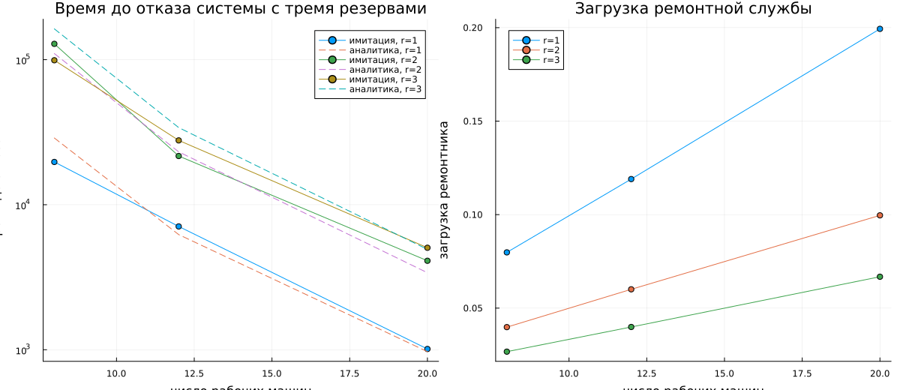

# Информация

## Докладчик

- Исаева Зарина Исмайилбековна
- студенческий билет: **1132232882**
- дисциплина: «Имитационное моделирование»
- лабораторная работа № 7

## Тема

**Реализация основных моделей в дискретно-событийном подходе**

Две системы:

- очередь M/M/c;
- резервируемая система Росса.

## Цель

Реализовать процессные дискретно-событийные модели в Julia и проверить
имитационные оценки аналитическими характеристиками.

## Задачи

1. Воспроизвести базовую M/M/2.
2. Исследовать влияние $\lambda$ и $c$.
3. Воспроизвести систему Росса.
4. Добавить несколько ремонтников и разные $N$.
5. Сопоставить имитацию и теорию.

# Дискретные события

## Календарь событий

- состояние меняется только в моменты событий;
- `Simulation` хранит модельное время;
- `timeout` планирует следующее событие;
- `Resource` ограничивает число каналов;
- `@resumable` приостанавливает и продолжает процесс.

## Структура проекта

- `src` — модели и сохранение результатов;
- `scripts` — четыре литературных сценария;
- `data`, `plots` — наблюдения;
- `notebooks` — выполненные IPYNB;
- `markdown` — QMD и автономные HTML.

## Настоящий VS Code



## Второй модуль в VS Code



# Очередь M/M/c

## Предпосылки

- пуассоновский поток с интенсивностью $\lambda$;
- экспоненциальное обслуживание с интенсивностью $\mu$;
- $c$ параллельных каналов;
- FIFO;
- стационарность при $\rho<1$.

## Коэффициент загрузки

$$\rho=\frac{\lambda}{c\mu}$$

Для базовой M/M/2:

$$\rho=\frac{0{,}9}{2\cdot0{,}5}=0{,}9.$$

Система устойчива, но работает близко к пределу.

## Формула Эрланга C

$$P_{wait}=\frac{(c\rho)^c}{c!(1-\rho)}P_0$$

$$L_q=\frac{\rho}{1-\rho}P_{wait},\qquad
W_q=\frac{L_q}{\lambda},\qquad W=W_q+\frac1\mu.$$

## Базовые параметры

| Параметр | Значение |
|:--|--:|
| Клиенты | 10 |
| Каналы $c$ | 2 |
| $\lambda$ | 0,9 |
| $\mu$ | 0,5 |
| Seed | 123 |

## Процесс клиента

```julia
@yield timeout(env, arrival)
state.waiting += 1
@yield request(channels)
state.waiting -= 1
state.busy += 1
@yield timeout(env, rand(rng, service_law))
state.busy -= 1
@yield unlock(channels)
```

## Базовая траектория



## Короткий и стационарный опыт

| Источник | $W_q$ | $W$ | $P_{wait}$ |
|:--|--:|--:|--:|
| 10 клиентов | 4,8568 | 8,4105 | 0,8000 |
| Эрланг C | 8,5263 | 10,5263 | 0,8526 |

Десять клиентов показывают механизм, но не стационарное среднее.

## Выполненный notebook M/M/2



## План параметрического опыта

- $\lambda\in\{0{,}45;0{,}70;0{,}90\}$;
- $c\in\{2;3;4\}$;
- $\mu=0{,}5$;
- 15 000 клиентов;
- разогрев 3 000 клиентов.

## Сравнение с теорией



## Вывод по очереди

- увеличение $c$ резко сокращает $W_q$;
- при $c=2$ рост $\lambda$ до 0,9 создаёт большую очередь;
- максимальная относительная ошибка $W_q$ — 19,62%;
- остаток закона Литтла мал по сравнению с масштабом показателей.

# Система Росса

## Схема

- $N$ машин постоянно должны работать;
- $S$ машин находятся в холодном резерве;
- отказавшие машины ремонтируются;
- отказ системы: число неисправных стало $S+1$.

## Интенсивности CTMC

В состоянии с $k$ неисправными машинами:

$$q_{k,k+1}=\frac{N}{F},\qquad
q_{k,k-1}=\frac{\min(k,r)}{G}.$$

Состояние $S+1$ — поглощающее.

## Базовые параметры

| Параметр | Значение |
|:--|--:|
| Рабочие машины $N$ | 10 |
| Резерв $S$ | 3 |
| Ремонтники $r$ | 1 |
| Среднее до отказа $F$ | 100 ч |
| Среднее ремонта $G$ | 1 ч |
| Прогоны | 5 |

## Эквивалентная событийная реализация

```julia
failure_rate = required/failure_mean
repair_rate = min(failed, repairers)/repair_mean
total_rate = failure_rate + repair_rate
@yield timeout(env, rand(rng, Exponential(inv(total_rate))))
failed += rand(rng) < failure_rate/total_rate ? 1 : -1
```

## Почему агрегация точна

- времена экспоненциальны;
- будущая интенсивность зависит только от $k$;
- личности машин не входят в состояние;
- календарь ConcurrentSim сохраняется;
- число событий уменьшается без изменения распределения отказа.

## Траектория до отказа



## Пять прогонов

| № | Время отказа, ч |
|--:|--:|
| 1 | 4 196,93 |
| 2 | 22 311,63 |
| 3 | 66 946,37 |
| 4 | 12 198,35 |
| 5 | 31 867,14 |

## Теоретическое решение

$$Q\mathbf{t}=-\mathbf{1}$$

- аналитическое среднее: **12 340 ч**;
- невязка: меньше $10^{-9}$;
- загрузка одного ремонтника: **0,09968**;
- средняя очередь ремонта: **0,01053**.

## Почему среднее пяти прогонов отличается

- отказ с тремя резервами — редкое событие;
- распределение времени имеет большой разброс;
- один длинный прогон сильно меняет среднее;
- аналитическое значение остаётся контрольным;
- параметрический опыт использует больше повторов.

## Выполненный notebook Росса



## Факторный план

- $N\in\{8,12,20\}$;
- $r\in\{1,2,3\}$;
- $S=3$;
- 40 повторов на сочетание;
- 360 независимых траекторий.

## Время отказа и загрузка



## Эффект ремонтников

- увеличение $r$ повышает время до отказа;
- загрузка одного ремонтника уменьшается;
- при трёх ремонтниках очередь ремонта равна нулю;
- при большем $N$ отказы чаще, поэтому резерв исчерпывается быстрее.

# Проверка и результат

## Набор проверок

- одинаковый seed воспроизводит таблицы;
- число занятых каналов не превышает $c$;
- времена клиента упорядочены;
- $\rho$, $W_q$, $L_q$ совпадают с контрольными формулами;
- отказ Росса происходит при $N-1$ рабочих машинах;
- матричная невязка меньше $10^{-9}$.

## Форматы результатов

Для каждого из четырёх сценариев созданы:

- литературный исходник;
- чистый Julia-скрипт;
- выполненный Jupyter notebook;
- Quarto QMD;
- автономный HTML;
- CSV-таблицы и график.

## Итоги

- M/M/c подтверждена формулой Эрланга C;
- закон Литтла проверен на стационарных выборках;
- система Росса проверена решением CTMC;
- исследованы несколько ремонтников и разные $N$;
- результаты полностью воспроизводятся из `Manifest.toml` и `Makefile`.
