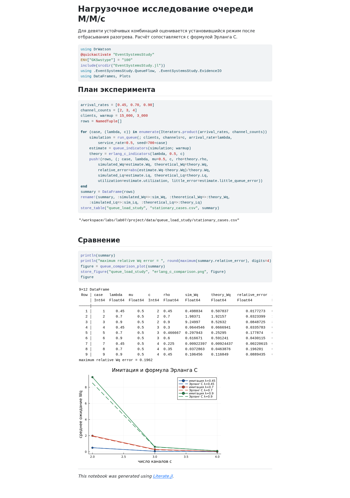
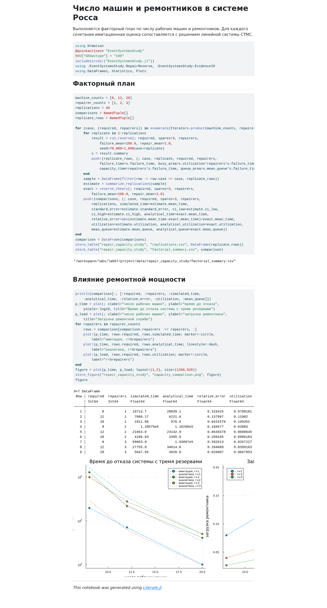

# Информация о работе

**Автор:** Исаева Зарина Исмайилбековна\
**Студенческий билет:** 1132232882\
**Дисциплина:** Имитационное моделирование\
**Тема:** реализация основных моделей дискретно-событийного подхода.

# Цель работы

Освоить процессное и агрегированное описание дискретно-событийных систем,
реализовать очередь M/M/c и резервируемую систему Росса, проверить имитационные
оценки аналитическими формулами и исследовать влияние параметров моделей.

# Задание

1. Организовать переносимый проект Julia с помощью `DrWatson`.
2. Реализовать пример M/M/2 для десяти клиентов при
   $\lambda=0{,}9$, $\mu=0{,}5$, $c=2$ и `StableRNG(123)`.
3. Добавить графическое и табличное наблюдение очереди и параметрический опыт.
4. Реализовать систему Росса с $N=10$, $S=3$, одним ремонтником,
   средними временами отказа и ремонта 100 и 1 час; выполнить пять прогонов.
5. Добавить несколько ремонтников, разные числа рабочих машин, загрузку
   ремонтников, среднюю очередь ремонта и траекторию числа работающих машин.
6. Сопоставить имитацию с аналитическими решениями и подготовить литературные
   программы, чистые Julia-файлы, выполненные IPYNB, QMD и HTML.

# Теоретическое введение

## Дискретно-событийный подход

Состояние дискретно-событийной модели меняется только в моменты событий.
Имитатор хранит модельное время и календарь будущих событий; процесс временно
приостанавливается до `timeout` или освобождения ресурса. Такой способ особенно
удобен для очередей и систем надёжности [@korolkova_kulyabov_2026; @ross2013].
В Julia календарь, процессы и ограниченные ресурсы предоставляет пакет
`ConcurrentSim.jl` [@concurrentsim].

## Очередь M/M/c

В обозначении M/M/c межприходные интервалы и времена обслуживания имеют
экспоненциальное распределение, а $c$ одинаковых каналов обслуживают клиентов
по дисциплине FIFO. Коэффициент загрузки

$$\rho=\frac{\lambda}{c\mu}$$

должен быть меньше единицы. Для устойчивой системы вероятность ожидания
вычисляется формулой Эрланга C [@gross2008]:

$$
P_0=\left[\sum_{n=0}^{c-1}\frac{(c\rho)^n}{n!}
+\frac{(c\rho)^c}{c!(1-\rho)}\right]^{-1},\qquad
P_{wait}=\frac{(c\rho)^c}{c!(1-\rho)}P_0.
$$

Остальные показатели связаны соотношениями

$$L_q=\frac{\rho}{1-\rho}P_{wait},\quad
W_q=\frac{L_q}{\lambda},\quad W=W_q+\frac1\mu,\quad L=\lambda W.$$

## Система Росса

В системе работают $N$ машин, ещё $S$ находятся в холодном резерве. После
отказа рабочей машины резервная немедленно вводится в строй, а отказавшая
направляется в ремонт. Система отказывает в момент, когда число неисправных
машин становится $S+1$.

Пока система работоспособна, интенсивность отказов равна $N/F$, где $F$ —
среднее время работы одной машины. Если неисправны $k$ машин, суммарная
интенсивность ремонта равна $\min(k,r)/G$, где $r$ — число ремонтников, а $G$ —
среднее время ремонта. Благодаря отсутствию памяти экспоненциального закона
процесс можно точно агрегировать по состоянию $k=0,\ldots,S$.

Для матрицы переходов $Q$ средние времена до поглощения решаются из

$$Q\mathbf{t}=-\mathbf{1}.$$

Ожидаемые времена пребывания в состояниях дают награды: загрузку ремонтной
службы и среднюю длину очереди ремонта.

# Организация проекта

Исходники разделены на расчётные модули, литературные сценарии, данные,
графики, notebook и HTML. Все пути вычисляются относительно каталога проекта.
`Manifest.toml` фиксирует точные версии пакетов, а `Makefile` повторяет полный
цикл расчёта и проверки [@drwatson; @literate].

На рис. @fig-vscode-queue показан настоящий полноэкранный VS Code без данных
учётной записи. В отчёт включены разные участки исходного кода, а не повтор
одного снимка.

{#fig-vscode-queue width=96%}

{#fig-vscode-repair width=96%}

# Реализация

## Модуль очереди

`QueueFlow` запускает по процессу на клиента. Приход увеличивает очередь,
`request` ожидает свободный канал, а `unlock` освобождает его. Журнал состояния
не восстанавливается после расчёта: он записывается непосредственно в моменты
событий.



## Модуль резервирования

`RepairReserve` моделирует эквивалентную CTMC в календаре ConcurrentSim. После
каждого интервала выбирается отказ или завершение ремонта пропорционально
суммарным интенсивностям. Перед изменением состояния интегрируются занятость
ремонтников и очередь.



## Сохранение данных и графиков



## Корневой модуль



# Выполнение модели M/M/c

## Базовый сценарий



Первые два клиента сразу занимают каналы, затем возникает очередь. Завершение
последнего клиента зарегистрировано в момент 18,6903. На короткой выборке из
десяти клиентов среднее ожидание равно 4,8568; стационарная формула даёт
8,5263. Расхождение ожидаемо: пример иллюстрирует события, но ещё не является
стационарным статистическим экспериментом.

{#fig-queue-timeline width=92%}

Выполненный notebook на рис. @fig-queue-notebook содержит код, таблицу событий,
численный вывод и построенный график в одном документе.

{#fig-queue-notebook width=90%}

## Параметрическое исследование



В каждом из девяти режимов рассчитано 15 000 клиентов; первые 3 000 исключены
как разогрев. Все сочетания устойчивы. Максимальная относительная ошибка
$W_q$ составила 19,62%, а в наиболее нагруженной системе M/M/2 — 8,49%.
Наиболее заметная относительная ошибка относится к малому абсолютному времени
ожидания; её можно уменьшить увеличением числа клиентов.

{#fig-erlang width=92%}

{#fig-queue-param-notebook width=90%}

# Выполнение системы Росса

## Базовый сценарий



Пять времён отказа равны 4 196,93; 22 311,63; 66 946,37; 12 198,35 и
31 867,14 часа. Их среднее 27 504,08 часа выше аналитического среднего
12 340 часов. Пять наблюдений недостаточно для точной оценки редкого события;
поэтому совпадение отдельно не навязывается. Загрузка и очередь устойчивее:
0,0981 против 0,0997 и 0,01047 против 0,01053.

{#fig-reserve-path width=92%}

{#fig-reserve-notebook width=90%}

## Несколько ремонтников и разное число машин



Факторный план содержит $3\times3=9$ сочетаний и по 40 независимых прогонов.
При $N=20$ относительная ошибка времени отказа равна 4,32%, 20,94% и 2,60%
для одного, двух и трёх ремонтников. Для редких отказов при $N=8$ разброс
сильнее, что видно по широким доверительным интервалам.

| N | r | Имитация, ч | Аналитика, ч | Загрузка | Очередь |
|--:|--:|--:|--:|--:|--:|
| 8  | 1 | 19 713,7 | 28 839,1 | 0,0798 | 0,00671 |
| 12 | 1 | 7 080,2  | 6 221,6  | 0,1190 | 0,01491 |
| 20 | 1 | 1 011,9  | 970,0    | 0,1994 | 0,04056 |
| 8  | 2 | 128 575,1| 110 206,3| 0,0398 | 0,00011 |
| 12 | 2 | 21 663,0 | 23 142,9 | 0,0601 | 0,00033 |
| 20 | 2 | 4 106,0  | 3 395,0  | 0,0996 | 0,00146 |
| 8  | 3 | 99 063,0 | 163 096,9| 0,0267 | 0 |
| 12 | 3 | 27 755,8 | 34 014,8 | 0,0399 | 0 |
| 20 | 3 | 5 048,0  | 4 920,0  | 0,0668 | 0 |

: Параметрическое исследование системы Росса {#tbl-ross-factorial}

{#fig-capacity width=96%}

{#fig-repair-param-notebook width=90%}

# Контроль выполнения

## Окружение проекта



## Автоматизация



## Подготовка окружения



## Генерация литературных форматов



## Автоматические проверки



Четыре IPYNB имеют выполненные кодовые ячейки и нулевое число ошибок. Для
каждого литературного сценария также созданы чистый Julia-файл, QMD, HTML и
отчётный фрагмент. Тестовый набор содержит 17 успешных проверок.

# Обсуждение результатов

В M/M/c параметр `Exponential` принимает среднее, поэтому в код передаётся
$1/\lambda$ или $1/\mu$, а не интенсивность. В системе Росса величины 100 и 1
также трактуются как средние времена. Следовательно, интенсивность отказа одной
машины равна 0,01 в час, а один ремонтник завершает в среднем один ремонт в час.

Агрегация системы Росса не меняет распределение времени отказа: при
экспоненциальных временах личности машин не влияют на будущие интенсивности.
Она уменьшает число параллельных процессов и делает явными контрольные
состояния $k=0,\ldots,S+1$.

Главное ограничение опыта — 40 повторов для редких отказов. Этого достаточно
для демонстрации тенденций и сравнения порядков величин, но недостаточно для
узких доверительных интервалов при трёх ремонтниках. Аналитическая CTMC служит
контрольным значением и позволяет обнаружить статистическую нестабильность.

# Выводы

Реализованы и выполнены две дискретно-событийные модели и два параметрических
исследования. Для M/M/c проверены устойчивость, формула Эрланга C и остаток
закона Литтла. Для системы Росса получены траектория до отказа, среднее время,
загрузка ремонтников и очередь ремонта; добавлены несколько ремонтников и
разные числа рабочих машин. Базовое аналитическое время отказа равно 12 340
часов, а матричное решение проверено с невязкой менее $10^{-9}$.

# Список литературы{.unnumbered}

::: {#refs}
:::
