::: {.text-center}
Российский университет дружбы народов имени Патриса Лумумбы

Студенческий билет: 1132232882

Москва, 2026
:::



# Содержание {.unnumbered}

1. Цель работы
2. Задание
3. Теоретическое введение
   1. Индивидуальные события
   2. Детерминированное приближение
   3. Расширения модели
4. Выполнение лабораторной работы
   1. Подготовка окружения и ядро модели
   2. Обработка результатов
   3. Базовый опыт
   4. Чувствительность к параметрам
   5. Длительность инфекции
   6. Производительность
   7. Анализ сохранённых CSV
   8. Рождения и смерти
   9. Вакцинация
   10. Латентная стадия
   11. Сопоставление с ОДУ
   12. Производные форматы
   13. Проверки модели и сборка
5. Выводы
6. Список литературы



# Цель работы

Изучить дискретно-событийное моделирование распространения инфекции в конечной
популяции. Реализовать индивидуальные процессы контактов и выздоровления на Julia,
исследовать влияние параметров и расширить модель демографией, вакцинацией и
латентной стадией. Сопоставить стохастический ансамбль с детерминированной моделью.

# Задание

Работа соответствует главе 8 практикума, страницам 221–234 [@manual]. Выполняются
базовая SIR-модель, семь дополнительных заданий §8.5 и преобразования Literate из
§8.6. Для дополнительных экспериментов выбрано девять самостоятельных сценариев
вместе с базовым запуском и отдельным сравнением с ОДУ. Число файлов дополнительных
заданий в методичке не задано. Параметрические серии не заменяют базовый опыт.

| Сценарий | Содержание | Условия |
|---|---|---|
| sir_des | Базовая SIR | N=1000, T=40, seed=1234 |
| sir_des__param | Чувствительность | β, c, γ отдельно, 20 повторов |
| sir_duration | Фиксированная болезнь | 1/γ=4, T=80 |
| sir_benchmark | Производительность | N=10000, свежая модель |
| sir_csv_report | Чтение CSV | Без повторной симуляции |
| sir_demography | Рождения и смерти | Λ=10, μ=0.01, T=400 |
| sir_vaccination | Пять долей вакцинации | t=0, по 20 повторов |
| sir_seir | Латентный период | σ=0.5, T=80 |
| sir_compare_ode | Сравнение с ОДУ | 30 повторов, RK4 |

# Теоретическое введение

## Индивидуальные события

Каждый восприимчивый агент инициирует контакт после случайного интервала
$\Delta t_c\sim\mathrm{Exp}(1/c)$. В записи распределения используется среднее,
поэтому интенсивность равна $c$. Собеседник выбирается равновероятно среди остальных
живых агентов. При контакте с инфицированным заражение происходит с вероятностью
$\beta$. Время до выздоровления имеет распределение
$\Delta t_r\sim\mathrm{Exp}(1/\gamma)$. При базовых параметрах средние интервалы
равны 0.1 и 4 единицам времени соответственно.

ConcurrentSim хранит очередь событий и продвигает виртуальное время до ближайшего
события. Возобновляемые функции приостанавливаются на `@yield timeout`, а процессы
регистрируются через `@process` [@concurrentsim]. Это позволяет совместить тысячи
агентов без отдельного системного потока на каждого из них.

## Детерминированное приближение

Для постоянной популяции $N=1000$ интенсивность заражения имеет вид
$\beta cSI/(N-1)$. Знаменатель $N-1$ возникает из исключения самого агента при
выборе собеседника. Соответствующая система имеет вид

$$
\frac{dS}{dt}=-\frac{\beta cSI}{N-1},\qquad
\frac{dI}{dt}=\frac{\beta cSI}{N-1}-\gamma I,\qquad
\frac{dR}{dt}=\gamma I.
$$

Начальное эффективное число воспроизводства равно
$\mathcal R_{\mathrm{eff}}(0)=\beta cS_0/[\gamma(N-1)]\approx1.982$.
Оно характеризует раннюю тенденцию, но не предсказывает исход отдельной случайной
траектории. Детерминированное приближение и конечная стохастическая популяция
различаются по смыслу [@keeling].

## Расширения модели

В варианте с фиксированной болезнью ожидание равно ровно $1/\gamma$.
В SEIR заражение сначала переводит агента в $E$, затем после
$\mathrm{Exp}(1/\sigma)$ он становится инфекционным. Смерть планируется отдельным
процессом с интенсивностью $\mu$ и конкурирует с контактом и выздоровлением.
Рождения образуют независимый поток с постоянной интенсивностью $\Lambda$.

Вакцинация переводит выбранную долю текущих восприимчивых в $R$. Счётчик вакцинаций
ведётся отдельно от числа заражений. Для идеальной вакцинации в начале опыта
условие подавления раннего роста имеет вид
$f>1-\gamma(N-1)/(\beta cS_0)\approx0.4955$.
Это порог среднего приближения, а не гарантия отсутствия отдельных заражений.

# Выполнение лабораторной работы

## Подготовка окружения

Проект ContactEpidemics использует Julia 1.11.9. Версии зависимостей закреплены в
Manifest.toml. Папка `src` содержит ядро и обработку результатов, `scripts` содержит
литературные исходники. Чистый код помещается в `generated`, выполненные блокноты
в `notebooks`, фрагменты Quarto в `markdown`. Данные сохраняются в `data/sims`
и `data/analysis`. Все рисунки находятся в едином каталоге `image` лабораторной.

```bash
pwd
julia --version
julia --project=. scripts/setup_environment.jl
make test
```

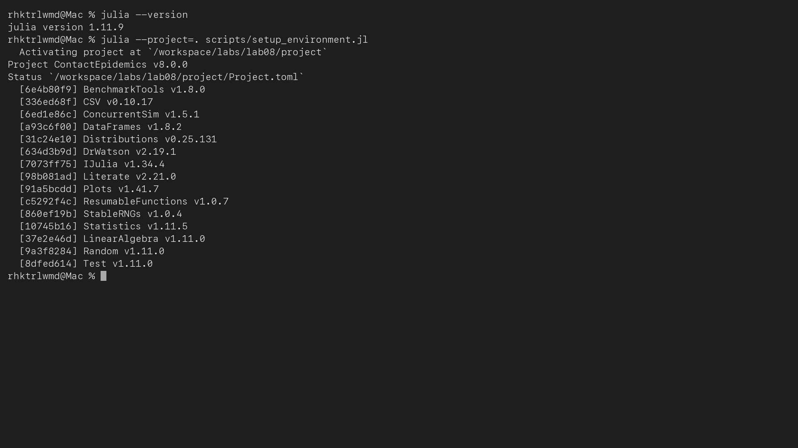{#fig-runtime width=100%}

@fig-runtime показана проверка рабочей среды перед вычислениями.
Ниже приведено полное описание непосредственных зависимостей проекта.


Листинг файла `project/Project.toml`.

```toml
name = "ContactEpidemics"
uuid = "cfe7c3ac-ef99-48ac-9581-c6a51e8a9bc1"
authors = ["rhktrlwmd"]
version = "8.0.0"

[deps]
BenchmarkTools = "6e4b80f9-dd63-53aa-95a3-0cdb28fa8baf"
CSV = "336ed68f-0bac-5ca0-87d4-7b16caf5d00b"
ConcurrentSim = "6ed1e86c-fcaf-46a9-97e0-2b26a2cdb499"
DataFrames = "a93c6f00-e57d-5684-b7b6-d8193f3e46c0"
Distributions = "31c24e10-a181-5473-b8eb-7969acd0382f"
DrWatson = "634d3b9d-ee7a-5ddf-bec9-22491ea816e1"
IJulia = "7073ff75-c697-5162-941a-fcdaad2a7d2a"
LinearAlgebra = "37e2e46d-f89d-539d-b4ee-838fcccc9c8e"
Literate = "98b081ad-f1c9-55d3-8b20-4c87d4299306"
Plots = "91a5bcdd-55d7-5caf-9e0b-520d859cae80"
Random = "9a3f8284-a2c9-5f02-9a11-845980a1fd5c"
ResumableFunctions = "c5292f4c-5179-55e1-98c5-05642aab7184"
StableRNGs = "860ef19b-820b-49d6-a774-d7a799459cd3"
Statistics = "10745b16-79ce-11e8-11f9-7d13ad32a3b2"
Test = "8dfed614-e22c-5e08-85e1-65c5234f0b40"

[compat]
CSV = "0.10"
ConcurrentSim = "1"
DataFrames = "1"
Distributions = "0.25"
DrWatson = "2"
IJulia = "1"
Literate = "2"
Plots = "1"
ResumableFunctions = "1"
StableRNGs = "1"
julia = "1.11"
```


Листинг файла `project/scripts/setup_environment.jl`.

```julia
using Pkg
Pkg.activate(joinpath(@__DIR__,".."))
Pkg.instantiate()
Pkg.status()
```

## Ядро модели

Состояния кодируются числами S=1, E=2, I=3, R=4, смерть обозначается 0.
Список живых агентов и обратный индекс позволяют удалять умерших без линейного
поиска. Единственная функция перехода одновременно меняет состояние, счётчики
и журнал. После каждого ожидания проверяется текущее состояние агента.
Это предотвращает заражение вакцинированного и выздоровление умершего.


Листинг файла `project/src/sir_model.jl`.

```julia
module ContactProcesses
using ConcurrentSim, ResumableFunctions, Distributions, Random
using StableRNGs, DataFrames
export Settings, Population, prepare, simulate, table, check_balance
export vaccinate!, transition!, activate!, finish!, sample_path

Base.@kwdef struct Settings
    beta::Float64 = 0.05
    contact::Float64 = 10.0
    recovery::Float64 = 0.25
    latent::Float64 = Inf
    fixed::Bool = false
    mortality::Float64 = 0.0
    births::Float64 = 0.0
    vaccination_time::Float64 = Inf
    vaccination_fraction::Float64 = 0.0
end

const Record = NamedTuple{(:t,:event,:person,:S,:E,:I,:R,:B,:D,:V,:cases),
    Tuple{Float64,Symbol,Int,Int,Int,Int,Int,Int,Int,Int,Int}}

mutable struct Population
    clock::Simulation
    config::Settings
    rng::StableRNG
    state::Vector{Int}
    living::Vector{Int}
    slot::Vector{Int}
    counts::Vector{Int}
    initial::Int
    born::Int
    died::Int
    vaccinated::Int
    cases::Int
    log::Vector{Record}
    active::Bool
end

function record!(m, event, id)
    s,e,i,r = m.counts
    push!(m.log, (t=Float64(now(m.clock)), event=event, person=id,
        S=s,E=e,I=i,R=r,B=m.born,D=m.died,V=m.vaccinated,cases=m.cases))
end

"""Change a living person's compartment and append one atomic ledger row."""
function transition!(m, id, destination, event)
    previous = m.state[id]
    previous == 0 && return false
    previous == destination && return false
    m.counts[previous] -= 1
    m.state[id] = destination
    if destination == 0
        position = m.slot[id]
        replacement = last(m.living)
        m.living[position] = replacement
        m.slot[replacement] = position
        pop!(m.living)
        m.slot[id] = 0
        m.died += 1
    else
        m.counts[destination] += 1
    end
    event == :infection && (m.cases += 1)
    event == :vaccination && (m.vaccinated += 1)
    record!(m, event, id)
    true
end

@resumable function disease(clock::Simulation, m::Population, id::Int)
    while m.state[id] == 1
        @yield timeout(clock, rand(m.rng, Exponential(1/m.config.contact)))
        # A pending timeout does not override death or vaccination.
        m.state[id] == 1 || return
        n = length(m.living)
        n <= 1 && continue
        draw = rand(m.rng, 1:n-1)
        draw >= m.slot[id] && (draw += 1)
        other = m.living[draw]
        if m.state[other] == 3 && rand(m.rng) < m.config.beta
            target = isfinite(m.config.latent) ? 2 : 3
            transition!(m,id,target,:infection)
        end
    end
    if m.state[id] == 2
        @yield timeout(clock,rand(m.rng,Exponential(1/m.config.latent)))
        m.state[id] == 2 || return
        transition!(m,id,3,:onset)
    end
    if m.state[id] == 3
        duration = m.config.fixed ? 1/m.config.recovery :
            rand(m.rng,Exponential(1/m.config.recovery))
        @yield timeout(clock,duration)
        m.state[id] == 3 || return
        transition!(m,id,4,:recovery)
    end
end

@resumable function death(clock::Simulation, m::Population, id::Int)
    @yield timeout(clock,rand(m.rng,Exponential(1/m.config.mortality)))
    transition!(m,id,0,:death)
end

function launch!(m,id)
    @process disease(m.clock,m,id)
    if m.config.mortality > 0
        @process death(m.clock,m,id)
    end
end

@resumable function immigration(clock::Simulation,m::Population)
    while true
        @yield timeout(clock,rand(m.rng,Exponential(1/m.config.births)))
        id = length(m.state)+1
        push!(m.state,1)
        push!(m.living,id)
        push!(m.slot,length(m.living))
        m.counts[1] += 1
        m.born += 1
        record!(m,:birth,id)
        launch!(m,id)
    end
end

"""Vaccinate a random fraction of current susceptibles, without new cases."""
function vaccinate!(m, fraction)
    0 <= fraction <= 1 || throw(ArgumentError("invalid fraction"))
    candidates = filter(id -> m.state[id] == 1,m.living)
    shuffle!(m.rng,candidates)
    for id in candidates[1:floor(Int,fraction*length(candidates))]
        transition!(m,id,4,:vaccination)
    end
end

@resumable function vaccination(clock::Simulation,m::Population)
    @yield timeout(clock,m.config.vaccination_time)
    vaccinate!(m,m.config.vaccination_fraction)
end

"""Build a fresh unstarted model; compartments are S=1, E=2, I=3, R=4."""
function prepare(; u0=(990,10,0), seed=1234, config=Settings())
    all(x -> x >= 0,u0) || throw(ArgumentError("negative population"))
    0 <= config.beta <= 1 || throw(ArgumentError("invalid beta"))
    config.contact > 0 && config.recovery > 0 && config.latent > 0 ||
        throw(ArgumentError("rates must be positive"))
    config.mortality >= 0 && config.births >= 0 ||
        throw(ArgumentError("negative demographic rate"))
    config.vaccination_time >= 0 || throw(ArgumentError("negative time"))
    0 <= config.vaccination_fraction <= 1 ||
        throw(ArgumentError("invalid fraction"))
    s,i,r = u0
    n = sum(u0)
    states = vcat(fill(1,s),fill(3,i),fill(4,r))
    m = Population(Simulation(),config,StableRNG(seed),states,
        collect(1:n),collect(1:n),[s,0,i,r],n,0,0,0,i,Record[],false)
    record!(m,:initial,0)
    m
end

function activate!(m)
    m.active && throw(ArgumentError("model already active"))
    m.active = true
    for id in copy(m.living)
        launch!(m,id)
    end
    m.config.births > 0 && (@process immigration(m.clock,m))
    isfinite(m.config.vaccination_time) && (@process vaccination(m.clock,m))
    m
end

function finish!(m,T)
    T > now(m.clock) || throw(ArgumentError("horizon must advance"))
    run(m.clock,Float64(T))
    record!(m,:horizon,0)
    m
end

function simulate(; T=40.0,kwargs...)
    finish!(activate!(prepare(;kwargs...)),T)
end

table(m) = DataFrame(m.log)

"""Check conservation at every event, plus the live-index bijection."""
function check_balance(m)
    all(row -> row.S+row.E+row.I+row.R == m.initial+row.B-row.D &&
        min(row.S,row.E,row.I,row.R) >= 0,m.log) &&
    sum(m.counts) == length(m.living) &&
    all(k -> m.slot[m.living[k]] == k,eachindex(m.living)) &&
    all(j -> count(==(j),m.state) == m.counts[j],1:4)
end

"""Right-continuous sampling preserves event jumps and duplicate times."""
function sample_path(data,grid; column=:I)
    [data[searchsortedlast(data.t,t),column] for t in grid]
end
end
```

## Обработка результатов

Для каждой траектории сохраняются журнал событий и параметры запуска в имени
CSV. Отдельно вычисляются максимум I, его время, R(T), I(T), накопленные инфекции
и вакцинации. Ансамбль хранит метрики отдельных прогонов и среднюю траекторию
раздельно. Временные ряды интерполируются справа непрерывно.


Листинг файла `project/src/StudyTools.jl`.

```julia
module StudyTools
using ..ContactProcesses
using CSV, DataFrames, Plots, Statistics
export save_run, run_metrics, draw_states, imagefile, save_table, ensemble
const ROOT = normpath(joinpath(@__DIR__,".."))
const IMAGES = normpath(joinpath(ROOT,"..","image","results"))
imagefile(name) = (mkpath(IMAGES); joinpath(IMAGES,name*".png"))

function save_table(name,df)
    directory = joinpath(ROOT,"data","analysis")
    mkpath(directory)
    CSV.write(joinpath(directory,name*".csv"),df)
end

function run_metrics(m)
    d = table(m)
    peak = argmax(d.I)
    (; peak=maximum(d.I),time_peak=d.t[peak],R_T=last(d.R),
        cases=last(d.cases),I_T=last(d.I),vaccinated=last(d.V),
        population=length(m.living),balance=check_balance(m))
end

function save_run(m; label="sir",seed=1234,T=40.0)
    c = m.config
    name = "$(label)_N$(m.initial)_b$(c.beta)_c$(c.contact)" *
        "_g$(c.recovery)_seed$(seed)_T$(T).csv"
    folder = joinpath(ROOT,"data","sims")
    mkpath(folder)
    CSV.write(joinpath(folder,name),table(m))
end

function draw_states(m,name; title="SIR")
    d = table(m)
    columns = isfinite(m.config.latent) ? [:S,:E,:I,:R] : [:S,:I,:R]
    p = plot(d.t,Matrix(d[:,columns]),label=permutedims(string.(columns)),
        xlabel="Time",ylabel="People",title=title,linewidth=2,
        seriestype=:steppost,size=(1050,620))
    savefig(p,imagefile(name))
    p
end

"""Return separate per-run metrics and the mean path, never conflate peaks."""
function ensemble(config; repeats=20,T=80.0,u0=(990,10,0))
    rows = NamedTuple[]
    grid = collect(0.0:0.25:T)
    paths = Matrix{Float64}(undef,length(grid),repeats)
    for k in 1:repeats
        m = simulate(;config,T,u0,seed=1233+k)
        push!(rows,(;replicate=k,run_metrics(m)...))
        paths[:,k] = sample_path(table(m),grid)
    end
    (metrics=DataFrame(rows),path=DataFrame(t=grid,
        mean_I=vec(mean(paths;dims=2)),sd_I=vec(std(paths;dims=2))))
end
end
```


Листинг файла `project/src/ContactEpidemics.jl`.

```julia
module ContactEpidemics
include("sir_model.jl")
include("StudyTools.jl")
end
```

## Базовый опыт

Параметры §8.2: 990 восприимчивых, 10 заражённых, горизонт 40.

```bash
julia --project=. scripts/sir_des.jl
```




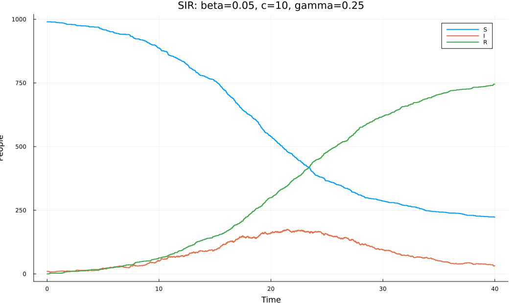{#fig-sir-des width=95%}

В базовом опыте пик I равен 175 при t=21.4162. К горизонту 40 получено S=223, I=32, R=745;
накопленное число инфицированных с учётом начальных десяти равно 777. Базовый опыт использует
исходные параметры без изменения. R(40) описывает число выздоровевших к горизонту; при I(40)>0 это
не окончательный размер эпидемии.

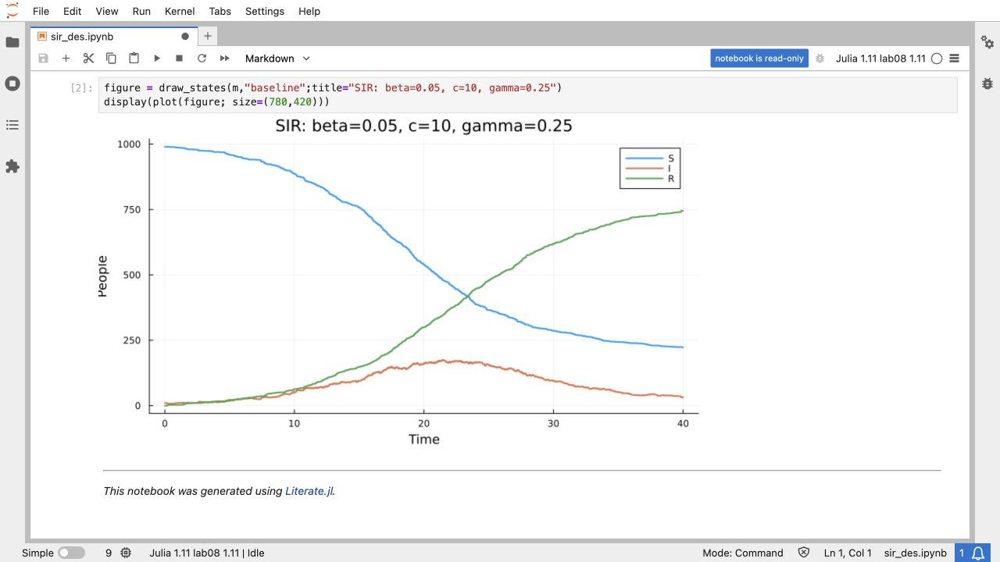{#fig-nb-sir-des width=100%}

@fig-nb-sir-des представлены выполненные ячейки и результат соответствующего сценария.

## Чувствительность к параметрам

Меняется один параметр за раз. По 20 повторов, горизонт 80.

```bash
julia --project=. scripts/sir_des__param.jl
```



| parameter | value | mean_peak | mean_time_peak | mean_R_T | mean_I_T |
| --- | --- | --- | --- | --- | --- |
| beta | 0.03 | 33.4 | 20.64 | 249.7 | 2.95 |
| beta | 0.05 | 174.4 | 18.34 | 800.3 | 0.1 |
| beta | 0.07 | 291.6 | 11.77 | 923.6 | 0 |
| contact | 6 | 26.45 | 20.2 | 184.6 | 2.3 |
| contact | 10 | 174.4 | 18.34 | 800.3 | 0.1 |
| contact | 14 | 295.1 | 12.01 | 927.8 | 0 |
| recovery | 0.15 | 348.6 | 16.62 | 958.1 | 0.15 |
| recovery | 0.25 | 174.4 | 18.34 | 800.3 | 0.1 |
| recovery | 0.35 | 70.35 | 22.88 | 520.4 | 2.1 |


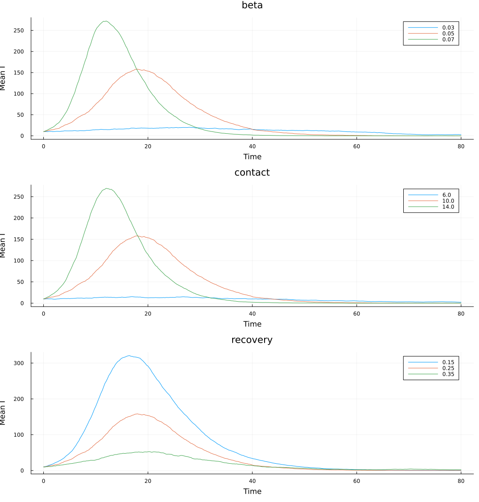{#fig-sir-des--param width=95%}

Рост β и c усиливает передачу, рост γ сокращает инфекционный период. Для сравнения используются
средние метрики 20 повторов. Горизонт расширен до 80 отдельно от базового опыта.

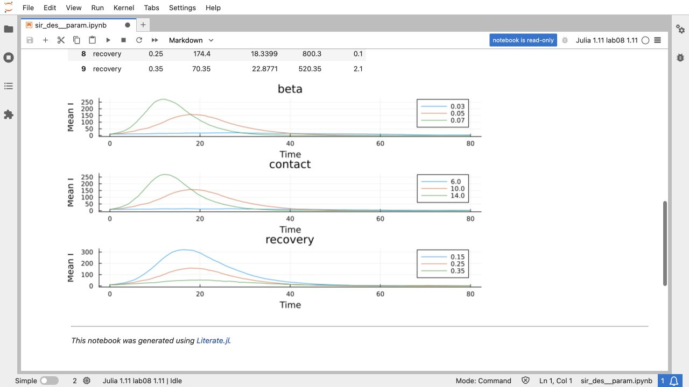{#fig-nb-sir-des--param width=100%}

@fig-nb-sir-des--param представлены выполненные ячейки и результат соответствующего сценария.

## Длительность инфекции

Одинаковый seed для экспоненциальной и фиксированной болезни.

```bash
julia --project=. scripts/sir_duration.jl
```



| fixed | peak | time_peak | R_T | I_T |
| --- | --- | --- | --- | --- |
| false | 175 | 21.42 | 815 | 2 |
| true | 299 | 12.08 | 794 | 0 |


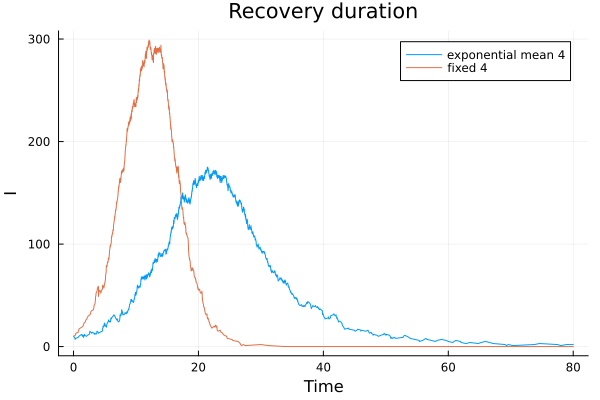{#fig-sir-duration width=95%}

Фиксированный период устраняет длинный хвост времени болезни. Одинаковое зерно не означает
одинаковую последовательность контактов после расхождения очередей событий.

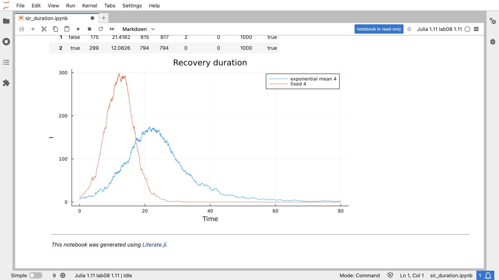{#fig-nb-sir-duration width=100%}

@fig-nb-sir-duration представлены выполненные ячейки и результат соответствующего сценария.

## Производительность

Каждый образец использует новую активированную модель N=10000.

```bash
julia --project=. scripts/sir_benchmark.jl
```



| N | samples | median_seconds | min_seconds | allocated_bytes | allocations |
| --- | --- | --- | --- | --- | --- |
| 10000 | 8 | 2.098 | 1.995 | 1215293328 | 43239718 |


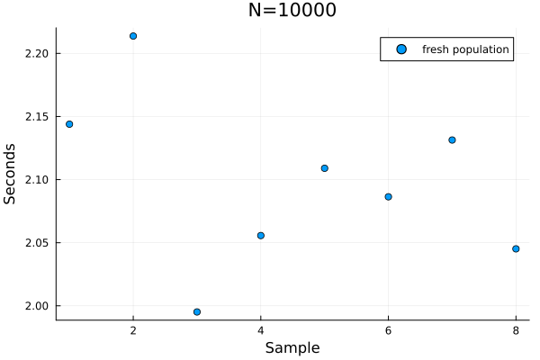{#fig-sir-benchmark width=95%}

Время измеряется только для выполнения активированной модели. setup создаёт новую модель перед
каждым образцом, evals=1 исключает измерение уже завершённого процесса. Allocated bytes означает
суммарные выделения, а не пиковую резидентную память. Для ускорения стоит уменьшать выделения
объектов событий и стоимость контактов.

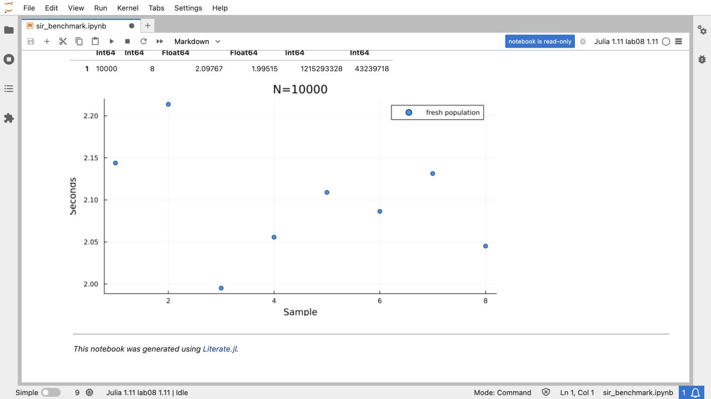{#fig-nb-sir-benchmark width=100%}

@fig-nb-sir-benchmark представлены выполненные ячейки и результат соответствующего сценария.

## Анализ сохранённых CSV

Этот сценарий не запускает модель: входом служит базовый CSV.

```bash
julia --project=. scripts/sir_csv_report.jl
```



| rows | peak | time_peak | R_T |
| --- | --- | --- | --- |
| 1514 | 175 | 21.42 | 745 |


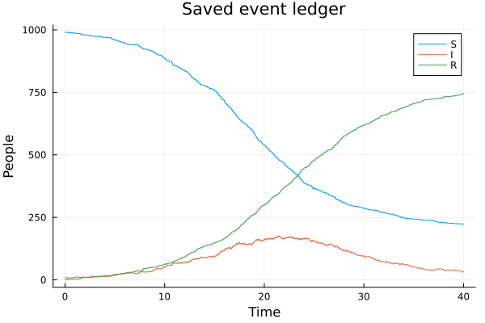{#fig-sir-csv-report width=95%}

Сценарий читает ранее созданный файл и проверяет баланс. В нём отсутствует вызов simulate, поэтому
график является результатом анализа сохранённых данных.

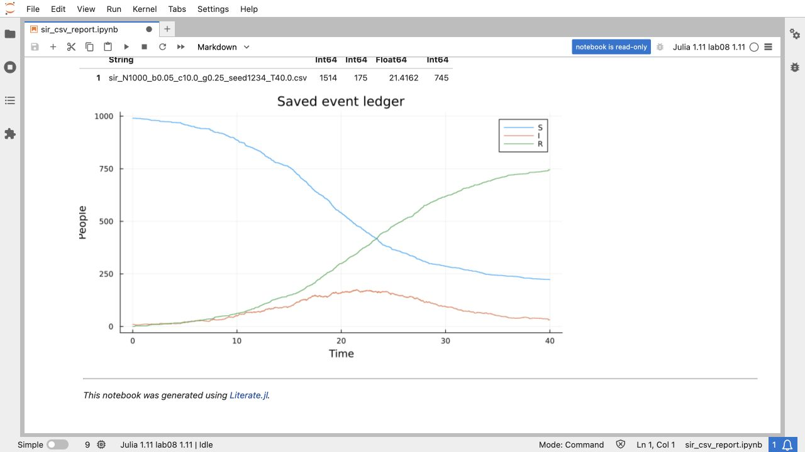{#fig-nb-sir-csv-report width=100%}

@fig-nb-sir-csv-report представлены выполненные ячейки и результат соответствующего сценария.

## Рождения и смерти

Смерть независима от болезни. Поток рождений 10, смертность 0.01.

```bash
julia --project=. scripts/sir_demography.jl
```



| peak | I_T | population | births | deaths |
| --- | --- | --- | --- | --- |
| 169 | 0 | 1016 | 4242 | 4226 |


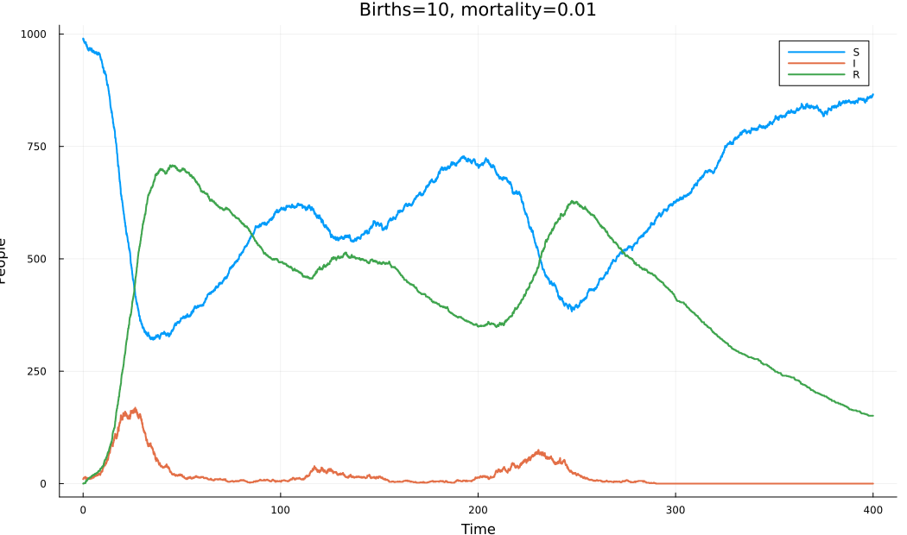{#fig-sir-demography width=95%}

При Λ=10 и μ=0.01 средняя равновесная численность равна 1000. Для приближения с частотной передачей
эндемические значения около S*=520 и I*=18.46. Положительное равновесие ОДУ не гарантирует
сохранение инфекции в конечной популяции без заноса. Один опыт T=400 не является статистическим
доказательством стационарности.

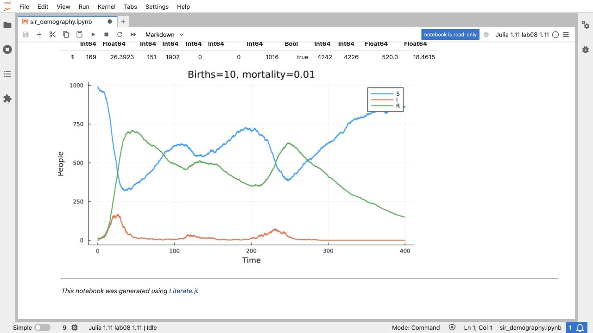{#fig-nb-sir-demography width=100%}

@fig-nb-sir-demography представлены выполненные ячейки и результат соответствующего сценария.

## Вакцинация

Вакцинация в t=0, по 20 повторов для пяти долей восприимчивых.

```bash
julia --project=. scripts/sir_vaccination.jl
```



| fraction | mean_peak | mean_cases | vaccinated | mean_I_T |
| --- | --- | --- | --- | --- |
| 0 | 179.3 | 795.5 | 0 | 0.15 |
| 0.25 | 63.2 | 419.1 | 247 | 1.7 |
| 0.5 | 18.35 | 98.05 | 495 | 0.3 |
| 0.65 | 11.55 | 29 | 643 | 0 |
| 0.8 | 10.35 | 14.75 | 792 | 0 |


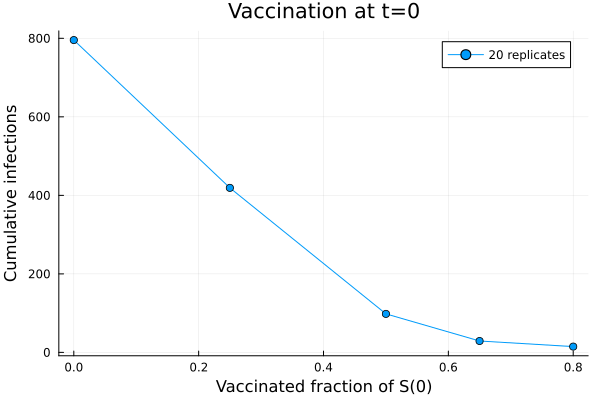{#fig-sir-vaccination width=95%}

Порог раннего роста около 49.55% относится к доле исходных восприимчивых. Опыты с долями 0, 0.25,
0.5, 0.65 и 0.8 показывают изменение среднего накопленного числа инфекций. Вакцинированные не
включаются в cases.

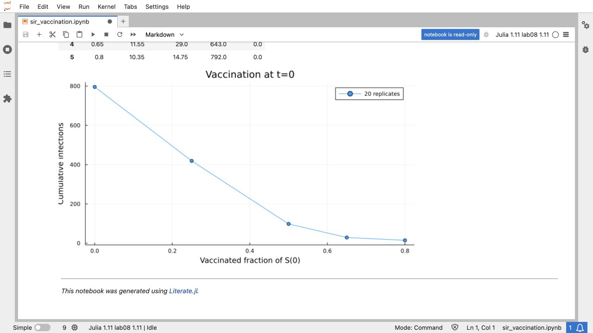{#fig-nb-sir-vaccination width=100%}

@fig-nb-sir-vaccination представлены выполненные ячейки и результат соответствующего сценария.

## Латентная стадия

Средний латентный период 2; сравнение с SIR при одинаковом seed.

```bash
julia --project=. scripts/sir_seir.jl
```



| sigma | peak | time_peak | peak_E | R_T | I_T |
| --- | --- | --- | --- | --- | --- |
| inf | 175 | 21.42 | 0 | 815 | 2 |
| 0.5 | 116 | 34.51 | 74 | 798 | 0 |


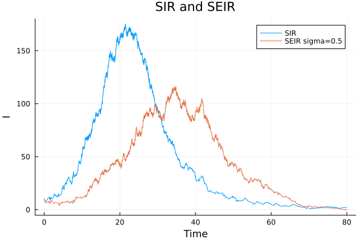{#fig-sir-seir width=95%}

Латентная стадия откладывает появление инфекционных агентов. После смерти отложенное событие E→I
отменяется проверкой состояния. Помимо сравнения I сохранены все четыре ряда S/E/I/R.

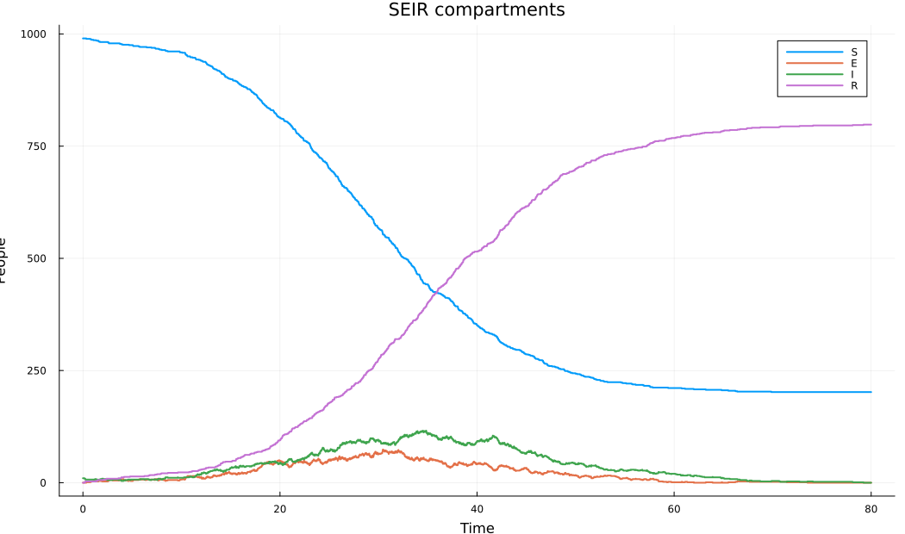{#fig-seir-states width=95%}

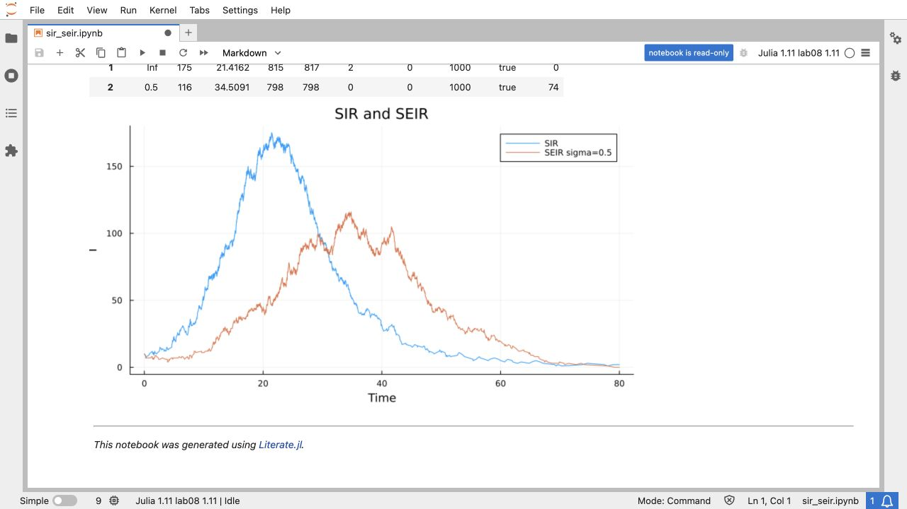{#fig-nb-sir-seir width=100%}

@fig-nb-sir-seir представлены выполненные ячейки и результат соответствующего сценария.

## Сопоставление с ОДУ

Средний ансамбль из 30 прогонов сопоставляется с RK4 и шагом 0.01.

```bash
julia --project=. scripts/sir_compare_ode.jl
```



| ode_peak | peak_mean_path | mean_individual_peak | rmse | step_difference |
| --- | --- | --- | --- | --- |
| 158.8 | 154.8 | 175.4 | 1.765 | 2.25e-11 |


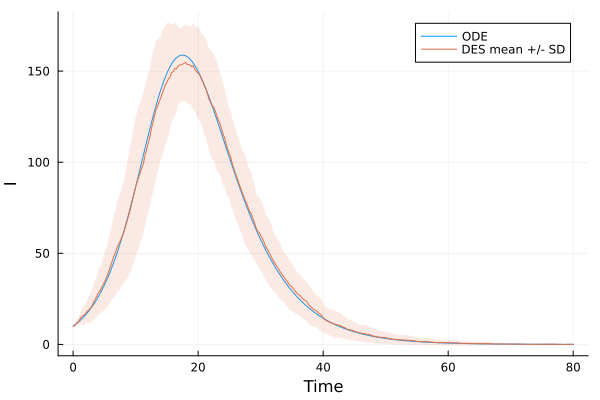{#fig-sir-compare-ode width=95%}

RK4 проверяется уменьшением шага с 0.01 до 0.005. Полоса вокруг среднего DES показывает стандартное
отклонение траекторий, а не доверительный интервал среднего. Максимум средней траектории и среднее
индивидуальных максимумов вычисляются отдельно.

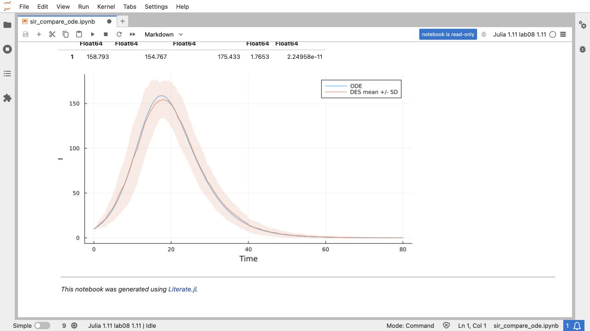{#fig-nb-sir-compare-ode width=100%}

@fig-nb-sir-compare-ode представлены выполненные ячейки и результат соответствующего сценария.

## Производные форматы

Literate преобразует один литературный источник в чистый Julia-скрипт,
Jupyter notebook и Quarto QMD [@literate]. Каждый из девяти блокнотов выполняется,
включая параметры, benchmark и чтение CSV. В тематические разделы этого отчёта
подключены полные QMD-фрагменты, сформированные генератором. Повторные копии
исходников в виде чистых скриптов не печатаются второй раз.

```bash
make notebooks
make docs
```


Листинг файла `project/scripts/tangle.jl`.

```julia
using Pkg
Pkg.activate(joinpath(@__DIR__,".."))
using Literate
root = dirname(@__DIR__)
execute = "--execute" in ARGS
names = ["sir_des","sir_des__param","sir_duration","sir_benchmark",
    "sir_csv_report","sir_demography","sir_vaccination","sir_seir",
    "sir_compare_ode"]
for name in names
    source = joinpath(@__DIR__,name*".jl")
    clean = joinpath(root,"generated",name)
    nb = joinpath(root,"notebooks",name)
    docs = joinpath(root,"markdown",name)
    Literate.script(source,clean;documenter=false)
    Literate.notebook(source,nb;execute,documenter=false)
    Literate.markdown(source,docs;flavor=Literate.QuartoFlavor())
    qmd = joinpath(docs,name*".qmd")
    # The full generated prose and code are included without rerunning in Word.
    text = replace(read(qmd,String),"```{julia}"=>"```julia")
    text = replace(text,r"(?m)^# [^\n]+"=>"### Литературный исходник")
    write(joinpath(docs,name*"-report.qmd"),text)
end
```

## Проверки модели и сборка

Проверяются баланс на каждом событии, тождественность повторов с одинаковым
seed, отсутствие передачи при β=0, точное выздоровление при фиксированном периоде,
случаи N=0 и N=1, отсутствие действий умершего агента, полная вакцинация,
латентная стадия, демография и правостороннее чтение временного ряда.

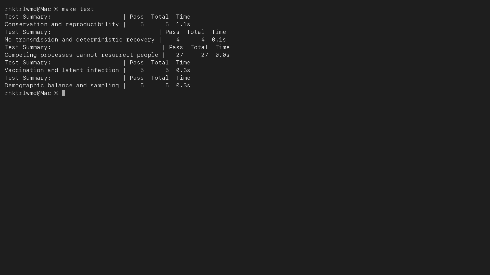{#fig-tests width=100%}

@fig-tests содержит фактический вывод набора тестов.


Листинг файла `project/test/runtests.jl`.

```julia
using Test, ContactEpidemics.ContactProcesses
@testset "Conservation and reproducibility" begin
    m = simulate()
    @test check_balance(m)
    @test table(m) == table(simulate())
    @test first(table(m).I) == 10
    @test last(table(m).t) == 40.0
    @test all(diff(table(m).S) .<= 0)
end
@testset "No transmission and deterministic recovery" begin
    m = simulate(config=Settings(beta=0.0,fixed=true),T=5.0)
    @test m.counts == [990,0,0,10]
    @test all(row.t == 4.0 for row in m.log if row.event == :recovery)
    @test simulate(u0=(1,0,0)).counts == [1,0,0,0]
    @test simulate(u0=(0,0,0)).counts == [0,0,0,0]
end
@testset "Competing processes cannot resurrect people" begin
    m = simulate(u0=(10,10,0),T=30.0,
        config=Settings(mortality=5.0,latent=0.5))
    @test check_balance(m)
    @test isempty(m.living)
    dead = Set{Int}()
    for row in m.log
        @test !(row.person in dead)
        row.event == :death && push!(dead,row.person)
    end
    @test !transition!(m,1,4,:recovery)
end
@testset "Vaccination and latent infection" begin
    m = simulate(config=Settings(vaccination_time=0.0,
        vaccination_fraction=1.0),T=80.0)
    @test m.cases == 10
    @test m.vaccinated == 990
    @test check_balance(m)
    seir = simulate(config=Settings(latent=0.5),T=80.0)
    @test maximum(table(seir).E) > 0
    @test check_balance(seir)
end
@testset "Demographic balance and sampling" begin
    m = simulate(config=Settings(mortality=0.05,births=50.0))
    @test check_balance(m)
    @test m.born > 0 && m.died > 0
    d = table(m)
    @test sample_path(d,[0.0,40.0]) == [10,last(d.I)]
    @test_throws ArgumentError prepare(config=Settings(beta=1.1))
    @test_throws ArgumentError activate!(m)
end
```


Листинг файла `project/Makefile`.

```makefile
JULIA ?= julia
SCENARIOS = sir_des sir_des__param sir_duration sir_benchmark \
    sir_csv_report sir_demography sir_vaccination \
    sir_seir sir_compare_ode
.PHONY: setup run tangle notebooks docs test all
setup:
	$(JULIA) --project=. scripts/setup_environment.jl
run:
	@for name in $(SCENARIOS); do $(JULIA) --project=. scripts/$$name.jl || exit $$?; done
tangle:
	$(JULIA) --project=. scripts/tangle.jl
notebooks:
	$(JULIA) --project=. scripts/tangle.jl --execute
docs:
	@for name in $(SCENARIOS); do \
	  (cd notebooks/$$name && quarto render $$name.ipynb --to html \
	    --embed-resources --no-execute --output $$name.html) || exit $$?; \
	  mv notebooks/$$name/$$name.html markdown/$$name/; \
	done
test:
	$(JULIA) --project=. test/runtests.jl
all: setup run notebooks docs test
```

# Выводы

Реализована дискретно-событийная модель с индивидуальными контактами и отдельными
событиями выздоровления. Базовые условия сохранены, дополнительные опыты охватывают
все пункты §8.5. Параметры передачи и длительность болезни влияют на высоту и время
пика, вакцинация уменьшает накопленные инфекции, а латентная стадия меняет временной
профиль эпидемии. Для демографии соблюдается баланс S+E+I+R=N₀+B−D.

Сравнение с ОДУ интерпретируется на уровне ансамбля. Отдельные траектории могут
отклоняться от среднего, а ненулевое I(T) требует осторожности при трактовке
конечной доли переболевших. Из литературных исходников получены и выполнены
производные форматы, а их полные листинги включены в соответствующие разделы.

# Список литературы {.unnumbered}

::: {#refs}
:::
